#  Build and deploy an ASP.NET Core 3.0 Web API on Azure Kubernetes Service
This project describes the steps for building and deploying a real world **Medical Claims Processing** microservice application (**Claims API**) on Azure Kubernetes Service.

Table of Contents
=================

<!--ts-->
  * [A. Deploy an Azure SQL Server Database](#a-deploy-an-azure-sql-server-and-database)
  * [B. Provision a Linux VM (Bastion Host/Jump Box) on Azure and install pre-requisite software](#b-provision-a-linux-centos-vm-on-azure)
  * [C. Build and run the Claims API microservice locally on the Bastion Host](#c-build-and-run-the-claims-api-microservice-locally-on-the-linux-vm)
  * [D. Deploy an Azure DevOps Services build agent on the Bastion Host](#d-deploy-the-azure-devops-services-build-agent)
  * [E. Deploy an Azure Container Registry (ACR)](#e-deploy-azure-container-registry)
  * [F. Define and execute a Build Pipeline in Azure DevOps Services](#f-define-and-execute-claims-api-build-pipeline-in-azure-devops-services)
  * [G. Deploy an Azure Kubernetes Service (AKS) cluster](#g-create-an-azure-kubernetes-service-cluster-and-deploy-claims-api-microservice)
    * [Invoking the Claims API Microservice REST API](#invoking-the-claims-api-microservice-rest-api)
  * [H. Define and execute a Release Pipeline in Azure DevOps Services](#h-define-and-execute-claims-api-release-pipeline-in-azure-devops-services)
    * [Exercise 1: Execute functional tests in QA region and then deploy Claims API microservice in Production region](#exercise-1)
    * [Exercise 2: Implement Blue-Green deployments in Production region](#exercise-2)
  * [I. Deploy a Delivery Pipeline in Azure DevOps Services](#i-define-and-execute-claims-api-delivery-pipeline-in-azure-devops-services)
    * [Exercise 3: Scan container images and digitally sign them using Docker Content Trust](#exercise-3)
  * [J. Explore out of box AKS features](#j-explore-out-of-box-aks-features)
<!--te-->

This project provides step by step instructions to use **Azure DevOps Services** to build the application binaries, package the binaries within a container and deploy the container on **Azure Kubernetes Service** (AKS). The deployed microservice exposes a Web API (REST interface) and supports all CRUD operations for accessing (retrieving / storing) medical claims records from a relational data store.  The microservice persists all claims records in an Azure SQL Server Database.

**Prerequisites:**
1.  Review and complete all modules in [Azure Fundamentals](https://docs.microsoft.com/en-us/learn/paths/azure-fundamentals/) course.
2.  An active **Microsoft Azure Subscription** with **Owner** *Role* permission.  You can obtain a free Azure subscription by accessing the [Microsoft Azure](https://azure.microsoft.com/en-us/?v=18.12) website.

    **IMPORTANT NOTES:**
    - In order to complete all sections in this project, at least one person in your team **must** have **Owner** *Role* permission for the Azure Subscription.
    - For an Azure Subscription, there is a default limit on the number of **VM Cores** which can be provisioned per region.  The Azure limits are also referred to as quotas.  The VM Cores have both a regional total limit (~ 20) and a per-size series limit.  In case a single Azure Subscription is used for provisioning resources (~ VM's) by all attendees, the default VM Cores limit might get exceeded. The default quota can be increased by opening an online Azure Customer Support request.  More details can be found [here](https://docs.microsoft.com/en-us/azure/azure-resource-manager/management/azure-subscription-service-limits).
3.  An Azure **Resource Group** with **Owner** *Role* permission.  All Azure resources will be deloyed into this resource group.
4.  A **GitHub** Account to fork and clone this GitHub repository.
5.  A **Azure DevOps Services** (formerly Visual Studio Team Services) Account.  You can get a free Azure DevOps account by accessing the [Azure DevOps Services](https://azure.microsoft.com/en-us/services/devops/) web page.
6.  Review [Overview of Azure Cloud Shell](https://docs.microsoft.com/en-us/azure/cloud-shell/overview).  **Azure Cloud Shell** is an interactive, browser accessible shell for managing Azure resources.  You will be using the Cloud Shell to create the Bastion Host (Linux VM).
7.  This project assumes readers/attendees are familiar with Linux fundamentals, Git SCM, Linux Containers (*docker engine*), Kubernetes, DevOps (*Continuous Integration/Continuous Deployment*) concepts and developing Microservices in one or more programming languages.  If you are new to any of these technologies, go thru the resources below.
    - [Learn Linux, 101: A roadmap for LPIC-1](https://developer.ibm.com/tutorials/l-lpic1-map/)

      Go thru the chapters in **Topic 103: GNU and UNIX commands**
    - [Introduction to Git SCM](https://git-scm.com/docs/gittutorial)
    - [Git SCM Docs](https://git-scm.com/book/en/v2)
    - [Docker Overview](https://docs.docker.com/engine/docker-overview/)
    - [Introduction to .NET and Docker](https://docs.microsoft.com/en-us/dotnet/core/docker/intro-net-docker)
    - [Kubernetes Overview](https://kubernetes.io/docs/tutorials/kubernetes-basics/)
    - [Introduction to Azure DevOps Services](https://azure.microsoft.com/en-us/overview/devops-tutorial/)
8.  (Windows users only) A **terminal emulator** is required to login (SSH) into the Linux VM (Bastion) host running on Azure. Download and install one of the utilities below.
    - [Putty](https://putty.org/)
    - [Git bash](https://gitforwindows.org/)
    - [Windows Sub-System for Linux](https://docs.microsoft.com/en-us/windows/wsl/install-win10)
9.  (Optional) Download and install [Microsoft SQL Server Management Studio](https://docs.microsoft.com/en-us/sql/ssms/download-sql-server-management-studio-ssms?view=sql-server-2017) to manage SQL Server database artifacts.
10. (Optional) Download and install [Postman App](https://www.getpostman.com/apps), a REST API Client used for testing the Web API's.

**Functional Architecture:**

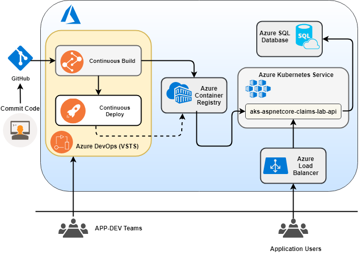

For easy and quick reference, readers can refer to the following on-line resources as needed.
- [Azure CLI 2.0](https://docs.microsoft.com/en-us/cli/azure/install-azure-cli?view=azure-cli-latest)
- [ASP.NET Core 3.0 Documentation](https://docs.microsoft.com/en-us/aspnet/core/?view=aspnetcore-3.0)
- [Docker Documentation](https://docs.docker.com/)
- [Kubernetes Documentation](https://kubernetes.io/docs/home/?path=users&persona=app-developer&level=foundational)
- [Helm Documentation](https://docs.helm.sh/)
- [Creating an Azure VM](https://docs.microsoft.com/en-us/azure/virtual-machines/linux/quick-create-cli)
- [Azure Kubernetes Service (AKS) Documentation](https://docs.microsoft.com/en-us/azure/aks/)
- [Azure Container Registry Documentation](https://docs.microsoft.com/en-us/azure/container-registry/)
- [Azure DevOps Documentation](https://docs.microsoft.com/en-us/vsts/index?view=vsts)
- [Zero instrumentation application monitoring for Kubernetes with Application Insights](https://docs.microsoft.com/en-us/azure/azure-monitor/app/kubernetes)

**Important Notes:**
- AKS is a managed [Kubernetes](https://kubernetes.io/) service on Azure.  Please refer to the [AKS](https://azure.microsoft.com/en-us/services/container-service/) product web page for more details.
- This project has been tested on AKS v1.14.5+ and .NET Core 3.0.
- Commands which are required to be issued on a Linux terminal window are prefixed with a `$` sign.  Lines that are prefixed with the `#` symbol are to be treated as comments.
- This project requires **all** resources to be deployed to the same Azure **Resource Group**.
- Specify either **eastus**, **westus**, **westus2** or **centralus** as the *location* for the Azure *Resource Group* and the *AKS cluster*.

## A. Deploy an Azure SQL Server and Database
**Approx. time to complete this section: 20 minutes**

In this section, we will create an Azure SQL Server instance and create a database (`ClaimsDB`).  This database will be used by the Claims API microservice to persist *Claims* records.

1.  Login to the Azure Cloud Shell.

    Login to the [Azure Portal](https://portal.azure.com) using your credentials and use a [Azure Cloud Shell](https://shell.azure.com) session to perform the next steps.  Azure Cloud Shell is an interactive, browser-accessible shell for managing Azure resources.  The first time you access the Cloud Shell, you will be prompted to create a resource group, storage account and file share.  You can use the defaults or click on *Advanced Settings* to customize the defaults.  Accessing the Cloud Shell is described in [Overview of Azure Cloud Shell](https://docs.microsoft.com/en-us/azure/cloud-shell/overview). 

2.  Create a Resource Group. 

  **Note:-** If you are using a pre-deployed environment, you should already have a resource group with the name of **myresourcegroup-######**. you should use this RG during the lab.
  
  An Azure *Resource Group* is a logical container into which Azure resources are deployed and managed.  From the Cloud Shell, use Azure CLI to create a **Resource Group**.  Azure CLI is already pre-installed and configured to use your Azure account (subscription) in the Cloud Shell.  Alternatively, you can also use Azure Portal to create this resource group.  
    ```bash
    $ az group create --name myResourceGroup --location westus2
    ```
    >**NOTE:** Keep in mind, if you specify a different name for the resource group (other than **myResourceGroup**), you will need to substitute the same value in multiple CLI commands in the remainder of this project!  If you are new to Azure Cloud, it's best to use the suggested name.

3.  Create an Azure SQL Server (managed instance) and database.

    In the Azure Portal, click on **+ Create a resource**, **Databases** and then click on **SQL Database** as shown in the screenshot below.

    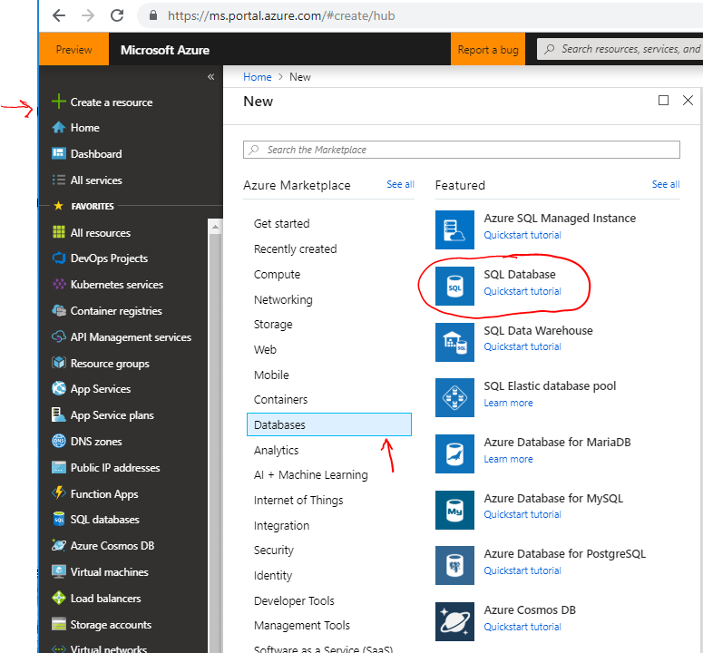
    
    In the **Create SQL Database** window **Basics** tab, select the resource group which you created in the previous step and provide a name for the database (`ClaimsDB`).  Then click on **Create new** besides field **Server**.

    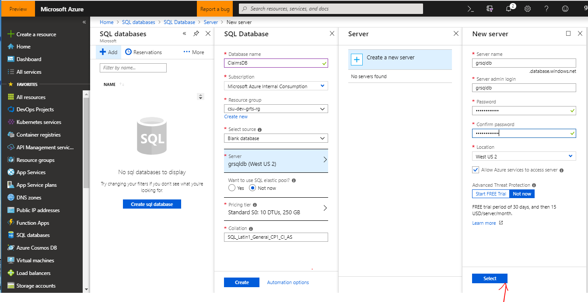

    Fill in the details in the **New Server** web page.  The **Server name** value should be unique as the SQL database server FQDN will be constructed with this name eg., <SQL_server_name>.database.windows.net. Use a pattern such as **<Your_Initial>sqldb** for the server name (Replace *Your_Initial* with your initials).

    Specify a **Server admin login** name.  Specify a simple **Password** containing numbers, lower and uppercase letters.  Avoid using special characters (eg., * ! # $ ...) in the password!

    For the **Location** field, use the same location which you specified for the resource group.

    See screenshot below.

    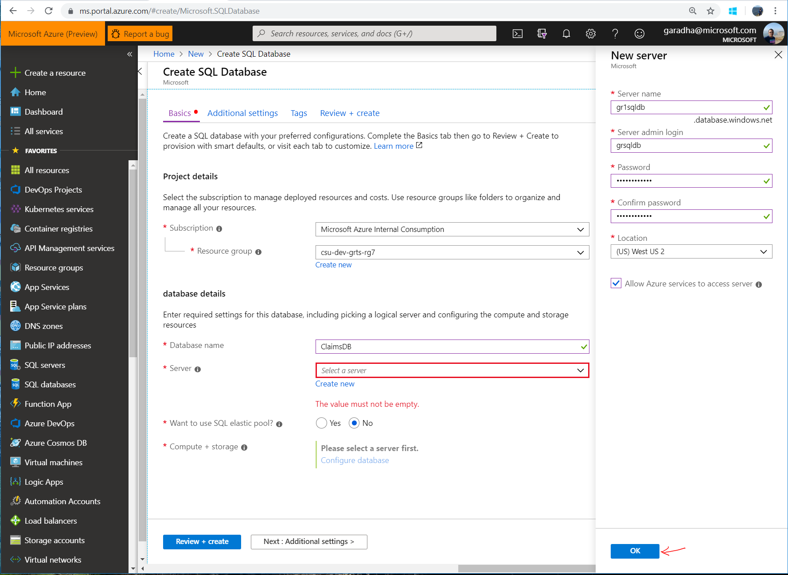

    Click on **OK**.

    In the **Basics** tab, click on **Configure database** and select the **Basic** SKU.  See screenshots below.

    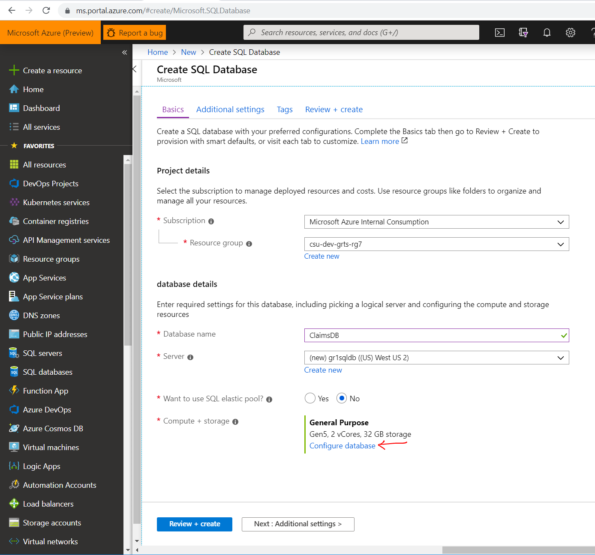

    

    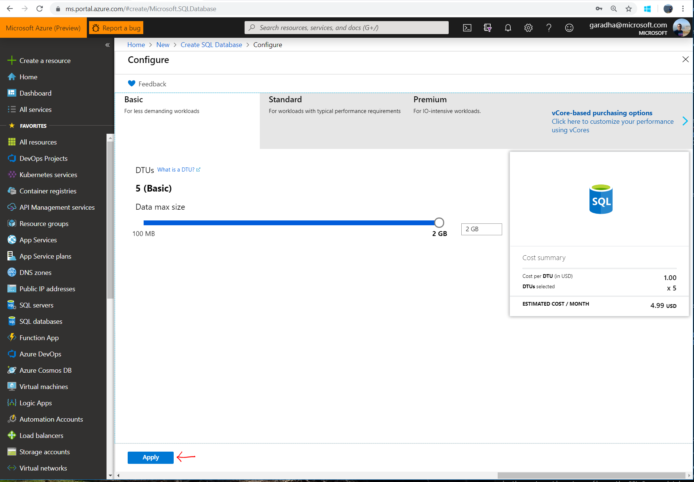

    Click **Apply**.

    Click on **Next : Networking >** at the bottom of the web page.  In the **Networking** tab, select *Public endpoint* for **Connectivity method**.  Also, enable the button besides **Allow Azure services and resources to access this server**.  Next, click on **Review + create**.  See screenshot below.

    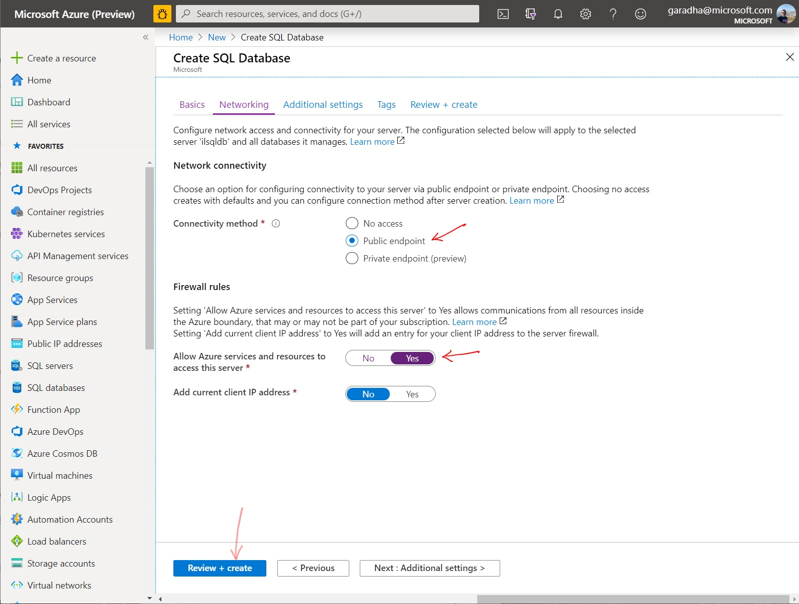

    Review and make sure all options you have selected are correct.

    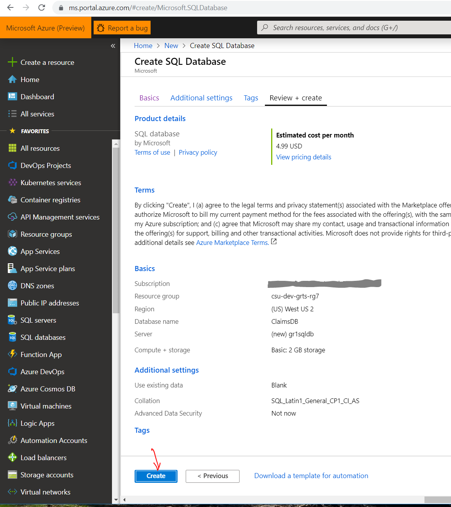

    Click **Create**.  It will take approx. 10 minutes for the SQL Server instance and database to get created.

4.  Configure a firewall for Azure SQL Server.

    Once the SQL Server provisioning process is complete, click on the database `ClaimsDB`. In the **Overview** tab, click on **Set server firewall** as shown in the screenshot below.

    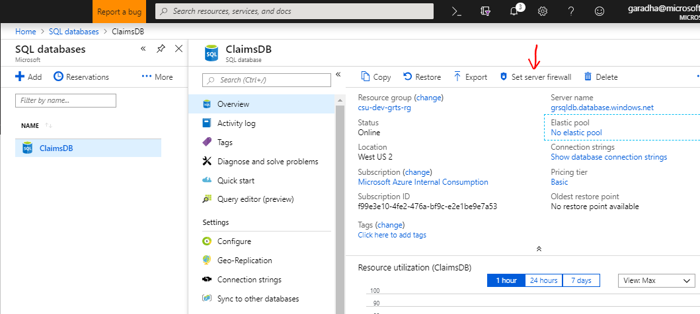

    In the **Firewall settings** tab, configure a *rule* to allow inbound connections from all public IP addresses as shown in the screenshots below.  Alternatively, if you know the Public IP address of your workstation/pc, you can create a rule to only allow inbound connections from your local pc.  Leave the setting for **Allow access to Azure services** ON.  See screenshot below.

    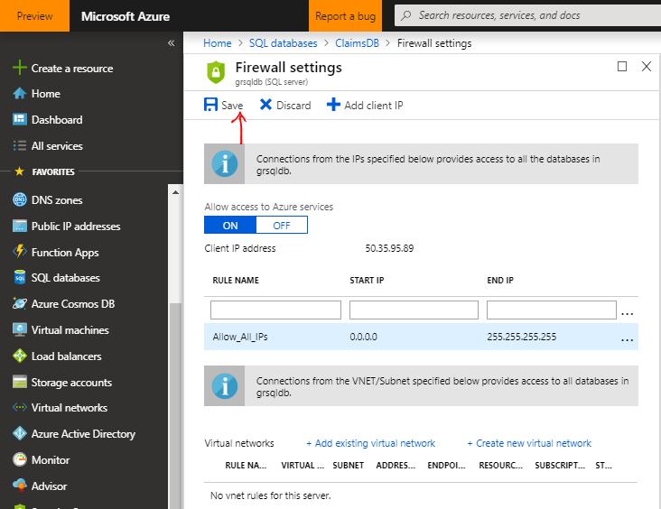

    Click on **Save**.

    >**NOTE**: Remember to delete the firewall rule setting once you have finished working on all labs in this project.

5.  Copy the Azure SQL Server database (ClaimsDB) connection string.

    In the **ClaimsDB** tab, click on **Connection strings** in the left navigational panel (blade).  See screenshot below.

    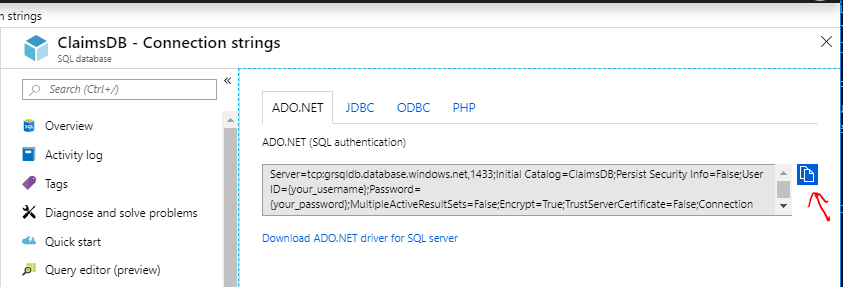

    Copy the SQL Server database connection string under the **ADO.NET** tab.  In the connection string, remove the listener port address including the 'comma' (**,1433**) before saving this string in a file.  If the **comma** and the port number are present in the connection string then application deployments will **fail**.  We will need the SQL Server db connection string in the next sections to configure the SQL Server database for the Claims API microservice.

### B. Provision a Linux CentOS VM on Azure
**Approx. time to complete this section: 45 Minutes**

The following tools (binaries) will be installed on the Linux VM (~ Bastion Host).

- Azure DevOps (VSTS) build agent (docker container). The build container will be used for running application and container builds.
- Azure CLI 2.0 client.  Azure CLI will be used to administer and manage all Azure resources including the AKS cluster resources.
- Git client.  The Git client will be used to clone this GitHub repository and then push source code changes to the forked repository.
- .NET Core SDK.  This SDK will be used to build and test the microservice application locally. 
- Kubernetes CLI (`kubectl`).  This CLI will be used for managing and introspecting the current state of resources deployed on the Kubernetes (AKS) cluster.
- Helm CLI (`helm`).  Helm is a package manager for Kubernetes and will be used to manage and monitor the lifecyle of application deployments on AKS.
- Istio CLI (`istioctl`).  [Istio](https://istio.io/docs/concepts/what-is-istio/) reduces complexity of managing microservice deployments by providing a uniform way to secure, connect, control and manage microservices.
- Docker engine and client.  Docker engine will be used to run the Azure DevOps build agent. It will also be used to build and run the Claims API microservice container locally. 

Follow the steps below to create the Bastion host (Linux VM) and install pre-requisite software on this VM.

1.  Fork this [GitHub repository](https://github.com/ganrad/aks-aspnet-sqldb-rest) to **your** GitHub account.

    In the browser window, click on **Fork** in the upper right hand corner to get a separate copy of this project added to your GitHub account.  You must be signed in to your GitHub account in order to fork this repository.

    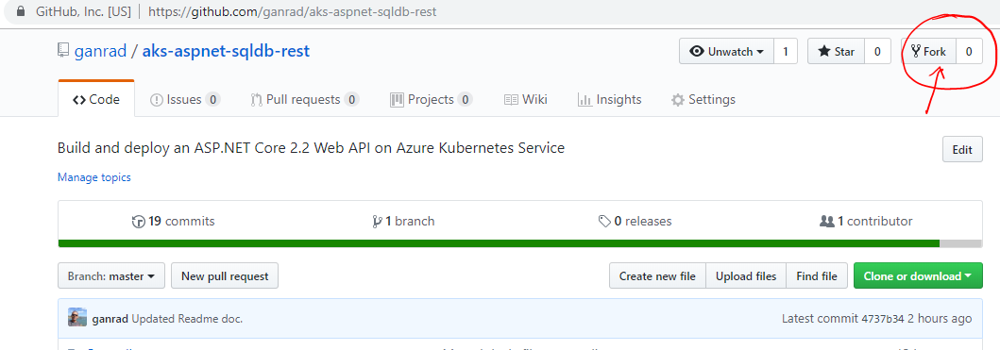

2.  Create a Linux CentOS VM (Bastion Host).

    Open the [Azure Cloud Shell](https://shell.azure.com) in a separate browser tab and use the command below to create a **CentOS 7.5** VM on Azure.  Make sure you specify the correct **resource group** name and provide a value for the *password*.  Once the command completes, it will print the VM connection info. in the JSON message (response).  Save the **Public IP address**, **Login name** and **Password** info. in a file.  Alternatively, if you prefer you can use SSH based authentication to connect to the Linux VM.  The steps for creating and using an SSH key pair for Linux VMs in Azure is described [here](https://docs.microsoft.com/en-us/azure/virtual-machines/linux/mac-create-ssh-keys).  You can then specify the location of the public key with the `--ssh-key-path` option to the `az vm create ...` command.

    ```bash
    $ az vm create --resource-group myResourceGroup --name k8s-lab --image OpenLogic:CentOS:7.5:latest --size Standard_B2s --data-disk-sizes-gb 128 --generate-ssh-keys --admin-username labuser --admin-password <password> --authentication-type password
    ```

3.  Login into the Linux VM via SSH.

    On a Windows PC, you can use a SSH client such as [Putty](https://putty.org/), [Git Bash](https://gitforwindows.org/) or the [Windows Sub-System for Linux (Windows 10)](https://docs.microsoft.com/en-us/windows/wsl/install-win10) to login into the VM.

    >**NOTE:** Use of Cloud Shell to SSH into the VM is **NOT** recommended.
    ```bash
    # SSH into the VM.  Substitute the public IP address for the Linux VM in the command below.
    $ ssh labuser@x.x.x.x
    #
    ```

4.  Format and mount a separate file system for docker storage.

    Docker engine stores container instances (writeable layers), images, build caches and container logs in `/var/lib/docker` directory.  As container images are built and instances are spawned, this directory tends to fill up pretty quickly.  To avoid running out of space on the OS file system, we will format a new partition on an empty data disk (created during VM provisioning), write a file system in the new partition and then mount the file system onto the docker storage directory.
    ```bash
    #
    # Partition the disk with fdisk
    $ (echo n; echo p; echo 1; echo ; echo ; echo w) | sudo fdisk /dev/sdc
    #
    # Write a file system to the partition using 'mkfs' command
    $ sudo mkfs -t xfs /dev/sdc1
    #
    # Mount the disk so it's accessible in the operation system
    $ sudo mkdir -p /var/lib/docker && sudo mount /dev/sdc1 /var/lib/docker
    #
    # Verify the disk got mounted property.  The output should display filesystem '/dev/sdc1' mounted on directory
    # '/var/lib/docker'
    $ df -h
    #
    # To ensure the drive remains mounted after rebooting the VM, add it to the '/etc/fstab' file
    #
    # First determine the UUID of the drive '/dev/sdc1'.  The output of this command should list the UUID's of 
    # of all drives on this system/VM.  Note down (Copy) the UUID of the '/dev/sdc1' drive.
    $ sudo -i blkid
    #
    # Use 'vi' or 'nano' editor to update the '/etc/fstab' file.  You will need to use 'sudo'.  Add a line as follows.
    # IMPORTANT : Substitute the UUID value of '/dev/sdc1' drive which you copied, output of previous command ('blkid').
    UUID=33333333-3b3b-3c3c-3d3d-3e3e3e3e3e3e   /var/lib/docker  xfs    defaults,nofail   1  2
    #
    # Verify the content of '/etc/fstab/ file.  Make sure the drive '/dev/sdc1' is listed in the output
    $ sudo cat /etc/fstab
    #
    ```

5.  Install Git client and clone [this repository](https://github.com/ganrad/aks-aspnet-sqldb-rest).

    When cloning the repository, make sure to use your Account ID in the GitHub URL.
    ```bash
    # Switch to home directory
    $ cd
    #
    # Install Git client
    $ sudo yum install -y git
    #
    # Check Git version number
    $ git --version
    #
    # Create a new directory for GitHub repositories.
    $ mkdir git-repos
    #
    # Change the working directory to 'git-repos'
    $ cd git-repos
    #
    # Clone your GitHub repository into directory 'git-repos'.  Cloning this repo. will allow you to make changes to the application artifacts in the forked GitHub project.
    # Substitute your GitHub Account ID in the URL.
    $ git clone https://github.com/<YOUR-GITHUB-ACCOUNT>/aks-aspnet-sqldb-rest.git
    #
    # Switch to home directory
    $ cd
    #
    ```

6.  Install a command-line JSON processor.

    Download [jq command line processor](https://stedolan.github.io/jq/) and install it on the VM.
    ```bash
    # Make sure you are in the home directory
    $ cd
    #
    # Create a directory called 'jq'
    $ mkdir jq
    #
    # Switch to the 'jq' directory
    $ cd jq
    #
    # Download the 'jq' binary and save it in this directory
    $ wget https://github.com/stedolan/jq/releases/download/jq-1.6/jq-linux64
    #
    # Switch back to the home directory
    $ cd
    #
    ```

7.  Install Azure CLI and login into your Azure account.
    ```bash
    # Install Azure CLI on this VM.
    #
    # Import the Microsoft repository key.
    $ sudo rpm --import https://packages.microsoft.com/keys/microsoft.asc
    #
    # Create the local azure-cli repository information.
    $ sudo sh -c 'echo -e "[azure-cli]\nname=Azure CLI\nbaseurl=https://packages.microsoft.com/yumrepos/azure-cli\nenabled=1\ngpgcheck=1\ngpgkey=https://packages.microsoft.com/keys/microsoft.asc" > /etc/yum.repos.d/azure-cli.repo'
    #
    # Install with the yum install command.
    $ sudo yum install -y azure-cli
    #
    # Check the Azure CLI version (Should be 2.0.54+)
    $ az -v
    #
    # Login to your Azure account.  Use your Azure login ID and password to login.
    $ az login -u <user name> -p <password>
    #
    ```

8.  Install Kubernetes CLI, Helm CLI, Istio CLI and .NET Core SDK on this VM.
    ```bash
    # Make sure you are in the home directory
    $ cd
    #
    # Install Helm v2.16.3
    # Create a new directory 'Helm' under home directory to store the helm binary
    $ mkdir helm
    $ cd helm
    $ wget https://get.helm.sh/helm-v2.16.3-linux-amd64.tar.gz
    $ tar -xzvf helm-v2.16.3-linux-amd64.tar.gz
    #
    # Switch back to home directory
    $ cd
    #
    # Install Kubernetes CLI
    # Create a new directory 'aztools' under home directory to store the kubectl binary
    $ mkdir aztools
    #
    # Install kubectl binary in the new directory
    $ az aks install-cli --install-location=./aztools/kubectl
    #
    # Install Istio Service Mesh CLI v1.4.5
    $ ISTIO_VERSION=1.4.5
    $ curl -sL "https://github.com/istio/istio/releases/download/$ISTIO_VERSION/istio-$ISTIO_VERSION-linux.tar.gz" | tar xz --directory=$HOME/aztools
    # 
    # Register the Microsoft key, product repository and required dependencies.
    $ sudo rpm -Uvh https://packages.microsoft.com/config/centos/7/packages-microsoft-prod.rpm
    #
    # Update the system libraries.  This command will take a few minutes (~10 mins) to complete.  Be patient!
    $ sudo yum update
    #
    # Install .NET Core 3.0 binaries
    $ sudo yum install -y dotnet-sdk-3.0
    #
    # Check .NET Core version (Should print 3.0.100)
    $ dotnet --version
    #
    # Install EF Core 3.0
    # This command installs dotnet-ef in ~/.dotnet/tools directory. so this directory has to be in
    # the Path !!
    $ dotnet tool install --global dotnet-ef --version 3.0
    #
    # Finally, update '.bashrc' file and set the path to jq, Helm and Kubectl binaries
    $ JQ=/home/labuser/jq
    $ KUBECLI=/home/labuser/aztools
    $ HELM=/home/labuser/helm/linux-amd64
    $ ISTIO=/home/labuser/aztools/istio-$ISTIO_VERSION/bin
    $ DOTNET_TOOLS=$HOME/.dotnet/tools
    $ echo "export PATH=$JQ:$KUBECLI:$HELM:$ISTIO:${DOTNET_TOOLS}:${PATH}" >> ~/.bashrc
    #
    ```

9.  (Optional) Install Kubernetes utilities.

    Install [power tools](https://github.com/ahmetb/kubectx) for `kubectl`.
    ```bash
    #
    # Install 'kubectx' and 'kubens' in ~/aztools/kubectx
    $ git clone https://github.com/ahmetb/kubectx $HOME/aztools/kubectx
    # Create sym links to the power tools - kubectx and kubens
    $ sudo ln -s $HOME/aztools/kubectx/kubectx /usr/local/bin/kubectx
    $ sudo ln -s $HOME/aztools/kubectx/kubens /usr/local/bin/kubens
    #
    ```

10. Install **docker-ce** container runtime.

    Refer to the commands below.  You can also refer to the [Docker CE install docs for CentOS](https://docs.docker.com/install/linux/docker-ce/centos/).

    ```bash
    #
    $ sudo yum install -y yum-utils device-mapper-persistent-data lvm2
    $ sudo yum-config-manager --add-repo https://download.docker.com/linux/centos/docker-ce.repo
    $ sudo yum install -y docker-ce docker-ce-cli containerd.io
    $ sudo systemctl enable docker
    $ sudo groupadd docker
    $ sudo usermod -aG docker labuser
    #
    ```

    LOGOUT AND RESTART YOUR LINUX VM BEFORE PROCEEDING.  You can restart the VM via Azure Portal.  Alternatively, use the command below to reboot the VM.
    ```bash
    $ sudo shutdown -r now
    #
    ```

    Once the Linux VM is back up, log back in to the VM via SSH.  Run the command below to verify **docker** engine is running.
    ```bash
    $ docker info
    ```

### C. Build and run the Claims API microservice locally on the Linux VM
**Approx. time to complete this section: 1 hour**

In this section, we will work on the following tasks
- Configure the Azure SQL Server connection string in the Claims API microservice (source code)
- Build the Claims API microservice using the .NET Core 3.0 SDK
- Run the .NET Core *Entity Framework* migrations to create the relational database tables in Azure SQL Server provisioned in [Section A](#a-deploy-an-azure-sql-server-and-database).  These tables will be used to persist Claims records.
- Run the Claims API microservice locally using the .NET Core 3.0 SDK
- Build the microservice Docker container and run the container

Before proceeding, login into the Linux VM using SSH.

1.  Update the Azure SQL Server database connection string value in the **appsettings.json** file.

    The attribute **SqlServerDb** holds the database connection string and should point to the Azure SQL Server database instance which we provisioned in [Section A](#a-deploy-an-azure-sql-server-and-database).  You should have saved the SQL Server connection string value in a file.

    Refer to the comands below to edit the SQL Server database *Connection string*...
    ```bash
    # Switch to the source code directory.  This is the directory where you cloned this GitHub repository.
    $ cd git-repos/aks-aspnet-sqldb-rest
    #
    ```
    
    Edit the `appsettings.json` file using **vi** or **nano** editor and configure the SQL Server connection string value.  Replace the variable tokens and specify correct values for **SQL_SRV_PREFIX**, **SQL_USER_ID** and **SQL_USER_PWD** in the connection string.

    Variable Token | Description
    -------------- | -----------
    SQL_SRV_PREFIX | Name of the Azure SQL Server instance. Eg., <Your_Initial>sqldb
    SQL_USER_ID | User ID for the SQL Server instance
    SQL_USER_PWD | User password for the SQL Server instance 

    Do not include the curly braces and the hash symbols (#{ xxx }#) when specifying the values.  See the screenshot below.

    

2.  Build the Claims API microservice using the .NET Core SDK.

    ```bash
    #
    # Build the Claims API microservice
    $ dotnet build
    #
    ```

3.  Create and run the database migration scripts. 
  
    This step will create the database tables for persisting *Claims* records in the Azure SQL Server database.  Refer to the command snippet below.
    ```bash
    # Run the .NET Core CLI command to create the database migration scripts
    $ dotnet-ef migrations add InitialCreate
    #
    # Run the ef (Entity Framework) migrations
    $ dotnet-ef database update
    #
    ```

    Login to the Azure Portal and check if the database tables have been created. See screenshot below.

    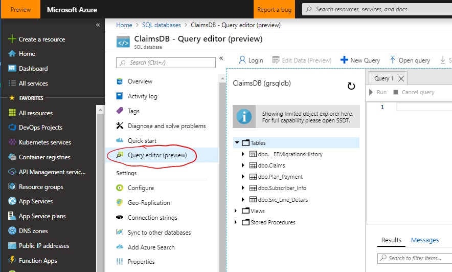

4.  Run the Claims API locally using the .NET Core SDK.

    Run the Claims API microservice in a Linux terminal window.  Refer to the commands below.
    ```bash
    # Make sure you are in the Claims API source code directory
    $ pwd
    /home/labuser/git-repos/aks-aspnet-sqldb-rest
    #
    # Run the microservice
    $ dotnet run
    #
    # When you are done testing:
    #   Press 'Control + C' to exit the program and return to the terminal prompt ($)
    #
    ```

    Login to the Linux VM using another SSH terminal session.  Use the **Curl** command to invoke the Claims API end-point.  Refer to the command snippet below.
    ```bash
    # Use curl command to hit the claims api end-point.  
    $ curl -i http://localhost:5000/api/v1/claims
    #
    ```

    The API end-point should return a 200 OK HTTP status code and also return one claim record in the HTTP response body.  See screenshot below.

    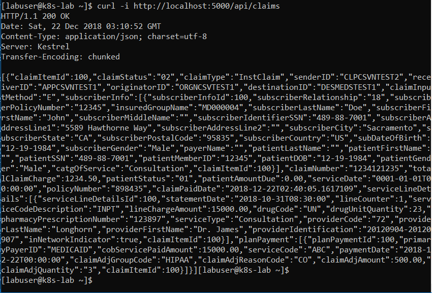

5.  Build and run the Claims API with Docker for Linux containers.

    In the SSH terminal window where you started the application (dotnet run), press Control-C to exit the program and return to the terminal prompt (`$`).  Then execute the instructions (see below) in this terminal window.
    ```bash
    # Make sure you are in the Claims API source code directory.  If not switch ($ cd ...).
    $ pwd
    /home/labuser/git-repos/aks-aspnet-sqldb-rest
    #
    # Run the docker build.
    # The build will take a few minutes to download both the .NET core build and run-time 
    # containers!
    # NOTE:
    # The 'docker build' command does the following (Review the 'dockerfile'):
    # 1. Build the dotnet application
    # 2. Layer the application binaries on top of a base container image
    # 3. Create a new application container image
    # 4. Save the built container image on the host (local machine)
    #
    # DO NOT forget the dot '.' at the end of the 'docker build' command !!!!
    # The '.' is used to set the context directory (path to the dockerfile) for the docker build.
    #
    $ docker build -t claims-api .
    #
    # List the docker images on this VM.  You should see two container images -
    # - mcr.microsoft.com/dotnet/core/sdk
    # - mcr.microsoft.com/dotnet/core/aspnet
    # Compare the sizes of the two dotnet container images and you will notice the size of the runtime image is pretty small ~ 207MB when compared to the 'build' container image ~ 689MB.
    $ docker images
    #
    # (Optional : Best Practice) Delete the intermediate .NET Core build container as it will consume unnecessary 
    # space on your build system (VM).
    $ docker rmi $(docker images -f dangling=true -q)
    #
    # Run the application container
    $ docker run -it --rm -p 5000:80 --name test-claims-api claims-api
    #
    # When you are done testing:
    #   Press 'Control + C' to exit the program and return to the terminal prompt ($)
    #
    ```

6.  Invoke the Claims API HTTP end-point.

    Switch to the other SSH terminal window and this time invoke the Claims API HTTP end-points using the provided functional test shell script `./shell-scripts/start-load.sh`
    ```bash
    # The shell script './shell-scripts/start-load.sh' calls the Claims API end-points and retrieves,
    # inserts, updates and deletes (CRUD) both institutional and professional claims records from/to
    # the Azure SQL Server database.
    #
    # Make sure you are in the project root directory (check => $ pwd)
    #
    $ chmod 700 ./shell-scripts/start-load.sh
    #
    # Substitute values for -
    #  - No. of runs : eg., 1, 2, 3, 4 ....
    #  - hostname and port : eg., localhost:5000
    $ ./shell-scripts/start-load.sh <No. of runs> <hostname and port> ./test-data
    #
    ```

    In the SSH terminal window where you started the application container (docker run), press Control-C to exit out of the program and return back to the terminal prompt.

You have now successfully tested the Claims API microservice locally on this VM.

### D. Deploy the Azure DevOps Services build agent
**Approx. time to complete this section: 30 minutes**

Use one of the options below for deploying the *Azure DevOps Services* self-hosted build agent on the Linux VM.  **Option 1** is recommended for advanced users who are well versed in container technology and are familiar with docker engine. Alternatively, if you are new to containers, it's best to follow along the instructions in **Option 2**.

Although the Azure DevOps build agent (formerly VSTS build agent) container image is currently supported and available for download from docker hub, for production deployments Microsoft recommends customers to build their own Azure DevOps agent container images (*Option 1*).

**Option 1:**
This solution affords more flexibility allowing customers to include additional application build tools and utilities within the image to meet their specific needs and requirements.  To build and run the Azure DevOps self-hosted build agent, refer to one of the links below. 
- [Build and deploy Azure DevOps Pipeline Agent on AKS](https://github.com/ganrad/Az-DevOps-Agent-On-AKS)
- [Azure DevOps Services Self-hosted Linux agents](https://docs.microsoft.com/en-us/azure/devops/pipelines/agents/v2-linux?view=azure-devops)

**Option 2:**
Download the [Azure DevOps (VSTS) build agent](https://hub.docker.com/_/microsoft-azure-pipelines-vsts-agent) container image from docker hub and run a instance on the Linux VM.

If you haven't already, login to the Linux VM using a SSH terminal session.

1.  Pull the Azure DevOps (VSTS) build agent container from docker hub.

    It will take approx. 20+ minutes to download the image (Size ~ 10.6 GB).  Take a coffee break or treat yourself to a cookie!
    ```bash
    # This command will take approx. 20 mins to download the Azure DevOps Pipeline (VSTS) build agent container image
    $ docker pull mcr.microsoft.com/azure-pipelines/vsts-agent:ubuntu-16.04-docker-18.06.1-ce-standard
    #
    # List the images on the system/VM
    $ docker images
    #
    ```

2.  Generate an Azure DevOps (VSTS) personal access token (PAT).

    The PAT token will be used to connect the Azure DevOps build agent to your Azure DevOps account.

    Login to [Azure DevOps](https://dev.azure.com) using your account ID. In the upper right, click on your profile image and click **Security**.  

    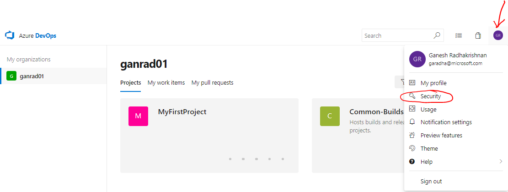

    Click on **New Token** to create a new PAT.  See screenshot below.

    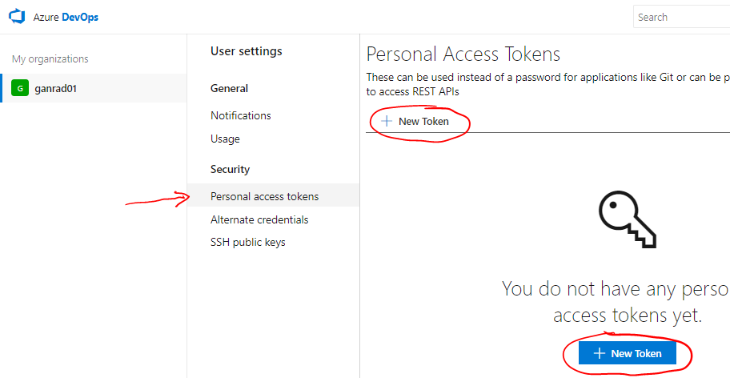

    In the **Create a new personal access token** tab, provide a **Name** for the token, check the radio button besides **Full access**, select an **Expiration** period and click **Create**.  See screenshot below.

    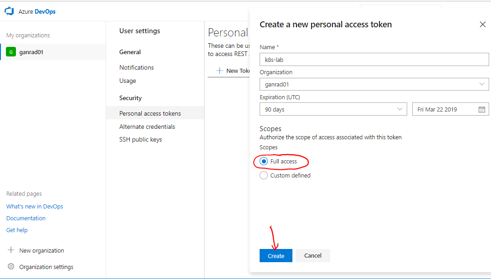

    In the next page, make sure to **copy and store** the PAT (token) into a file.  Keep in mind, you will not be able to retrieve this token again.  Incase you happen to lose or misplace the token, you will need to generate a new PAT and use it to reconfigure the VSTS build agent.  So save this PAT (token) to a file.

3.  Start the Azure DevOps (VSTS) build container.

    The *Continuous Integration* (CI) and *Continuous Deployment* (CD) pipelines deployed on Azure DevOps will be executed by the build container on the Linux VM.

    Refer to the table below to set the parameter values for the build container correctly.

    Parameter | Value
    --------- | -----
    VSTS_TOKEN | VSTS PAT Token.  This is the value which you copied and saved in a file in the previous step.
    VSTS_ACCOUNT | VSTS Organization name.  An Org. is a container for DevOps projects in Azure DevOps (VSTS) platform.  It's usually the first part (Prefix) of the VSTS URL (eg., **Prefix**.visualstudio.com).  If you are using Azure DevOps URL, then it is the last part (ContextPath) of the URL (eg., dev.azure.com/**ContextPath**).
    VSTS_POOL | VSTS Agent Pool Name.  For this lab, use value *Default*.  **NOTE:** In case you use a different name for the pool, you will need to first create this pool in your VSTS account.  Otherwise the agent will not be able to connect to the pool.

    In the Linux terminal window, start the Azure DevOps (VSTS) build container.  See command snippet below.
    ```bash
    # Substitute the correct values for VSTS_ACCOUNT, VSTS_POOL and VSTS_TOKEN before running this command
    #
    $ docker run -e VSTS_ACCOUNT=<Org. Name> -e VSTS_TOKEN=<PAT Token> -e VSTS_POOL=Default -v /var/run/docker.sock:/var/run/docker.sock --name vstsagent --rm -it mcr.microsoft.com/azure-pipelines/vsts-agent:ubuntu-16.04-docker-18.06.1-ce-standard
    #
    ```

    The VSTS build agent will initialize and you should see a message indicating "Listening for Jobs".  See below.  
    ```
    Determining matching VSTS agent...
    Downloading and installing VSTS agent...

    >> End User License Agreements:

    Building sources from a TFVC repository requires accepting the Team Explorer Everywhere End User License Agreement. This step is not required for building sources from Git repositories.

    A copy of the Team Explorer Everywhere license agreement can be found at:
      /vsts/agent/externals/tee/license.html


    >> Connect:

    Connecting to server ...

    >> Register Agent:

    Scanning for tool capabilities.
    Connecting to the server.
    Successfully added the agent
    Testing agent connection.
    2018-12-23 05:26:36Z: Settings Saved.
    Scanning for tool capabilities.
    Connecting to the server.
    2018-12-23 05:26:39Z: Listening for Jobs
    ```

    Minimize this terminal window for now as you will only be using it to view the results of an Azure DevOps build.  Before proceeding, open another terminal (WSL Ubuntu/Putty) window and login (SSH) into the Linux VM.

In subsequent sections, we will configure *Azure DevOps Services* to use the build container as a *self-hosted* agent to perform application and container builds.

### E. Deploy Azure Container Registry
**Approx. time to complete this section: 10 minutes**

In this step, we will deploy an instance of Azure Container Registry (ACR) to store container images which we will build in later steps.  A container registry such as ACR allows us to store multiple versions of application container images in one centralized repository and consume them from multiple nodes (VMs/Servers) where our applications are deployed.

1.  Login to your Azure portal account.  Then click on **Container registries** in the navigational panel on the left.  If you don't see this option in the nav. panel then click on **All services**, scroll down to the **COMPUTE** section and click on the star beside **Container registries**.  This will add the **Container registries** option to the service list in the navigational panel.  Now click on the **Container registries** option.  You will see a page as displayed below.

    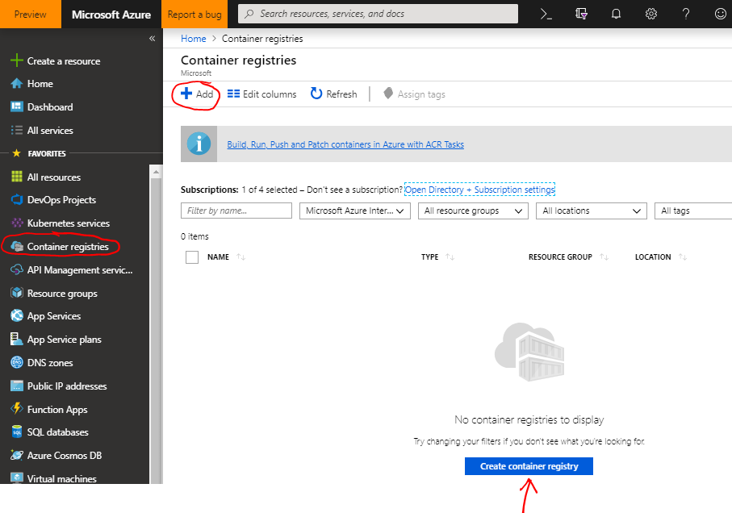

2.  Click on **Add** to create a new ACR instance.  Give a meaningful name to your registry and make a note of it.  Select an Azure **Subscription**, select the **Resource group** which you created in [Section A](#a-deploy-an-azure-sql-server-and-database) and leave the **Location** field as-is.  The location should default to the location assigned to the resource group.  Select the **Basic** pricing tier (SKU).  Click **Create** when you are done.

    **IMPORTANT NOTES:**
    - Keep in mind, you will need an **Premium** SKU ACR instance in order to work on *Exercise 4*.  Hence select the **Premium** SKU if you intend to work on this challenge later.

    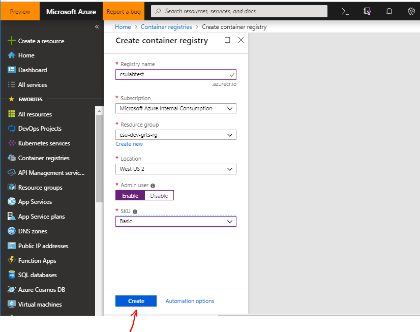

### F. Define and execute Claims API Build Pipeline in Azure DevOps Services
**Approx. time to complete this section: 1 Hour**

In this step, we will create a **Continuous Integration** (CI) pipeline in Azure DevOps.  This pipeline will contain the tasks for building the microservice (binary artifacts) and packaging (layering) it within a docker container.  During the application container build process, the application binary is layered on top of a base docker image (mcr.microsoft.com/dotnet/core/aspnet).  Finally, the application container image is pushed into the ACR which you deployed in [Section E](#e-deploy-azure-container-registry).

Before proceeding with the next steps, take a few minutes and go thru the **dockerfile** and Claims API source files in the GitHub repository.  This will help you understand how the container is built when the continuous integration (CI) pipeline is executed in Azure DevOps Services.

1.  Enable/Verify *Preview* features in Azure DevOps Services.

    If you haven't already done so, login to [Azure DevOps](https://www.visualstudio.com/team-services/) using your Microsoft Live ID (or Azure AD ID).  Click on your profile picture (top right corner) and then click on **Preview Features** as shown in the screenshot below.

    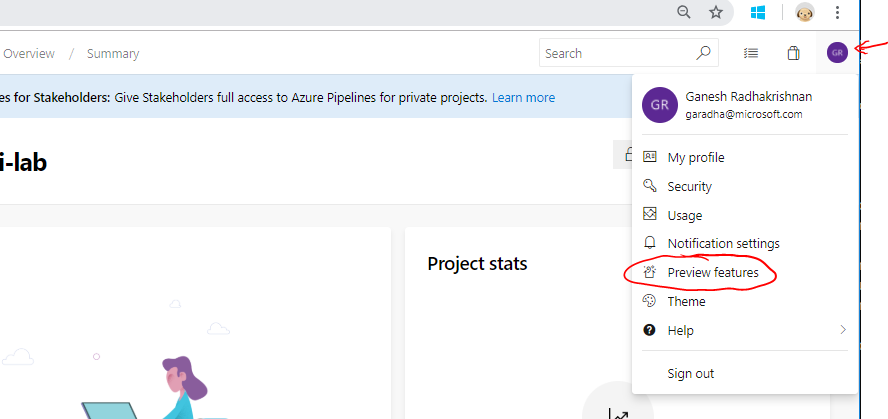

    Ensure the following *Preview* features are **disabled (Off)**.
    - Analytics Views (Optional)
    - Experimental Themes
    - Multi-stage pipelines
    - New account manager (Optional)
    - New service connections experience
    - New Test Plans Page
    - New user hub
    - Project Permissions Settings page

2.  Create an Azure DevOps *Organization* and *Project*.

    (Optional) Create an *Organization* and give it a meaningful name (eg., <Your_Short_Name>).

    Next, create a new *DevOps Project*. Assign a meaningful name to your project (eg., **claims-api-lab**).  Select the **Private** project radio button.  See screenshots below.

    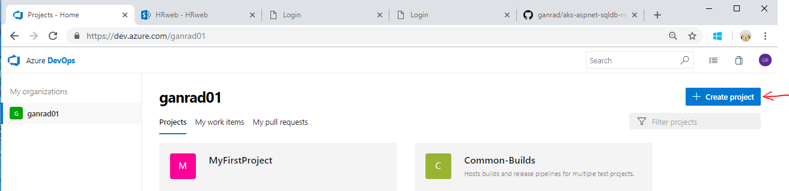

    

3.  Create a **Build** pipeline and define tasks to build application binaries and a *claims-api* container image.

    Click on **Pipelines** in the left navigational menu and select *Builds*.  Then click on **New pipeline**.

    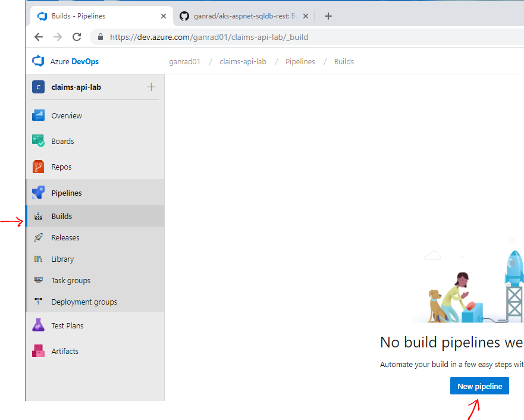

    In the *New pipeline* definition wizard, click on **Use the classic editor** as shown in the screenshot below.  We will use the **YAML Delivery Pipeline** feature in a subsequent lab.

    

    In the **Select a source** page, select *GitHub* as the source repository. Give your connection a *name* and then select *Authorize using OAuth* link.  Optionally, you can use a GitHub *personal access token* instead of OAuth.  When prompted, sign in to your **GitHub account**.  Then select *Authorize* to grant access to your Azure DevOps account.

    Once authorized, select the **GitHub Repo** which you forked in [Section B](#b-provision-a-linux-centos-vm-on-azure) above.  Make sure you replace the account name in the **GitHub URL** with your account name.  Leave the value in the **Default branch for manual and scheduled builds** field as **master**.  Then hit continue.

    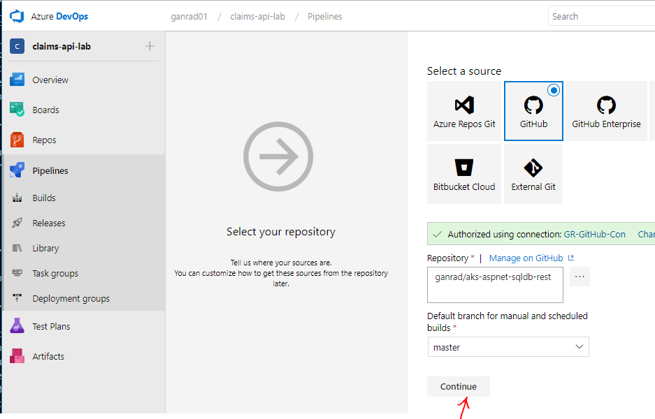

    Search for text *Docker* in the **Select a template** field and then select *Docker container* task.  Click **Apply**.

    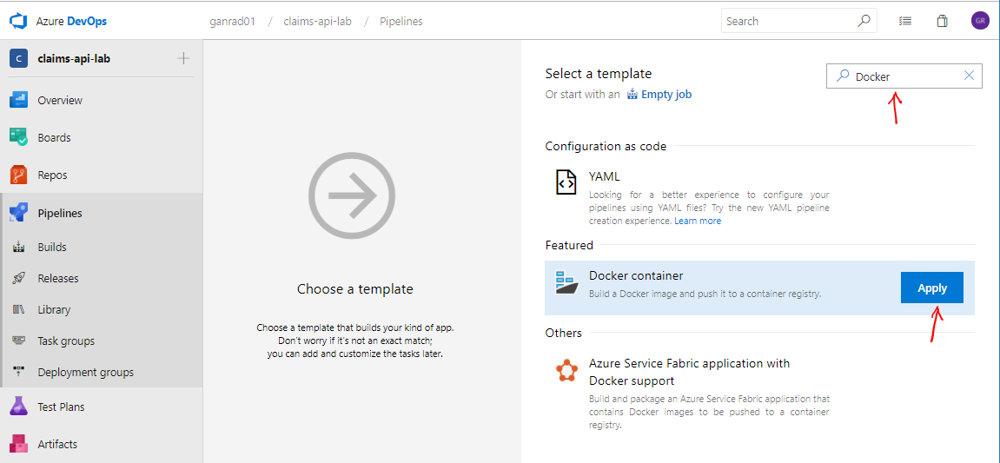

    Select *Default* in the **Agent Pool** field.  The Azure DevOps build agent which you deployed in [Section D](#d-deploy-the-azure-devops-services-build-agent) is connected to this *pool* and listens for build requests on a queue.  When you queue a build, the build executes on an agent which is connected to this **Default** pool.

    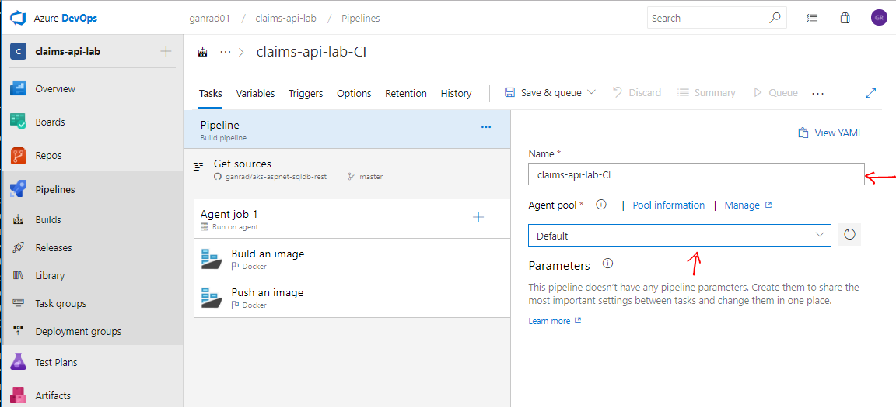

    **Save** your build pipeline before proceeding.

    >**NOTE:** Make sure the build pipeline **name** does not have a space or any special character like '/' in it.

    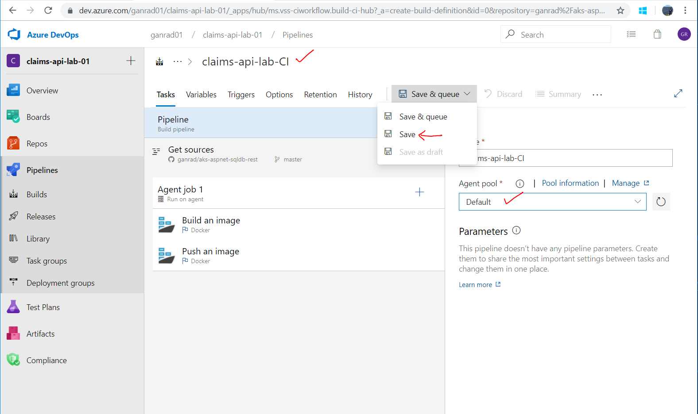

    Copy the **Helm** chart folder from the source directory to the staging directory.  Click on the plus symbol beside **Agent job 1**.  Search by text **copy**, select the extension **Copy Files** and click **Add**. See screenshot below.

    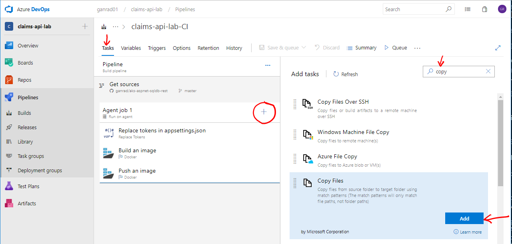
    
    Move the **Copy Files to:** task to the top, above the **Build an image** task.  Specify values for fields **Source folder**, **Contents** and **Target Folder** as shown in the screenshot below.

    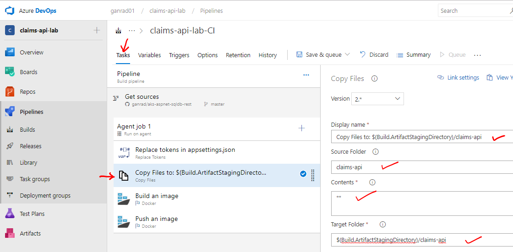

    Next, we will package the application binary within a container image.  Review the **dockerfile** in the source repository to understand how the application container image is built.

    Click on the **Build an image** task on the left panel.  Specify correct values for the following fields.

    - Task version = `0.*`
    - Display name = `Build container image`
    - Container Registry Type = `Azure Container Registry`
    - Azure Subscription = Select your Azure Subscription.  Click **Drop Down button on authorize button**, select advance option and select service principal authenticatoin and then select myrsourcegroup-##### and click Ok.
    - Azure Container Registry = Select ACR which you provisioned in [Section E](#e-deploy-azure-container-registry) above.
    - Action = `Build an image`
    - Docker File = `dockerfile`
    - Image Name = `claims-api:$(Build.BuildId)`
    - Qualify Image Name = Enable checkbox.
    - Include Latest Tag = Enable checkbox.

    See screenshot below.

    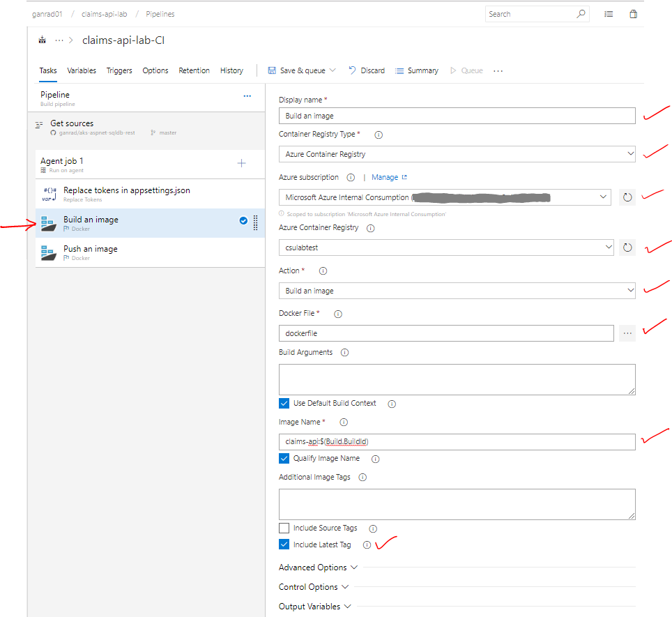

    Once the application container image has been built, it has to be pushed into the ACR.

    Click on the **Push an image** task on the left panel.  Specify correct values for the following fields.

    - Task version = `0.*`
    - Display name = `Push container image to ACR`
    - Container Registry Type = `Azure Container Registry`
    - Azure Subscription = Select your Azure Subscription.
    - Azure Container Registry = Select ACR which you provisioned in [Section E](#e-deploy-azure-container-registry) above.
    - Action = `Push an image`
    - Image Name = `claims-api:$(Build.BuildId)`
    - Qualify Image Name = Enable checkbox.
    - Include Latest Tag = Enable checkbox.

    See screenshot below.

    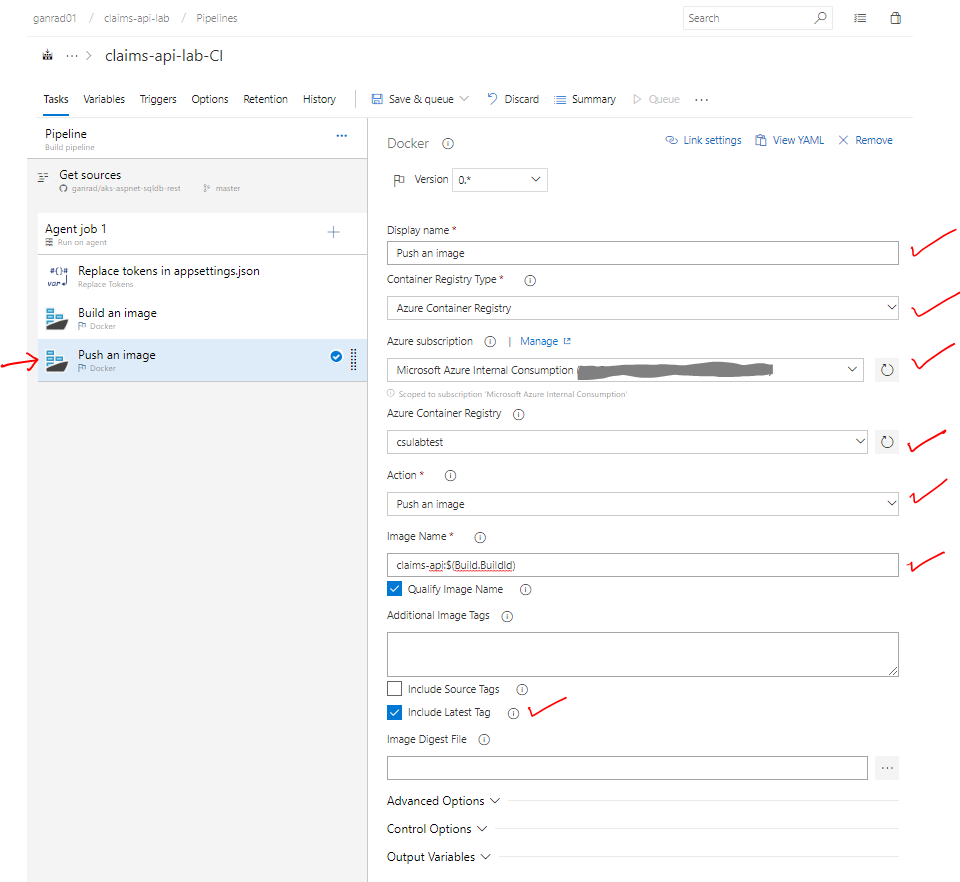

    Next, publish the contents of the **Helm** chart directory to the artifact staging (**drop**) location.  The Helm chart will be used in the release pipeline [Section H](#h-define-and-execute-claims-api-release-pipeline-in-azure-devops-services) for deploying the Claims API microservice on AKS. 
    
    Click on the plus symbol beside **Agent job 1**.  Search by text **publish artifact**, select the extension **Publish Build Artifacts** and click **Add**.  See screenshot below.

    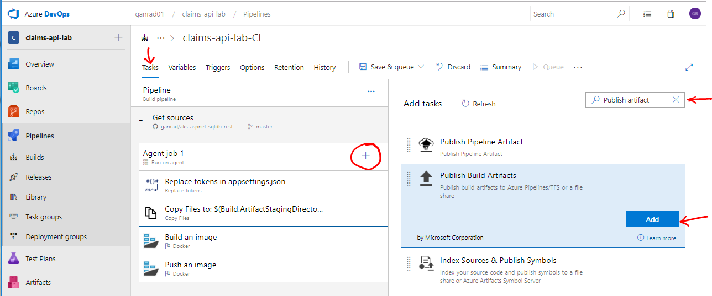

    Move the **Publish Artifact:drop** task below the **Push an image** task.  Leave the default values as is.

    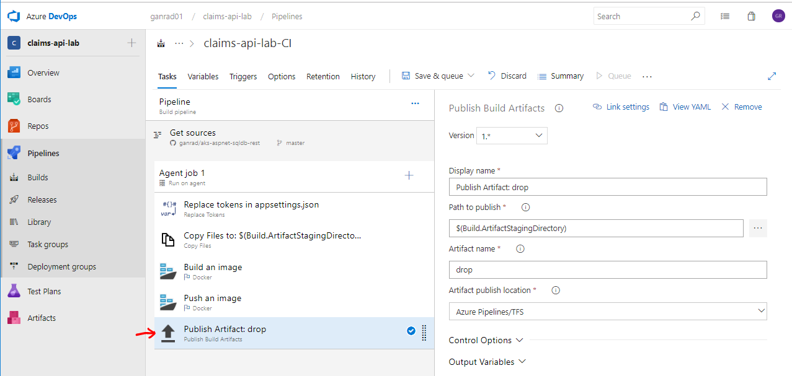

4.  Run the application and container image builds.

    At the top of the page, click **Save and Queue** to save the build definition and queue it for execution. Click on the **Build number** on the top of the page to view the progress of the build.  Wait for the build process to finish.  When all build tasks complete OK and the build process finishes, you will see the screen below.

    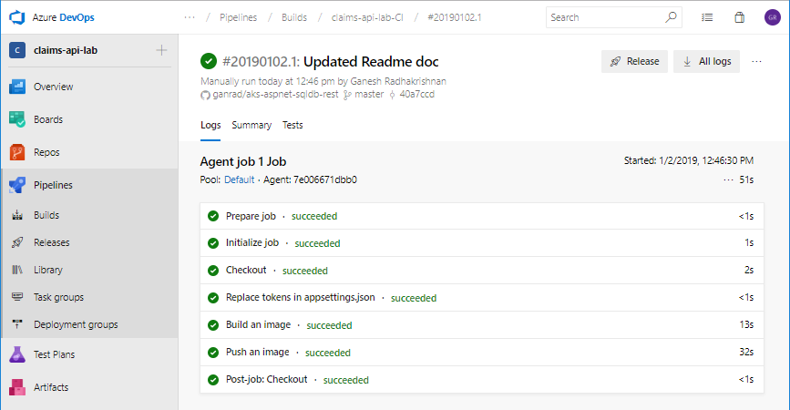

    Switch to the Azure DevOps build agent terminal window and you will notice that a build request was received from Azure DevOps and processed successfully. See below.

    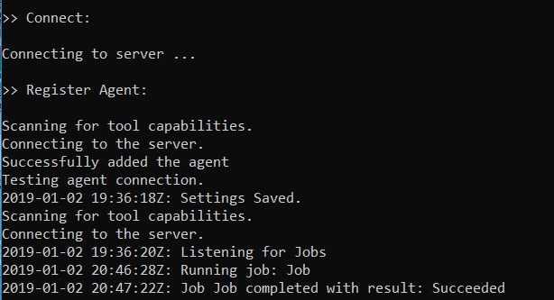

    Login to the Azure portal, open the blade for *Azure Container Registry* and verify that the container image for Claims API microservice (`claims-api:latest`) has been pushed into the registry.

    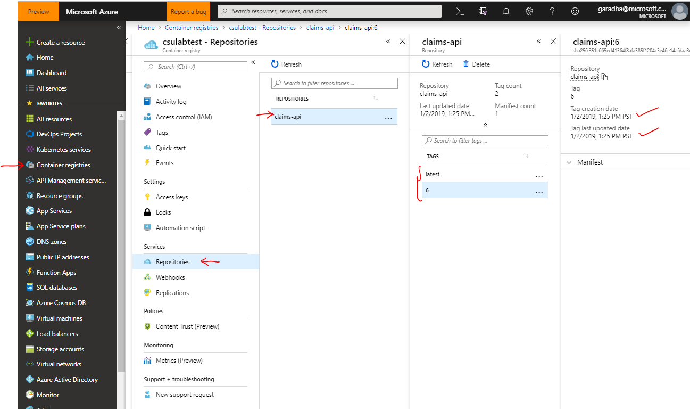

You have now successfully **built** the Claims API microservice container image and pushed it to the Azure Container Registry.

**IMPORTANT NOTES:**
- Access the *Repositories* blade of your ACR instance in Azure Portal.
- Note down the value of the latest **Tag** (Build ID number) of the Claims API container image. The **Build ID number** will represent version **v1** of the Claims API microservice. You will be using this image **Tag** value (ID number) to implement 
  - **Canary** application deployments in a subsequent section.
  - **Intelligent request routing** and traffic splitting in the **Istio** *Service Mesh* extension project.

### G. Create an Azure Kubernetes Service cluster and deploy Claims API microservice
**Approx. time to complete this section: 1 Hour**

In this step, we will first deploy an AKS cluster on Azure.  We will then use **Helm** package manager CLI to deploy the Claims API microservice on AKS.

Helm has become the de-facto tool for managing the lifecyle of containerized applications on Kubernetes.  With Helm, Kubernetes resources for a given application are packaged within a *Chart*.  When a Chart is deployed to Kubernetes, Helm creates a new *Release*.  A given Chart can be updated and deployed multiple times.  Each deployment creates a new *Revision* for the release.  A specific deployment can also be rolled back to a previous revision and/or deleted.  A Chart can also be deployed multiple times (multiple releases).  We won't be discussing the internals of Helm as it is beyond the scope of this project.  Refer to the Helm documentation for details (Links provided above).

Helm Chart templates for deploying the Claims API (`claims-api`) container on AKS are provided in the `./claims-api` folder in this GitHub repository.  Before proceeding with the next steps, feel free to inspect the resource files in the Helm Chart directory.  Kubernetes resources (Object definitions) are usually specified in manifest files (yaml/json) and then submitted to the API Server.  The API server is responsible for instantiating corresponding objects and bringing the state of the system to the desired state. Review the Kubernetes manifest files under the `./claims-api/templates` sub-directory.

Follow the steps below to provision the AKS cluster and deploy the Claims API microservice.
1.  Ensure the *Resource provider* for AKS service is enabled (registered) for your subscription.

    A quick and easy way to verify this is, use the Azure portal and go to *->Azure Portal->Subscriptions->Your Subscription->Resource providers->Microsoft.ContainerService->(Ensure registered)*.  Alternatively, you can use Azure CLI to register all required service providers.  See below.
    ```bash
    $ az provider register -n Microsoft.Network
    $ az provider register -n Microsoft.Storage
    $ az provider register -n Microsoft.Compute
    $ az provider register -n Microsoft.ContainerService
    ```

2.  Check Kubernetes CLI version and available AKS versions.

    (If you haven't already) Open a SSH terminal window and login to the Linux VM (Bastion host).  Refer to the command snippet below.
    ```bash
    # Check if kubectl is installed OK
    $ kubectl version -o yaml
    #
    # List the AKS versions in a specific (US West 2) region
    $ az aks get-versions --location westus2 -o table 
    ```

3.  Provision an AKS cluster. Please make sure you update the unique id in  resource group name and update the service principal Application ID and Password from the environment details page.


    >**NOTE:** Follow the steps in one of the options **A** or **B** below for deploying the AKS cluster.  If you would like to explore deploying containers on **Virtual Nodes** in the [extensions](./extensions) projects, follow the steps in option **B** below.  Otherwise, follow the steps in option **A**. 
    **A.** Use the latest supported Kubernetes version to deploy the AKS cluster.  At the time of this writing, version `1.11.5` was the latest AKS version. 

       Refer to the commands below to create the AKS cluster.  It will take a few minutes (< 10 mins) for the AKS cluster to get provisioned. 
       ```bash
       # Create a 2 Node AKS cluster v1.15.5.  This is not the latest patch release.
       # We will upgrade to the latest patch release in a subsequent lab/Section. 
       # The 'az aks' command below will provision an AKS cluster with the following settings -
       # - Kubernetes version ~ 1.15.5
       # - No. of application/worker nodes ~ 2
       # - RBAC ~ Disabled
       # - Location ~ US West 2
       # - DNS Name prefix for API Server ~ akslab
       # - You need to replace the <app-id> and <app-password> with the service principal app id and app password. you can get these details from the environment details.
       $ az aks create --resource-group myResourceGroup-###### --name akscluster --location westus2 --node-count 2 --dns-name-prefix akslab --generate-ssh-keys --disable-rbac --kubernetes-version "1.15.10" --service-principal <app-id> --client-secret <app-password>

       #
       # Verify status of AKS cluster
       $ az aks show -g myResourceGroup -n akscluster --output table
       ```
    **B.** With this option, the AKS cluster will be provisioned in a private virtual network on Azure.  You will need **Owner** level permission (role) for the Azure Subscription in order to proceed with the next steps.

       ```bash
       # Create a virtual network
       $ az network vnet create \
         --resource-group myResourceGroup \
         --name myVnet \
         --address-prefixes 10.0.0.0/8 \
         --subnet-name myAKSSubnet \
         --subnet-prefix 10.240.0.0/16
       #
       # Create a separate subnet for virtual nodes (to be used later).
       $ az network vnet subnet create \
         --resource-group myResourceGroup \
         --vnet-name myVnet \
         --name myVirtualNodeSubnet \
         --address-prefixes 10.241.0.0/16
       #
       # Create a service principal to allow AKS to interact with other Azure resources
       # NOTE: Make a note of the appId and password.
       # IMPORTANT: Save the appId and password in a file.  You will need to use these values
       # while executing the hands-on labs in the 'extensions' directory!!
       #
       $ az ad sp create-for-rbac --skip-assignment
       #
       # Get the VNET resource id => vnetId
       $ az network vnet show --resource-group myResourceGroup --name myVnet --query id -o tsv
       #
       # Assign permissions to the virtual network
       # Substitute the correct values for appId and vnetId.
       $ az role assignment create --assignee <appId> --scope <vnetId> --role Contributor 
       #
       # Get the subnet resource ID provisioned for the AKS Cluster
       # Take a note of the AKS Subnet resource ID => subnetId
       $ az network vnet subnet show --resource-group myResourceGroup --vnet-name myVnet --name myAKSSubnet --query id -o tsv
       #
       # Provision the AKS cluster within a private VNET
       # Substitute correct values for appId, password & subnetId
       $ az aks create \
         --resource-group myResourceGroup \
         --name akscluster \
         --location westus2 \
         --node-count 2 \
         --dns-name-prefix akslab \
         --generate-ssh-keys \
         --disable-rbac \
         --kubernetes-version "1.15.5" \
         --network-plugin azure \
         --service-cidr 10.0.0.0/16 \
         --dns-service-ip 10.0.0.10 \
         --docker-bridge-address 172.17.0.1/16 \
         --vnet-subnet-id <subnetId> \
         --service-principal <appId> \
         --client-secret <password>
       #
       # Verify status of AKS cluster
       $ az aks show -g myResourceGroup -n akscluster --output table
       ```

4.  Connect to the AKS cluster and initialize Helm package manager.
    ```bash
    # Configure kubectl to connect to the AKS cluster
    $ az aks get-credentials --resource-group myResourceGroup --name akscluster
    #
    # Check cluster nodes
    $ kubectl get nodes -o wide
    #
    # Check default namespaces in the cluster
    $ kubectl get namespaces
    #
    # Initialize Helm.  This will install 'Tiller' on AKS.  Wait for this command to complete!
    $ helm init --wait --upgrade
    #
    # Check if Helm client is able to connect to Tiller on AKS.
    # This command should list both client and server versions.
    $ helm version
    Client: &version.Version{SemVer:"v2.16.3", GitCommit:"e13bc94621d4ef666270cfbe734aaabf342a49bb", GitTreeState:"clean"}
    Server: &version.Version{SemVer:"v2.16.3", GitCommit:"e13bc94621d4ef666270cfbe734aaabf342a49bb", GitTreeState:"clean"}
    ```

5.  Deploy Traefik Kubernetes Ingress Controller.

    An ingress controller acts as a load balancer cum reverse proxy and intercepts HTTP traffic destined to applications deployed on the AKS cluster.  For production AKS deployments, it's usually a best practice (security reasons) to direct all inbound HTTP traffic into the cluster thru an Ingress Controller.  The ingress controller provides a single point of entry into the AKS cluster and is responsible for directing all HTTP traffic to respective service endpoints exposed on the cluster.

    For this project, we will deploy [Traefik Ingress Controller](https://github.com/helm/charts/tree/master/stable/traefik).  For AKS production deployments, either [NGINX Ingress Controller](https://github.com/nginxinc/kubernetes-ingress) or [Azure Application Gateway Controller](https://azure.github.io/application-gateway-kubernetes-ingress/) is recommended.
    ```bash
    # Deploy Traefik Ingress controller on AKS
    $ helm install stable/traefik --name ingress-traefik --namespace kube-system --set dashboard.enabled=true,dashboard.domain=db-traefik.akslab.com
    #
    # Retrieve the Public IP Address of Traefik load balancer service.
    $ kubectl get svc -n kube-system 
    # From the command output, record the Public IP address (External IP) for service 'ingress-traefik'.  You will need the IP address in the next step.
    #
    ```
    Update the DNS name resolver on your **local** workstation.  Select one of the options below for your PC/Workstation's Operating System.
    - **Linux/MacOS** : Update the `/etc/hosts` file.  On Linux systems, this file is used to lookup and resolve host name IP addresses.  Use *vi* or *nano* to edit this file.
    - **Windows** : Update the `C:\Windows\System32\Drivers\etc\hosts` file.

    Add an entry to the local DNS name resolver file as shown in the snippet below.
    ```
    # This entry resolves hostnames to the Traefik load balancer IP.  Substitute the correct value for
    # '<Traefik External IP Address>', obtained in previous step. 
    <Traefik External IP Address> db-traefik.akslab.com claims-api-prod.akslab.com claims-api-stage.akslab.com
    ```

    As part of deploying the *ingress-traefik* Kubernetes *Service* object, an Azure cloud load balancer gets auto-provisioned and configured. This load balancer accepts HTTP requests on a Public IP address and re-directes them to the respective microservice end-points on the AKS cluster.  Take a look at the Azure load balancer on the Azure Portal.

     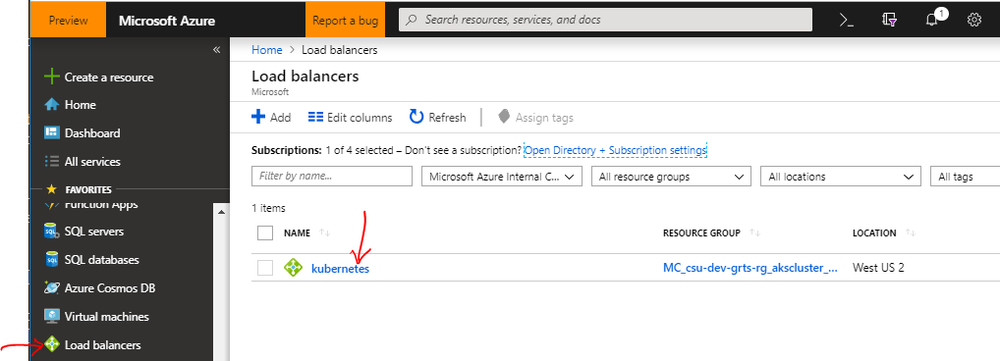
    
    **IMPORTANT NOTES:**
    - The Traefik Ingress Controller will not be used to load balance HTTP traffic to the *Claims API* microservice in the **development** and **qa-test** regions.  The Ingress Controller will be used for directing HTTP traffic in the **Production** region only.  You will work on this configuration in a later exercise.
    - Open a browser window/tab and make sure you are able to access the Traefik Dashboard [URL](http://db-traefik.akslab.com/).  Keep this window/tab open.

6.  Configure AKS to pull application container images from ACR.

    When AKS cluster is created, Azure also creates a 'Service Principal' (SP) to support cluster operability with other Azure resources.  This auto-generated service principal can be used to authenticate against the ACR.  To do so, we need to create an Azure AD role assignment that grants the cluster's SP access to the Azure Container Registry.

    Edit the shell script `./shell-scripts/acr-auth.sh` and specify correct values for the following variables.

    Variable | Description
    ----------------- | -------------------
    AKS_RESOURCE_GROUP | Name of the AKS resource group
    AKS_CLUSTER_NAME | Name of the AKS cluster instance
    ACR_RESOURCE_GROUP | Name of the ACR resource group
    ACR_NAME | Name of ACR instance

    After updating the shell script, execute it.  Refer to the commands below.

    ```bash
    # Change file permissions to allow script execution.
    $ chmod 700 ./shell-scripts/acr-auth.sh
    #
    # Update the shell script and then run it
    $ ./shell-scripts/acr-auth.sh
    #
    ```

7.  Use Helm to deploy the Claims API microservice container on AKS.

    A kubernetes *Namespace* is a container object used to group applications and their associated resources.  We will be deploying the Claims API microservice container within the **development** namespace.
    
    Refer to the commands below.
    ```bash
    # Make sure you are in the *aks-aspnet-sqldb-rest* directory.
    $ cd ~/git-repos/aks-aspnet-sqldb-rest
    #
    # Use Helm to deploy the Claims API microservice on AKS.  Make sure to specify -
    #   - Name of ACR repository in parameter 'image.repository'.  Substitute the correct value for the name of your 
    #     ACR.
    #     eg., --set image.repository=<your-acr-repo>.azurecr.io/claims-api
    #
    #   - Azure SQL Server DB Connection string in parameter 'sqldb.connectionString'.  Remember to
    # substitute the correct values for SQL_SRV_PREFIX, SQL_USER_ID & SQL_USER_PWD.
    #
    #     eg., --set sqldb.connectionString="Server=tcp:#{SQL_SRV_PREFIX}#.database.windows.net;Initial Catalog=ClaimsDB;Persist Security Info=False;User ID=#{SQL_USER_ID}#;Password=#{SQL_USER_PWD}#;MultipleActiveResultSets=False;Encrypt=True;TrustServerCertificate=False;Connection Timeout=30;"
    #
    #   - Enable/Set deployment type to 'blue'
    #     eg., --set blue.enabled=true
    # 
    $ helm upgrade aks-aspnetcore-lab ./claims-api --install --namespace development --set blue.enabled=true --set image.repository=<your-acr-repo>.azurecr.io/claims-api --set sqldb.connectionString="Server=tcp:#{SQL_SRV_PREFIX}#.database.windows.net;Initial Catalog=ClaimsDB;Persist Security Info=False;User ID=#{SQL_USER_ID}#;Password=#{SQL_USER_PWD}#;MultipleActiveResultSets=False;Encrypt=True;TrustServerCertificate=False;Connection Timeout=30;"
    #
    # List the Kubernetes namespaces.  Verify that the 'development' namespace got created.
    $ kubectl get namespaces
    #
    # List the application releases
    $ helm ls
    #
    # List the pods in the 'development' namespace
    $ kubectl get pods -n development
    #
    # Check the deployed Kubernetes service
    $ kubectl get svc -n development
    #
    ```

### Invoking the Claims API Microservice REST API 

When the *Claims API* (`claims-api`) microservice end-point is invoked the first time, one medical claim record will be automatically inserted into the backend (Azure SQL Server) database.  The inserted claim record will have a primary key (ID) value of 100.  The microservice REST API supports all CRUD operations (list, search by *ID* and *Claim Number*, create, update and delete) on *Claims* resources.

In a Kubernetes cluster, applications deployed within pods communicate with each other via *Services*.  A Service is responsible for forwarding all incoming requests to the backend application *Pods*.  A service can also expose an *External IP Address* so that applications that are external to the AKS cluster can access services deployed within the cluster.

Use the command below to determine the *External* (public) IP address (Azure load balancer IP) assigned to the `claims-api` Service end-point.
```bash
# List the kubernetes service objects
$ kubectl get svc -n development
```

The above command will list the **IP Address** (both internal and external) for all services deployed within the *development* namespace as shown below.

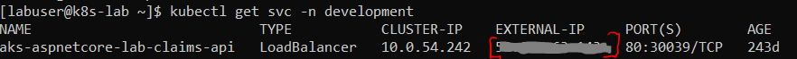

Use the *External-IP* address in the API end-point URL when invoking the Claims API. Substitute the *External-IP* address in place of **Azure_load_balancer_ip**.

The REST API exposed by this microservice can be accessed by using the _context-path_ (or Base Path) `api/v1/claims/`.  The REST API end-point's exposed are as follows.

URI Template | HTTP VERB | DESCRIPTION
------------ | --------- | -----------
api/v1/claims/ | GET | List all available medical claims records in the backend database.
api/v1/claims/{id} | GET | Retrieve all details for a medical claim by `claim id`
api/v1/claims/fetch?{claimno=value} | GET | Search and retrieve all details for a specific claim record by `claim number` 
api/v1/claims/ | POST | Create/Store a new medical claim record in the backend database.  The API consumes and produces claims records in `JSON` format.
api/v1/claims/{id} | PUT | Update an existing claims record in the backend database. The API consumes and produces claims records in `JSON` format.
api/v1/claims/{id} | DELETE | Delete a claim record in the backend database.

You can access the Claims REST API (end-points) using a Web browser or by using a REST client such as *Postman*.

Example Claims API URL's:
- http://<Azure_load_balancer_ip>/api/v1/claims
- http://<Azure_load_balancer_ip>/api/v1/claims/100

Congrats!!  You have just built an *ASP.NET Core Web API* and deployed it as a containerized microservice on *Azure Kubernetes Service*!!

In the next section, we will define a *Release Pipeline* in Azure DevOps to automate containerized application deployments on AKS.

### H. Define and execute Claims API Release Pipeline in Azure DevOps Services
**Approx. time to complete this section: 1 Hour**

1.  Create a *Release Pipeline* for the Claims API microservice.

    Using a web browser, login to your Azure DevOps account (if you haven't already) and select your project (**claims-api-lab**) which you created in [Section F](#f-define-and-execute-claims-api-build-pipeline-in-azure-devops-services). 

    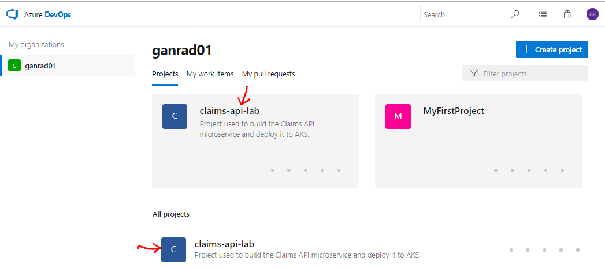

    Click on *Pipelines* menu on the left navigation panel and select *Releases*.  Next, click on *New pipeline*.  See screenshots below.

    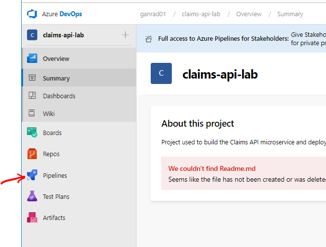

    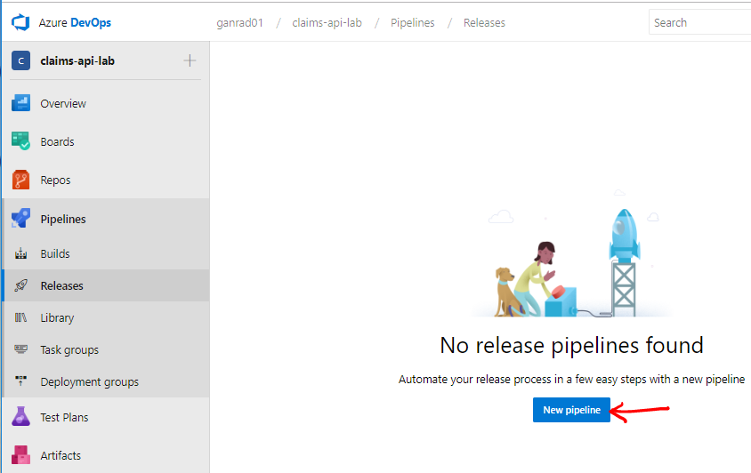

    In the *Select a Template* page, click on **Empty job**.  See screenshot below.

    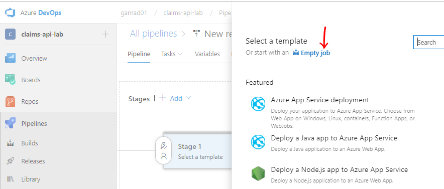

    In the *Stage* page, specify **Dev-Env** as the name for the environment.  Then click on **+Add** besides *Artifacts* (under *Pipeline* tab) as shown in the screenshot below.

    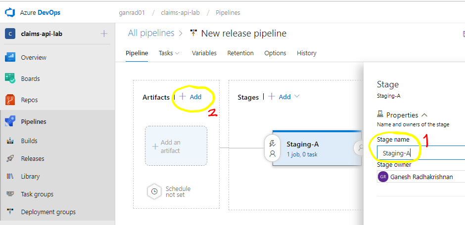

    In the *Add an artifact* tab, select *Build* for **Source type**, select your Azure DevOps *Project* from the **Project** drop down menu and select the *Build definition* in the drop down menu for **Source (Build pipeline)**.  Select *Latest* for field **Default version**.  See screenshot below. 

    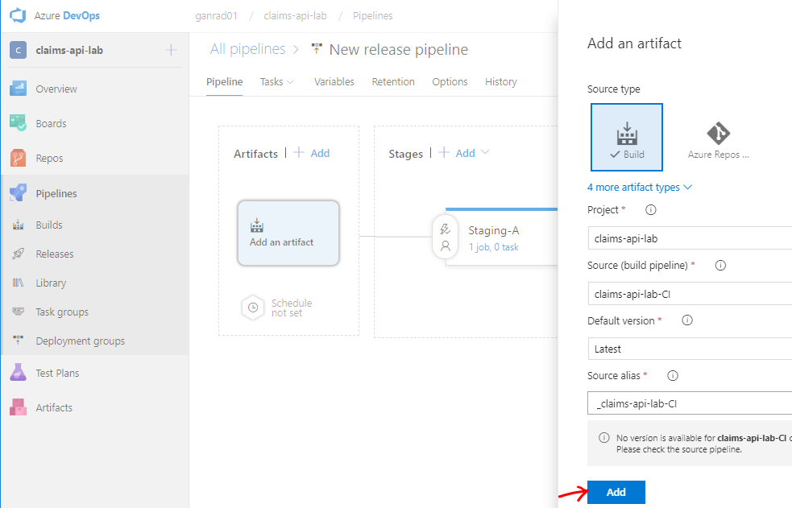

    Click on **Add**.

    Change the name of the *Release pipeline* as shown in the screenshot below.

    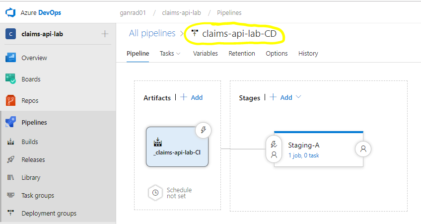

    In the *Pipeline* tab, click on the *trigger* icon (highlighted in yellow) and enable **Continuous deployment trigger**.  See screenshot below.

    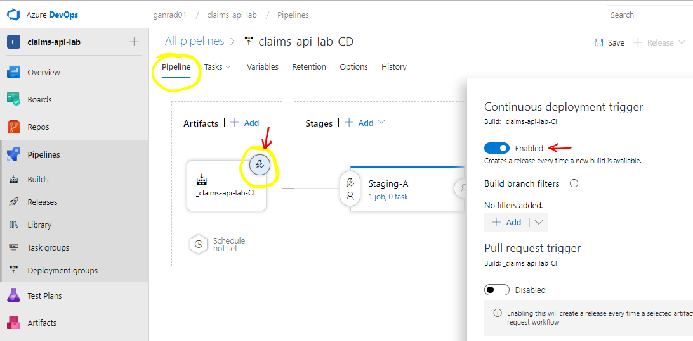

    In the **Stages** box under environment *Dev-Env*, click on **1 job, 0 task**. 

    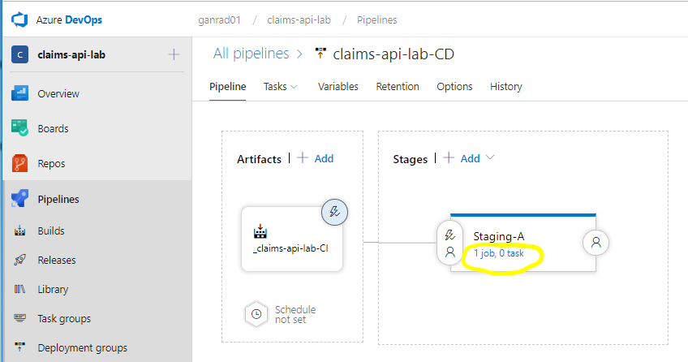

    Click on **Agent job** under the *Tasks* tab and make sure **Agent pool** value is set to *Default*.  Leave the remaining field values as is.  See screenshot below.

    

    Click on the **" + "** symbol beside **Agent job** and search for text **helm** in the *Search* text box (besides **Add tasks**). Select **Package and deploy Helm charts** plug-in and click on **Add**.  See screenshot below.

    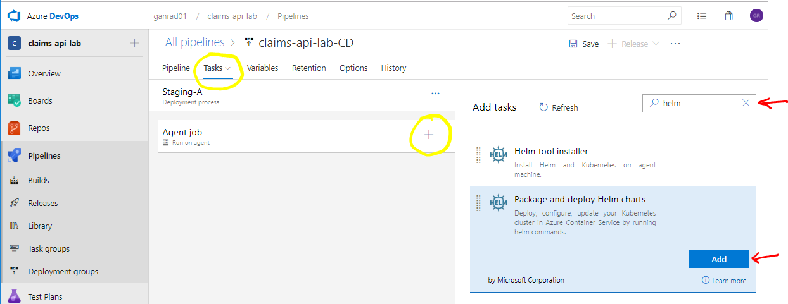

    Click on the **helm** task (on the left).  In the detail pane on the right, fill out the values as shown in the screenshots below.  Remember to specify the correct value for the Azure resource group (eg., myResourceGroup).

    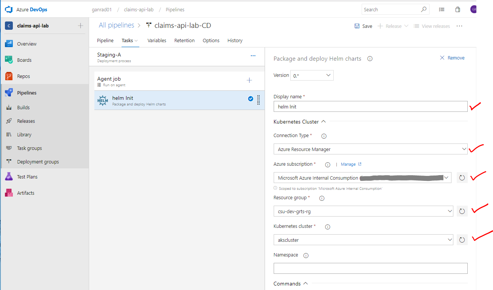

    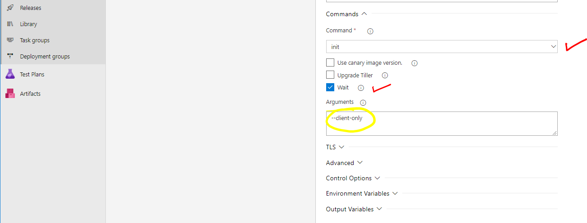

    Again, click on the **" + "** symbol beside **Agent job** and search for text *helm*, select extension **Package and deploy Helm charts** and click **Add**.  See screenshot below.

    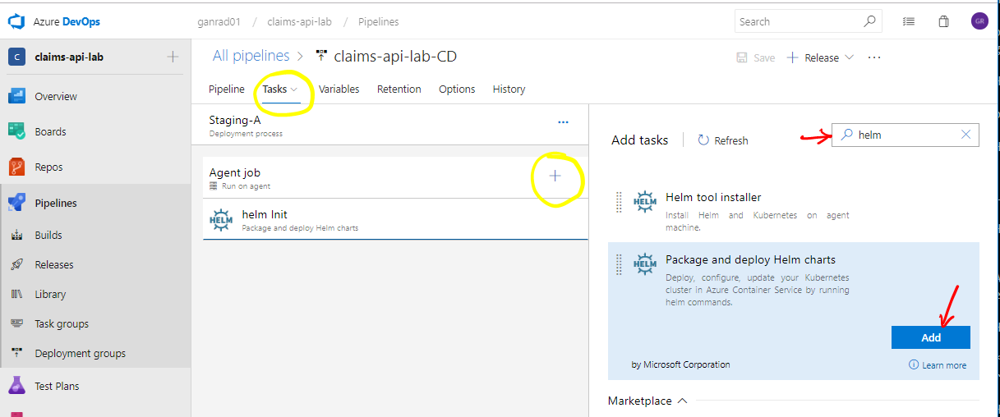

    Click on the **helm** task (on the left).  In the detail pane on the right, specify correct values for the following fields.
    - Display name = `helm upgrade`
    - Connection Type = `Azure Resource Manager`
    - Azure subscription
    - Azure resource group
    - AKS Cluster name
    - AKS namespace = `development`
    - Command = `upgrade`
    - Chart Type = `File Path`
    - Chart Path = `$(System.DefaultWorkingDirectory)/_claims-api-lab-CI/drop/claims-api`
    - Release name = `aks-aspnetcore-lab`
    - Arguments = `--set blue.enabled=true --set image.repository=<your-acr-repo>.azurecr.io/claims-api --set image.tag=$(Build.BuildId) --set sqldb.connectionString="$(sqlDbConnectionString)"`

    See screenshots below.

    

    

    Switch to the **Variables** tab, define a new variable `sqlDbConnectionString` and specify correct value for the Azure SQL Server DB connection string.  See screenshots below.

    

    

    In Azure DevOps Services, each **Stage** in a release pipeline represents a deployment target.  A deployment target in turn represents an application platform (PaaS service) hosted in a given region.  AKS is used as the PaaS service in this project.  It is worth mentioning that with Azure DevOps Services, applications can also be easily deployed on **Azure App Service** PaaS.

    Next, we will add another deployment target for **QA region**.  The *Claims API microservice* will first be deployed to AKS in the **Dev** region and if the deployment succeeds, the application would be deployed to **QA** region.  In AKS, a **Namespace** is usually used to denote a *Region* (eg., Development, QA, Pre-production and Production).

    In the **Pipeline** tab, select stage **Dev-Env** and click on **+ Add** besides **Stages**. Click on **Clone stage** and specify **QA-Env** as the name of the stage.  See screenshots below.

    

    

    Next, click on **Pre-deployment conditions** for stage *QA-Env* as shown in the screenshot below.

    

    In the **Pre-deployment conditions** window under **Triggers**, select **After Stage** (*Dev-Env* should be pre-selected).  This setting ensures *QA-Env* stage is triggered only after *Dev-Env* stage completes successfully.  Enable **Pre-deployment approvals** and select one or two users who can approve deployment of application to *QA-Env* region.  See screenshot below.

    

    Explore other **Pre-deployment conditions** settings.

    Click on **1 job, 2 tasks** under **QA-Env** stage.

    

    Click on **helm upgrade** task.  Change the Kubernetes **Namespace** to **qa-test** and the Helm **Release Name** to **aks-aspnetcore-lab-qa** as shown in the screenshot below. Leave all other field values as is.

    

    Click on **Save** to save the release pipeline.

    We have now finished defining the **Release pipeline** for the Claims API microservice.  This pipeline will in turn be triggered when the build pipeline completes successfully.

2.  Enable Continuous Integration.

    In DevOps, the *Continuous Integration (CI)* process is triggered when the application source code is committed to a source code management system.  In this case, the source code repository is GitHub.

    Edit the build pipeline to enable CI trigger.

    

    Click on the **Triggers** tab.

    

    Click the checkbox for both **Enable continuous integration** and **Batch changes while a build is in progress**.  Leave other fields as is.  Click on **Save & queue** menu and select the **Save** option.

3.  Update the Claims API microservice to expose OpenAPI (formerly Swagger API) specifications for end-points.

    The [Open API Specification](https://swagger.io/specification/) defines a standard, language-agnostic interface to RESTful APIs which allows both humans and computers to discover and understand the capabilities of the service without access to source code, documentation or through network traffic inspection.  When defined properly, a consumer of the API can understand and interact with the remote API with minimal knowledge of the underlying implementation logic.

    Use one of the options below to update the `Startup.cs` class in your forked GitHub repository.
    - Use Git CLI to update the class in your cloned repository on the Linux host.  Then commit and push the updates to your forked GitHub repository.
    - Alternatively, update the class using the browser by accessing your forked GitHub repository (described next).

    The changes to be made to the `Startup.cs` class is described below.

    Open a web browser tab and navigate to your forked project on GitHub.  Open **Startup.cs** file.  Click on the pencil (Edit) icon on the top right of the code view panel (see below) to edit this file.

    

    Uncomment lines 47 thru 75 (marked in red).

    

    Uncomment lines 91 thru 99 (marked in red).

    

    After making the changes, provide a comment and commit (save) the `Startup.cs` file.

    The git commit will trigger a new build (**Continuous Integration**) for the Claims API microservice in Azure DevOps Services.  Upon successful completion of the build process, the updated container images will be pushed into the ACR and the release pipeline (**Continuous Deployment**) will be executed.

    Verify the status of the *Build process* in Azure DevOps Services.  See screenshot below.

    

    As part of the Release (CD) process, the Kubernetes deployment object for the microservice in **development** namespace will be updated with the newly built container image.  This action will trigger a **Rolling** deployment of Claims API microservice in AKS.  During the *Rolling* deployment, consumers of the *Claims API* microservice will not experience any downtime.  The **aks-aspnetcore-lab-claims-api** container (*Pod*) from the old deployment (version 1.0) will be deleted and a new deployment (version 2.0) will be instantiated in AKS.  The new deployment will spawn a new container instance from the latest container image pushed into ACR.   

    After the *Claims API* microservice is deployed in the **Dev-Env** region (Namespace = development), you will experience first hand how to **Approve** and promote the containerized application to the **QA-Env** region (Namespace = qa-test) on AKS.  The new deployment will use the latest container image from ACR and spin up a new container (*Pod*) in the **qa-test** namespace on AKS.

    Verify the status of the *Release process* in Azure DevOps Services. See screenshot below.

    

4.  Verify the updated microservice container image was built and pushed to AKS thru Azure DevOps CI and CD pipelines.

    - Switch to a browser window and invoke the Claims API end-points.

      URL - `http://<Azure_load_balancer_ip>/api/v1/claims`
    - Invoke the Swagger end-point to view the generated `swagger.json` specification for the Claims API.

      URL - `http://<Azure_load_balancer_ip>/swagger/v1/swagger.json`
    - Invoke the Swagger UI to test the Claims REST API.

      URL - `http://<Azure_load_balancer_ip>/swagger/index.html`

      You should be able to view the Swagger UI as shown in the screenshot below.

      

**IMPORTANT NOTES:**
- Login to the Azure Portal using a browser window/tab.
- Access the *Repositories* blade of your ACR instance.
- Note down the value of the latest **Tag** (Build ID number) of the Claims API container image which was built and pushed by the Azure DevOps Build pipeline. The **Build ID number** will represent version **v2** of the Claims API microservice. You will be using this image **Tag** value (ID number) to implement 
  - **Canary** application deployments in a subsequent section.
  - **Intelligent request routing** and traffic splitting in the **Istio** *Service Mesh* extension project.

### Exercise 1:
**Execute functional tests in *QA* region and then deploy Claims API microservice in *Production* region**

This exercise will help validate and solidify your understanding of *Azure DevOps Pipeline* feature and how it can be easily used to build and deploy containerized applications to different namespaces (regions) on a Kubernetes (AKS) cluster.

**Challenge:**
Run automated functional tests in the QA region (**qa-test** namespace on AKS) and upon successful execution of tests, deploy the Claims API microservice to Production region (**production** namespace on AKS).

To complete this challenge, you will update the build and release pipelines in Azure DevOps Services.

1.  Update the Build pipeline
    - Copy the `./shell-scripts` and `./test-data` directories to the `staging` location on the build agent.  Refer to [Section F](#f-define-and-execute-claims-api-build-pipeline-in-azure-devops-services).
    - Execute the build pipeline.

2.  Update the Release pipeline
    - Edit the release/deployment pipeline and add a stage for production eg., *Prod-Env*.  This stage should deploy the microservice artifacts to **production** namespace on your AKS cluster.  Refer to [Section H](#h-define-and-execute-claims-api-release-pipeline-in-azure-devops-services).
    - In the *QA-Env* stage, add a *Kubectl* Task.  Use this *Task* to retrieve the external/public IP address assigned to the **aks-aspnetcore-lab-qa-claims-api** service in the **qa-test** namespace. Refer to the Kubernetes CLI command snippet below.

      ```bash
      # Retrieve the Public/External IP address assigned to the microservice in 'qa-test` namespace
      $ kubectl get svc claims-api-svc --template "{{range .status.loadBalancer.ingress}} {{.ip}} {{end}}" -n qa-test
      #
      ```

      The Public/External IP address assigned to the API service end-point should be used to configure the functional test shell script in the next step.
    - Add a *Bash* (bash shell) Task. This *Task* should be configured to execute a functional test shell script `./shell-scripts/start-load.sh`.  Open/Edit the shell script in this repository and go thru the logic before proceeding.  The script invokes the Claims API microservice end-point and executes get, insert, update and delete (CRUD) operations on *Claim* resources.  You will need to configure 3 input parameters for the shell script - No. of test runs, Public IP address of the service end-point (retrieved in previous step) & directory location containing test data (`./test-data`).
    - Execute the release/deployment pipeline.

### Exercise 2:
**Implement *Blue-Green* deployments in *Production* region**

In this exercise you will learn how to use the *Blue-Green* deployment technique in order to deploy or rollback containerized applications in Production region.

Blue-Green deployment is a technique that minimizes downtime and risk by running two identical production application environments called *Blue* and *Green*.  At any time, only one of the environments is live, with the live environment serving all API traffic.  With this configuration, it is also possible to quickly rollback to the current (most recent) application release with little to no downtime to the application.

To learn more about blue-green deployments, refer to the following online resources.
- [Blue-Green deployments](https://martinfowler.com/bliki/BlueGreenDeployment.html), Martin Fowler's Blog

**Challenge:** Implement **Blue-Green** deployment slots in the Production region (**production** namespace on AKS).

To complete this challenge, you will modify the Claims API microservice and update *Prod-Env* stage in the release pipeline in Azure DevOps Services.  The high level steps are detailed below.

1. Learn how Blue-Green deployments can be implemented in Kubernetes

   - For a quick overview, refer to this article - [Blue/Green deployments using Helm Charts](https://medium.com/@saraswatpuneet/blue-green-deployments-using-helm-charts-93ec479c0282)

   - Before proceeding, open a browser tab and go to [Helm Documentation](https://docs.helm.sh/) website.  If you are new to Helm, it is recommended to go thru [Helm User Guide](https://helm.sh/docs/using_helm/#using-helm) and familiarize yourself with basic concepts. Keep this tab open so you can quickly refer to Helm CLI commands. 

2. Update the Release/Deployment pipeline in Azure DevOps Services

   - Review the default parameter values defined in the helm chart `./claims-api/values.yaml` file.
   - Review the steps described in `./shell-scripts/blue-green-steps.txt` file.  Edit the pipeline and update the *Prod-Env* stage in the deployment pipeline accordingly.

3. Update *Claims API* microservice

   - Login to the Linux VM via a terminal session and switch to the directory containing the GitHub repository for Claims API (`~/git-repos/aks-aspnet-sqldb-rest`).
   - Use a text editor (*Vi or Nano*) to modify the business logic of one of the microservice's API method's. You can also update this method in your forked GitHub repository using a web browser.

     **Hint:** Update the `checkHealth` method in Claims API Controller `aks-aspnet-sqldb-rest/Controllers/ClaimsController.cs` to return an additional attribute in the JSON response.  

4. Trigger/Run *Build* and *Release* pipelines in Azure DevOps Services

   - Use Git CLI to commit your updates to the local Claims API repository on the Linux VM.  Then push the updates to your forked repository on GitHub.  Alternatively, if you made changes to the source code via the browser, commit the changes in your forked GitHub repository.

   - The Git commit should trigger a new build for the Claims API microservice in Azure DevOps Services.  A successful build should in turn trigger the release pipeline and deploy the microservice in all 3 namespaces (regions) on AKS - development, qa-test and production.  

   - If you followed the steps for Blue-Green deployment and configured the release pipeline tasks correctly for *Prod-ENV* stage, then the microservice should be deployed into both **prod** and **stage** slots in the **production** namespace on AKS.

   - In Azure DevOps Services, the release pipeline should have paused at the *Manual Intervention* step in the *Prod-Env* stage.  See screenshot below.

     

     Confirm the Claims API microservice deployed in **prod** and **stage** slots are accessible via the URL's listed below.
   
     **Stage** slot (new deployment) URL - http://claims-api-stage.akslab.com/api/v1/claims

     **Prod** slot (existing deployment in production) URL - http://claims-api-prod.akslab.com/api/v1/claims

     After you have verified the Claims API output (HTTP response) in both the prod and stage slots, you can either **Resume** (proceed with) or **Reject** (rollback) the *new* (updated) application deployment.

     

     Try both *Resume* and *Reject* scenarios.

5. Examine the status of Blue and Green slot deployments

   Use the [Traefik Ingress Controller UI/Dashboard](http://db-traefik.akslab.com) to view the **stage** and **prod** slot deployments in **production** namespace (region) on AKS.  The screenshot below shows the **prod** slot deployment in **production** namespace (region) on AKS.

   

6. Examine the status of Azure DevOps Pipelines

   Review the status of build and release pipelines.  A completed release pipeline is shown in the screenshot below.

   

Congrats!!  You have successfully built the *Claims API* microservice, packaged this application within a container image and pushed the container image into an ACR instance. Finally, you deployed the containerized application in **development**, **qa-test** & **production** namespaces (Development, QA and Production regions) on AKS.  Cool!!

### I. Define and execute Claims API Delivery Pipeline in Azure DevOps Services
**Approx. time to complete this section: 1 Hour**

In this section, we will build and deploy a *Continuous Delivery* pipeline in Azure DevOps Services.  A Continuous Delivery pipeline automates the build, test and deployment steps and combines them into a single release workflow.  We will also enable *Zero Instrumentation Monitoring* of the Claims API Microservice application via Azure Application Insights.

1.  Import this GitHub repository into Azure DevOps *Repos*

    Using a web browser, login to your Azure DevOps account (if you haven't already) and select your project (**claims-api-lab**) which you created in [Section F](#f-define-and-execute-claims-api-build-pipeline-in-azure-devops-services). 
    
    

    Click on **Repos** menu on the left navigational panel.  Then click on **Import** as shown in the screenshot below.

    

    Specify the URL to your forked GitHub repository as shown in the screenshot below.  Remember to substitute your GitHub account name in the URL.

    

    Click on **Import**.

2.  Create a *Service Connection* for ACR and copy the *Azure Resource Manager Connection* name

    Click on **Project settings** as shown in the screen shot below.

    

    Click on **Service Connections** under *Project Settings*. Then click on **+ New service connection** and select **Docker registry**. See screenshot below.

    

    In the **Add a Docker Registry service connection** page, select **Azure Container Registry** for **Registry type** and specify **acrSvcConnection** for **Connection name**. In the **Azure subscription** drop down field, select your Azure subscription.  In the **Azure container registry** field, select the ACR which you created in [Section E](#e-deploy-azure-container-registry).  See screenshot below.

    

    Click **OK**.

    Copy and save the *name* of the Azure Resource Manager Connection which was created when you deployed the *Build* pipeline in [Section F](#f-define-and-execute-claims-api-build-pipeline-in-azure-devops-services).  See screenshot below. Copy and save the value circled in yellow.  You will need this value in the next step. 

    

3.  Update the Delivery Pipeline YAML file

    Back in the *Repos* view, click on `azure-pipelines.yml` file.  Review the tasks defined in the pipeline.  You can refer to the [YAML schema reference](https://docs.microsoft.com/en-us/azure/devops/pipelines/yaml-schema?view=azure-devops&tabs=schema) in the Azure DevOps Services documentation for a detailed reference guide and description of built-in tasks.

    See screenshot below.

    

    Click on the *pencil* icon to edit this file.  See screenshot below.

    

    Specify correct values for the variables defined in this yaml file.  Refer to the *Description* section for an explanation of the variables.  After updating the variable values, click on **Commit**. 

4.  Enable metrics collection using Application Insights SDK

    In this step, we will first create an *Application Insights* instance via the Azure Portal.  Login to the Azure portal and search for *Application Insights* under *All services*.  See screenshot below.

    

    Click on **Application Insights**.  In the Application Insights blade, click on **+ Add**.

    

    Specify values for **Subscription**, **Resource Group**, **Name** and **Region** and click **Review + create**.

    
    
    Click on the **Overview** tab of the *Application Insights* instance and copy the value of the **Instrumentation Key** as shown in the screenshot below.  We will need to specify this value when we update the application code.

    

    Enable metrics collection by updating the Claims API application code.  Once metrics collection is enabled, the Application Insights SDK will instrument the application at runtime and send telemetry (server requests, server response times, availability, failed requests etc) data to Azure.  This is a *Zero instrumentation* application monitoring solution (currently in public preview for AKS).  Refer to the *Prerequisites* section for links to Application Insights documentation.

    In the *Repos* view, click on `Program.cs` file.  Edit this file by clicking on the *pencil* icon.  Uncomment line # 22 as shown in the screenshot below.

    

    Click on **Commit**.

    Next, edit file 'appsettings.json`.  Update the Application Insights *Instrumentation Key* as shown in the screenshot below.

    

    Click on **Commit**.

5.  Create an Azure DevOps Delivery Pipeline and execute it

    Click on *Pipelines* menu on the left navigational panel.  Click on *Builds* and then click on *+ New* drop down menu.  Select *New build pipeline* menu item.  See screenshot below.    

    

    In the *New Pipeline* wizard, select **Azure Repos Git YAML** (first item) in the *Connect* page as shown below.

    

    In the next tab, select the `aks-aspnet-sqldb-rest` repository which you imported in Step [1] above.

    

    In the *Configure* page, select *Existing Azure Pipelines YAML file**.  Then select the `azure-pipelines.yml` file in the **Path** drop down field.  Click **Continue**.  See screenshot below.

    

    In the **Review** tab, click on **Run** as shown in the screenshot below.

    

    After the pipeline completes OK, verify the following (left as an exercise)
    - Confirm a new container image for *Claims API* microservice was built and pushed into ACR
    - Verify a new revision for the Claims API microservice application (**aks-aspnetcore-lab**) was deployed successfully on AKS.  Check the update date and time of the release revision.
    - Verify the container image in the Pod manifest matches the container image (tag and Digest) pushed into ACR.
    - Use the Azure Portal and access the *Application Insights* instance.  Generate some API traffic and review the application map, live stream metrics, dashboards, server response times, backend (Azure SQL DB) calls and response times.

### Exercise 3:
**Scan container images and digitally sign them using Docker Content Trust**

In this exercise, you will learn how to
- Scan container images for known vulnerabilities using the Open Source container image scanning engine from [Aqua](https://github.com/aquasecurity/microscanner)
- Digitally sign container images using *Docker Content Trust* (DCT) before pushing these images into ACR
    
To learn more about digitally signing container images using *Docker Content Trust*, refer to the following online resources.

- [Content trust in Docker](https://docs.docker.com/engine/security/trust/content_trust/)
- [Content trust in Azure Container Registry](https://docs.microsoft.com/en-us/azure/container-registry/container-registry-content-trust)
- [Use DCT to sign images in Azure Pipelines](https://docs.microsoft.com/en-us/azure/devops/pipelines/ecosystems/containers/content-trust?view=azure-devops)
  
**Challenge:** **Scan** Claims API container image using *Aqua Trivy* and **sign** the image using *DCT*

To complete this challenge, you will update and run a YAML *delivery* pipeline in Azure DevOps Pipelines. The high level steps are detailed below.

1. Configure *ACR repository* and deploy a self-hosted Azure DevOps *build agent* on AKS

   - Make sure your ACR instance is using the 'Premium' SKU.  You can check this in the 'Overview' blade/page of your ACR instance in Azure portal.
   - In Azure Portal, confirm docker content trust (DCT) is enabled for your ACR instance.
   - If you haven't already, you will need to deploy a custom Azure DevOps build agent locally on the Linux VM (Bastion host) or on your AKS cluster.  Instructions for deploying a self-hosted Azure DevOps Services build agent can be found on this [GitHub repository](https://github.com/ganrad/Az-DevOps-Agent-On-AKS).

2. Generate the *DCT delegation key pair* and initiate the *claims-api* repository in ACR

   - To generate the delegation key pair, refer to [DCT docs](https://docs.docker.com/engine/security/trust/content_trust/).
   - Create a new *Service Principal* via Azure Portal or using Azure CLI (preferred). Use the service principal to login to ACR. Assign specific roles to the service pricipal so that it can be used to sign and push container images into ACR.
   - Use the service principal credentials to [log into ACR](https://docs.microsoft.com/en-us/azure/container-registry/container-registry-auth-service-principal)
   - [Initiate the 'claims-api' repository in ACR](https://docs.docker.com/engine/security/trust/content_trust/#signing-images-with-docker-content-trust).

3. Copy the delegation private key file to Azure DevOps Pipelines *Library*
   
   You will need to copy the delegation *private key* from the Linux VM (Bastion host) to Azure DevOps Services.
 
   - Copy the private key file from the Linux VM to your local machine.  You can use **scp** for copying the file.
   - In Azure DevOps Pipelines, select *Library* and import the private key as a secure file.

4. Create a new *ACR connection* in Azure DevOps Services for your ACR instance

   - In your Azure DevOps project, click on *Project settings*.
   - Use the same Service Principal credentials (appId and password) which you created in Step [2] to create an ACR connection in Azure DevOps Services.

5. Update the YAML delivery pipeline file `dct-pipeline.yml` in Azure DevOps Services *Repository*

   In Azure DevOps Services Repository, review the tasks defined in this YAML pipeline file. Edit this file and make the following changes.

   - variables: Go thru the description of each pipeline variable and assign the correct value.

   Save and commit the pipeline yaml file in your local Git repository on Azure DevOps Repos.

6. Create a new *Continuous Delivery* pipeline in Azure DevOps Pipelines and run it

   - After updating the `dct-pipeline.yml` pipeline file in Azure DevOps Repos, create a new *Delivery pipeline* (actually *Build* pipeline) in Azure DevOps Pipelines. Select *Azure Repos Git* for source code, *aks-aspnet-sqldb-rest* for repository, *Existing Azure Pipelines YAML file* for pipeline & select `dct-pipeline.yml`, review the pipeline code and **Run** it.
   - Keep in mind, Aqua Trivy will take approx. 15-20 mins to run the first time.  During the initial run Aqua will download OS vulnerability/fixes info. (CVE's etc) from multiple vendor advisory databases, cache it locally and then scan the image.  Vulnerability info. from the cached database will be used for subsequent image scans. As a result, the scan task should not take more than a few seconds to complete in subsequent pipeline runs.
   - After the pipeline completes OK, inspect the delivery pipeline task execution logs.

7. Verify the signed image in ACR

   Use Azure portal or Azure CLI to confirm a signed container image for Claims API microservice was pushed into ACR.

**IMPORTANT NOTES:**
- Login to the Azure Portal using a browser window/tab.
- Access the *Repositories* blade of your ACR instance.
- Note down the value of the latest **Tag** (Build ID number) of the Claims API container image which you built and pushed into the ACR using the Azure DevOps Delivery pipeline.  The **Build ID number** will represent version **v3** of the Claims API microservice. You will be using this image **Tag** value (ID number) to implement 
  - **Canary** application deployments in a subsequent section.
  - **Intelligent request routing** and traffic splitting in the **Istio** *Service Mesh* extension project.

At this point, you have built and pushed three different container images for the Claims API microservice into the ACR instance.  Each application version is packaged within a separate container image and the image has been tagged with a unique **Build ID number**.

For quick reference, here are the Claims API container image versions and their descriptions.  Each image version is tagged with a separate and unique Build ID.
- **v1**: Version 1 is the initial version of the Claims API microservice.
- **v2**: Version 2 is the second version of the microservice and includes enhancements for serving an OpenAPI for Claims API end-points.
- **v3**: Version 3 is the final version of the microservice and includes enhancements for sending metrics data to Azure Application Insights.

## J. Explore out of box AKS features

In this section, we will explore value add features for administering & managing the AKS cluster.

1.  [Scale the AKS cluster](https://docs.microsoft.com/en-us/azure/aks/scale-cluster)

    Manually scaling the number of nodes in an AKS cluster is as simple as issuing one simple CLI command.  The cluster nodes can be scaled up or down by specifying the desired no. of nodes in the *--node-count** parameter.

    Login to the Linux VM via SSH.  Issue the commands in the terminal window.
    ```bash
    # Retrieve the name of the node pool
    $ az aks show --resource-group myResourceGroup --name akscluster --query agentPoolProfiles
    #
    # Scale the nodes in the node pool to 3.  Substitute the name of the node pool name.
    # The scale command will run for a few minutes.
    $ az aks scale --resource-group myResourceGroup --name akscluster --node-count 3 --nodepool-name <your node pool name>
    #
    # Verify the number of nodes in the node pool has scaled up by 1.  Check the value of 'count'.
    $ az aks show --resource-group myResourceGroup --name akscluster --query agentPoolProfiles
    #
    # There should be 3 nodes listed in the output
    $ kubectl get nodes
    #
    ```
    [Auto-scaling](https://docs.microsoft.com/en-us/azure/aks/cluster-autoscaler) an AKS cluster is currently in public preview.

2.  [Upgrade an AKS cluster](https://docs.microsoft.com/en-us/azure/aks/upgrade-cluster)

    Upgrading an AKS cluster is equally simple.  The nodes in the cluster are upgraded to the desired Kubernetes release sequentially one after the other.  This ensures the applications deployed on the cluster are available during the upgrade process and there is no disruption to the business.

    Refer to the command snippet below.
    ```bash
    # List all the AKS versions 
    $ az aks get-versions -l westus2 -o table
    #
    # List the available upgrade versions for the AKS cluster
    $ az aks get-upgrades -g myResourceGroup -n akscluster -o table
    #
    # Upgrade the AKS cluster to v1.15.7.  Then confirm (y) the upgrade.
    # Be patient.  The upgrade will run for a few minutes!
    $ az aks upgrade -g myResourceGroup -n akscluster --kubernetes-version 1.15.7
    #
    # Verify the nodes have been upgraded by checking the value under the 'KubernetesVersion' column
    $ az aks show -g myResourceGroup -n akscluster -o table
    #
    ```

In this section, we will explore a few advanced features provided by Kubernetes (AKS).

1.  Self-Healing of application containers (*Pods*)

    Kubernetes periodically checks the health of application containers (Pods) deployed on cluster nodes.  If an application *Pod* dies or terminates unexpectedly, the *Replication Controller* or *Deployment* automatically spawns another instance of the application Pod.

    Login into the Linux VM via SSH.  Use the Kubernetes CLI to delete the Claims API microservice Pod.  Verify that the *Deployment* spawns another Pod instance almost instantaneously.  Refer to the command snippet below.
    ```bash
    # List the pods in the 'development' namespace.  Make a note of the pod name and the value
    # under the AGE column
    $ kubectl get pods -n development
    #
    # Delete the Claims API Pod by name (eg., aks-aspnetcore-lab-claims-api-xyz...)
    $ kubectl delete pod <pod-name>
    #
    # List the pods in the 'development' namespace.  Verify a new pod has been instantiated.
    # Look under the column headers 'NAME' and 'AGE'.  The Claims API pod should have a 
    # new name and it's age should be less than a minute.
    $ kubectl get pods -n development
    #
    ```

    Use a browser to invoke a Claims API end-point and verify the microservice is available and returns a valid response.

2.  Canary deployments
    
    Canary release is a technique to reduce the risk of introducing a new software version in production by slowly rolling out the change to a small subset of servers (or users) before rolling it out to the entire infrastructure and making it available to everyone.  Canary deployments help alleviate the side effects of failed or problematic deployments.

    With [Canary Deployments](https://kubernetes.io/docs/concepts/workloads/controllers/deployment/#canary-deployment), multiple application deployments are created, one for each release of the API/Application following the canary pattern.  Initially, only a small percentage of API/User traffic is directed to the new/canary release.  Once the canary release is tested and it's behavior is fully verified, all traffic is then directed to the new release.  Alternatively, if the performance of the canary release is found to be sub-optimal and/or the canary doesn't manifest the desired behavior, the canary deployment is deleted.

    To test *Canary* deployment of the Claims API microservice, refer to the command snippet below. Edit the file `./k8s-resources/claims-canary-deploy.yaml` and specify correct values for the following.

    Token | Value
    ----- | ----- 
    ACR Name | Name of your ACR instance
    Image Tag | Images tag values which you had noted down at the end of *Section I* and *Exercise 3*
    Azure SQL Server Connection String | SQL Server connection string
    
    ```bash
    # Create a new namespace to test Canary deployment of the Claims API microservice
    $ kubectl create namespace canary-test
    #
    # Go thru and edit the `./k8s-resources/claims-canary-deploy.yaml` file.
    # Substitute values for ACR Name and Image Tag - placeholders in the file (see above)
    # Deploy version v1 and version v2 of the Claims API
    $ kubectl apply -f ./k8s-resources/claims-canary-deploy.yaml -n canary-test
    #
    # Get the Public IP address of the deployed service
    $ kubectl get svc -n canary-test
    #
    # Verify only 1 in 4 API calls are being served by the Canary release
    ```

    Use **curl** and invoke the Claims API end-point in a loop.  You will observe that version v1 of the Claims API will only be invoked once for every 3 invokations of version v2 of the API.

    You can tweak the number of replicas in the v1 and v2 deployments to determine the ratio of each release which will receive live traffic.

    **Challenge:** Direct all (100%) API traffic to the Canary release (v2) and make it the current stable release.  Additionally, scale down the old (v1) release.

3.  Auto-scale application containers (*Pods*)

    An [Horizontal Pod Autoscaler](https://kubernetes.io/docs/tasks/run-application/horizontal-pod-autoscale/) automatically scales the number of Pods in a replication controller, deployment or a replica set based on observed CPU utilization. 

    We will define a (HPA) resource (API object) in the *development* namespace.  Refer to the command snippet below.
    ```bash
    # Create the HPA API object
    $ kubectl create -f ./k8s-resources/claims-api-hpa.yaml
    #
    # Wait a minute or two.
    # List the HPA objects in 'development' namespace.  Check the value under column 'TARGETS'.
    # The current CPU load on the Pod should be between 0% to 2%.  Also, notice the values under columns
    # 'MINPODS', 'MAXPODS' and no. of 'REPLICAS'.  The 'current' replicas should be 1.
    $ kubectl get hpa claims-api-hpa -n development
    #
    # There is another way to check CPU and Memory consumption for a pod (see below). 'm' stands for 'millicore'.
    # In the command output below, the memory consumption is 1m meaning .001 % of 1 vCPU (1 vCPU ~ 1000 millicores)
    # which is 1% vCPU utilization!
    $ kubectl top pods -n development
    NAME                                     CPU(cores)   MEMORY(bytes)   
    claims-api-deploy-blue-c8755bbcc-zms9p   1m           132Mi
    #
    ```

    If a Pod is not actively serving any requests then it's CPU utilization is minimal (0 - 2%) as noted above!   This is one of the value-add **advantages** for running applications within containers as opposed to running them within Virtual Machines.  By increasing the density of containers on Virtual or Physical machines, you can maximize resource utilization (CPU + Memory) and thereby drive down IT infrastructure costs.

    Now let's increase the load on the Claims API Pod by invoking it a few times (in a loop) and observe how Kubernetes intelligently auto scales the microservice instances.  Refer to the command snippet below.

    If the CPU load for the Claims API microservice (Pod) doesn't move up above 50%, you may need to run the shell script multiple times in multiple terminal (> 2) windows.
    ```bash
    # Make sure you are in the project root directory
    $ cd ~/git-repos/aks-aspnet-sqldb-rest
    #
    # Update 'execute' permissions on the shell script 'start-load.sh'
    $ chmod 700 ./shell-scripts/start-load.sh 
    #
    # Run the 'start-load.sh' script.  Provide the following parameter values when invoking the script.
    #   counter - No. of test runs.  Set this to a value between 20 - 50.
    #   svcIpAddress - External IP Address (Azure LB) for the Claims API microservice in 'development' namespace
    #   dataDir - Directory where sample claims data (json files) are stored - ./test-data
    $ ./shell-scripts/start-load.sh <counter> <svcIpAddress> <dataDir>
    #
    # Wait for a few minutes for HPA resource to receive the latest compute metrics from the 'metrics-server'.
    # The metrics-server receives the metrics data for pods by invoking the summary API exposed by kubelet. 
    # The kubelet in turn receives metrics data from the cAdvisor libraries running within the Linux kernel.
    #
    # Login to another terminal window via SSH. Check the no. of 'auto' scaled instances.
    # The underlying 'replica set' should have auto scaled the no. of instances to > 1 < 10 
    # instances.
    $ kubectl get hpa claims-api-hpa -n development
    NAME             REFERENCE                                  TARGETS   MINPODS   MAXPODS   REPLICAS   AGE
    claims-api-hpa   Deployment/aks-aspnetcore-lab-claims-api   52%/50%   1         10        2          17m
    #
    # Check the pod resource consumption.  Average CPU utilization should be above 50% in order for scaling
    # to occur.
    $ kubectl top pod -n development
    #
    ```

4.  Highly available application containers (*Pods*)
    
    When Kubernetes auto scales application Pods, it schedules the pods to run on different cluster nodes thereby ensuring the pods are highly available.

    Refer to the command snippet below to determine the nodes on which the Claims API pods have been deployed. Assuming there are two active Pods, these pods should have been deployed to two different cluster nodes.
    ```bash
    # Find out which cluster nodes are running the Claims API microservice pods.
    $ kubectl get pods -n development -o wide
    NAME                                             READY   STATUS    RESTARTS   AGE   IP            NODE                       NOMINATED NODE
    aks-aspnetcore-lab-claims-api-7d8ff8d494-msstk   1/1     Running   0          1m    10.244.1.23   aks-nodepool1-18961316-0   <none>
    aks-aspnetcore-lab-claims-api-7d8ff8d494-twptm   1/1     Running   0          44m   10.244.0.14   aks-nodepool1-18961316-1   <none>
    mysql-7cbb9c556f-g2n5k                           1/1     Running   0          4d    10.244.1.18   aks-nodepool1-18961316-0   <none>
    po-service-c99675765-g7fq8                       1/1     Running   0          4d    10.244.0.11   aks-nodepool1-18961316-1   <none>
    #
    # Look at the 'aks-aspnetcore-lab-claims-api-xyz' pods at the top of the list.  Notice
    # the values under column 'IP' and look at the 3rd Octet of the pod's IP address.
    # The 3rd Octet in the pod IP address denotes the cluster 'Node' number.
    #
    # If you want to find out the node on which the pods are actually running, use the 
    # command below. The 'Node:' attribute should contain the IP address / Name of the Node.
    $ kubectl describe pod <pod-name> -n development
    Name:               aks-aspnetcore-lab-claims-api-7d8ff8d494-msstk
    Namespace:          development
    Priority:           0
    PriorityClassName:  <none>
    Node:               aks-nodepool1-18961316-0/10.240.0.4
    Start Time:         Mon, 28 Jan 2019 18:40:31 +0000
    Labels:             app=claims-api
                    pod-template-hash=3849948050
    ...
    #
    ```

5.  Automatic load balancing of container (*Pod*) instances

    The Claims API microservice is exposed over an Azure Load Balancer (ALB) Public IP.  This IP is bridged to the Kubernetes cluster network.  As a result, the incoming HTTP request is intercepted by the ALB and forwarded to the AKS agent-pool (Cluster nodes).  The Kubernetes services (cluster network) layer then receives the request and distributes the HTTP traffic evenly to the Pod instances in a round robin manner.  When there are multiple Pod instances for a given microservice, the incoming HTTP requests for this microservice are distributed evenly across the currently active Pod instances.

    Edit and run the shell script `./shell-scripts/test-canary.sh`. The HTTP response header **X-Pod-IpAddr** contains the IP address of the Pod instance serving the HTTP request.  When two or more instances of the Claims API microservice are active, the HTTP requests should be served by the Pod instances in a round robin manner.

    Here is a sample output of the HTTP response headers.
    ```
    HTTP/1.1 200 OK
    Date: Tue, 29 Jan 2019 02:55:34 GMT
    Content-Type: application/json; charset=utf-8
    Server: Kestrel
    Transfer-Encoding: chunked
    X-Pod-IpAddr: 10.244.1.25
    ```

    Verify the automatic load balancing behavior provided by Kubernetes *Services* layer by following the instructions in the code snippet below.

    ```bash
    # Press Control-C and exit out of the shell script.  Then edit the `test-canary.sh` using
    # 'vi' or 'nano' editor.  Uncomment the 'sleep 2' shell command line.  Save the shell
    # script. Run the 'test-canary.sh` script.
    $ ./shell-scripts/test-canary.sh
    #
    # Observe the value of the 'X-Pod-IpAddr' HTTP Response Header.  It should alternate
    # among the Pod IP addresses.
    #
    # Press Control-C to exit out of the shell script and wait for a few minutes.
    # Check the no. of replicas for Claims API microservice again.  It should have been scaled
    # down to '1' instance automatically.
    $ kubectl get hpa claims-api-hpa -n development
    #
    # (Optional) Delete the HPA
    $ kubectl delete hpa claims-api-hpa -n development
    #
    ```

Congrats!  You have successfully used DevOps to automate the build and deployment of a containerized microservice application on Kubernetes.  You have also explored a few value add features provided out of the box by Kubernetes.

In this project, we experienced how DevOps tools, Microservices and Containers can be used to build next generation Web applications.  These three technologies are changing the way we develop and deploy software applications and are driving digital transformation in enterprises today!
