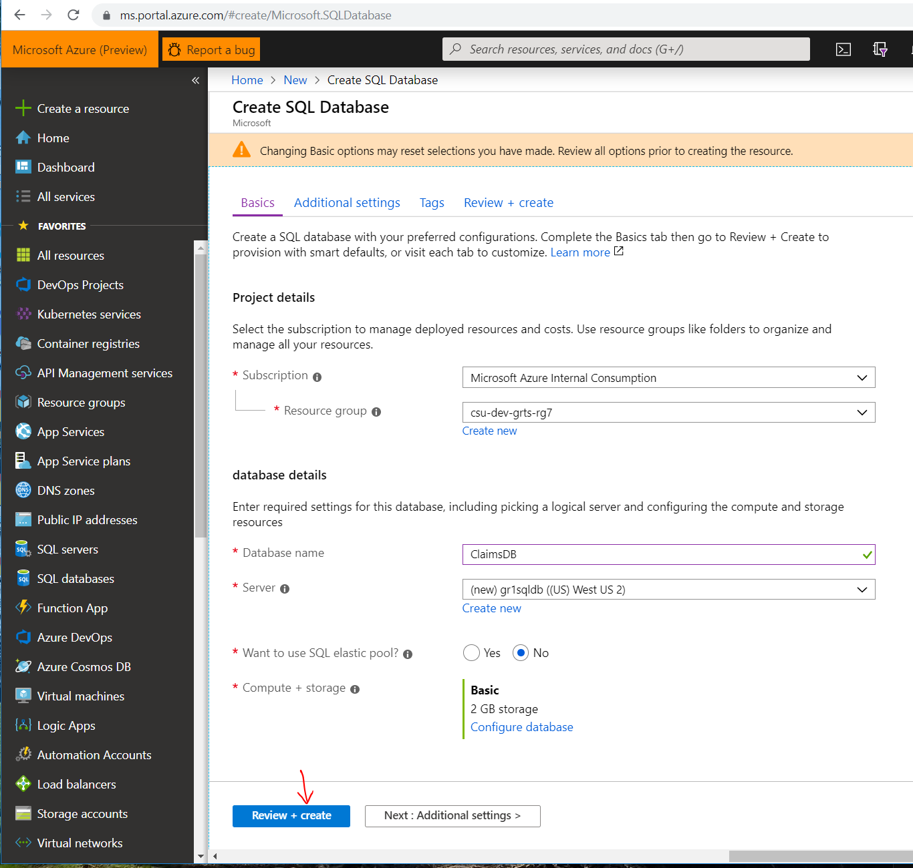
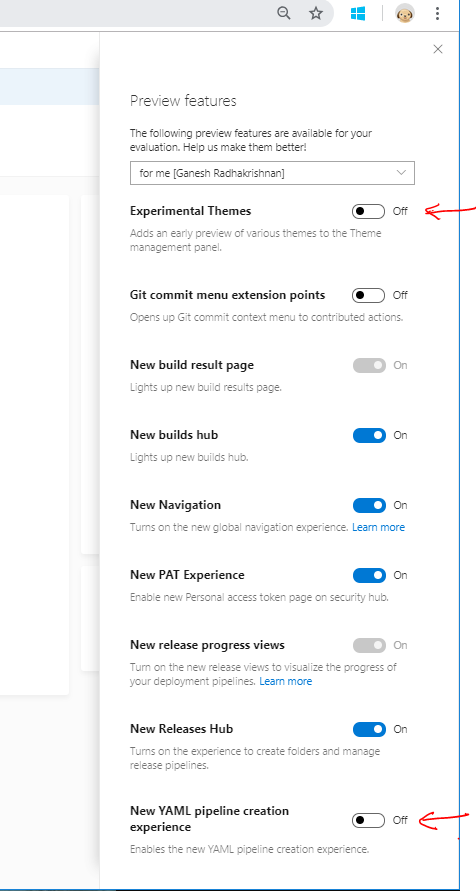
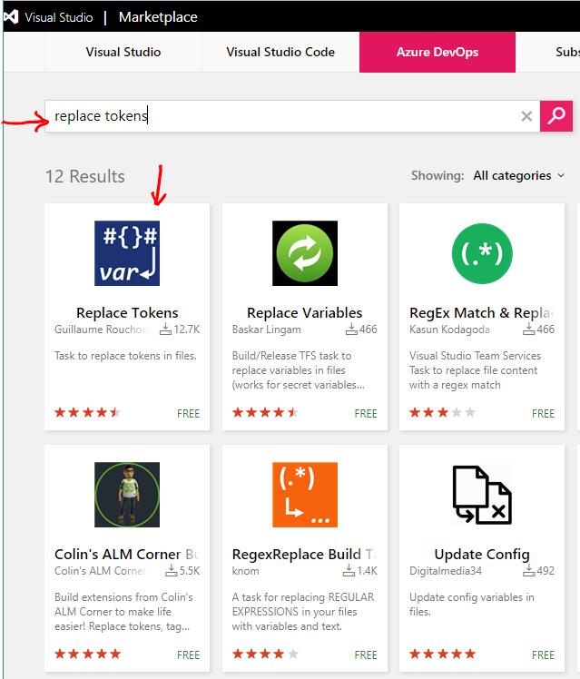
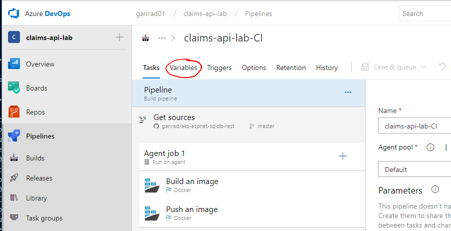
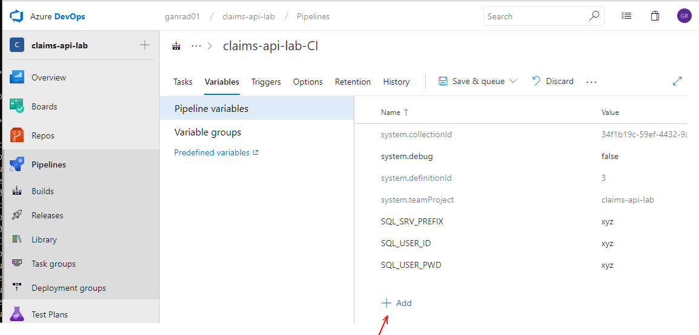
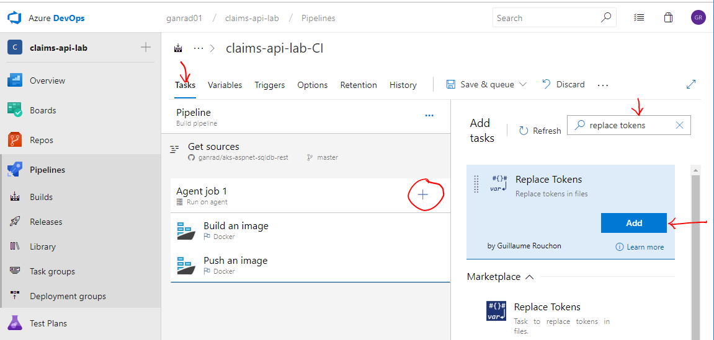
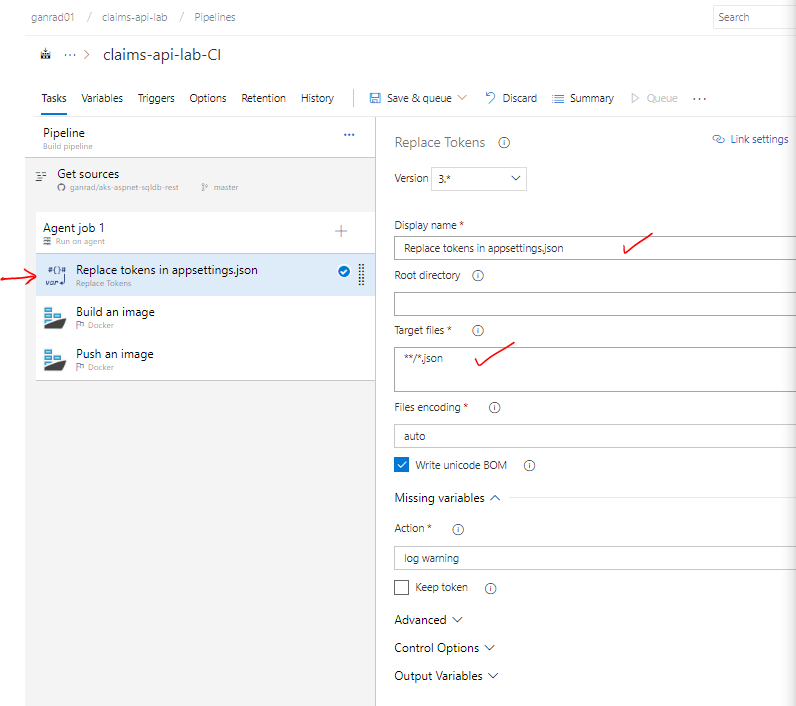
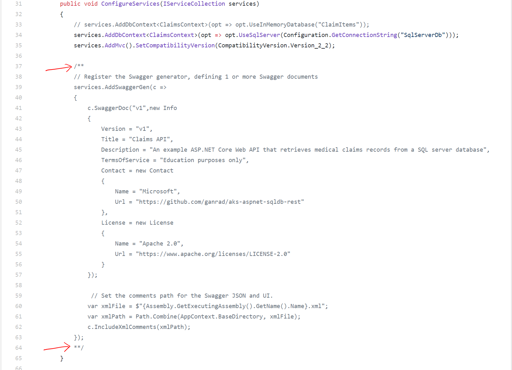
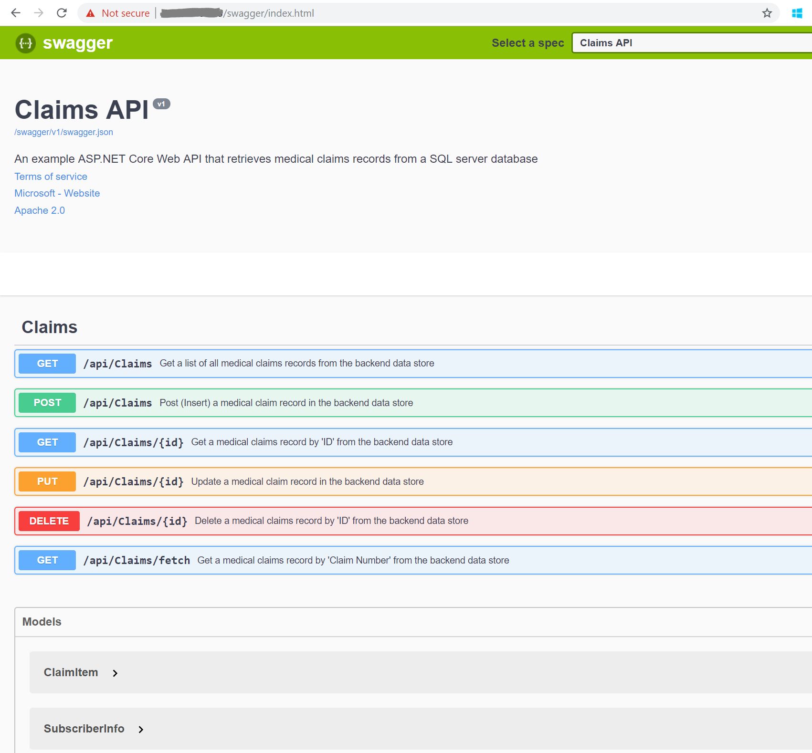

#  Build and deploy an ASP.NET Core 2.2 Web API on Azure Kubernetes Service
This project describes the steps for building and deploying a real world **Medical Claims Processing** microservice application (**Claims API**) on Azure Kubernetes Service.

**Description:**

In a nutshell, you will work on the following tasks.
1. Deploy an **Azure SQL Server Database**.  Complete Section [A]. 
2. Provision a **Linux VM** (Bastion Host/Jump Box) on Azure and install pre-requisite software.  Complete Section [B].
3. Build and run the *Claims API* microservice locally on the Bastion Host.  Complete Section [C].
4. Deploy a **Azure DevOps Services** build agent (container) on the Bastion Host. Complete Section [D].
5. Deploy an **Azure Container Registry** (ACR). Complete Section [E].
6. Define a *Build Pipeline* in **Azure DevOps** (formerly Visual Studio Team Services).  Execute the build pipeline to build the ASP.NET Core application, containerize it and push the container image to the ACR.  This task focuses on the **Continuous Integration** aspect of the DevOps process.  Complete Section [F].
7.  Deploy an **Azure Kubernetes Service** (AKS) cluster.  Deploy the *Claims API* (`claims-api`) microservice on AKS. Test the deployed microservice.  Complete Section [G].
8.  Define a **Release Pipeline** in Azure DevOps and use **Helm** Kubernetes package manager to deploy the containerized *Claims API* microservice on AKS. This task focuses on the **Continuous Deployment** aspect of the DevOps process.  Complete Section [H].

This project demonstrates how to use Azure DevOps Services to build the application binaries, package the binaries within a container and deploy the container on Azure Kubernetes Service (AKS). The deployed microservice exposes a Web API (REST interface) and supports all CRUD operations for accessing (retrieving / storing) medical claims records from a relational data store.  The microservice persists all claims records in a Azure SQL Server Database.

**Prerequisites:**
1.  An active **Microsoft Azure Subscription**.  You can obtain a free Azure subscription by accessing the [Microsoft Azure](https://azure.microsoft.com/en-us/?v=18.12) website.  In order to execute all the sections in this project, either your *Azure subscription* or the *Resource Group* **must** have **Owner** Role assigned to it.
2.  A **GitHub** Account to fork and clone this GitHub repository.
3.  A **Azure DevOps Services** (formerly Visual Studio Team Services) Account.  You can get a free Azure DevOps account by accessing the [Azure DevOps Services](https://azure.microsoft.com/en-us/services/devops/) web page.
4.  Review [Overview of Azure Cloud Shell](https://docs.microsoft.com/en-us/azure/cloud-shell/overview).  **Azure Cloud Shell** is an interactive, browser accessible shell for managing Azure resources.  You will be using the Cloud Shell to create the Bastion Host (Linux VM).
5.  **This project assumes readers are familiar with Linux containers (`eg., docker, OCI runc, Clear Containers ...`), Container Platforms (`eg., Kubernetes`), DevOps (`Continuous Integration/Continuous Deployment`) concepts and developing/deploying Microservices.  As such, this project is primarily targeted at technical/solution architects who have a good understanding of some or all of these solutions/technologies.  If you are new to Linux Containers/Kubernetes and/or would like to get familiar with container solutions available on Microsoft Azure, please go thru the hands-on labs that are part of the [MTC Container Bootcamp](https://github.com/Microsoft/MTC_ContainerCamp) first.**
6.  A **terminal emulator** is required to login (SSH) into the Linux VM (Bastion) host.  Download and install [Putty](https://putty.org/) or [Windows Sub-System for Linux](https://docs.microsoft.com/en-us/windows/wsl/install-win10).
7.  (Optional) Download and install [Microsoft SQL Server Management Studio](https://docs.microsoft.com/en-us/sql/ssms/download-sql-server-management-studio-ssms?view=sql-server-2017) to manage SQL Server database artifacts.
8.  (Optional) Download and install [Postman App](https://www.getpostman.com/apps), a REST API Client used for testing the Web API's.

**Functional Architecture:**


For easy and quick reference, readers can refer to the following on-line resources as needed.
- [Install Azure CLI 2.0](https://docs.microsoft.com/en-us/cli/azure/install-azure-cli?view=azure-cli-latest)
- [ASP.NET Core 2.2 Documentation](https://docs.microsoft.com/en-us/aspnet/core/?view=aspnetcore-2.2)
- [Docker Documentation](https://docs.docker.com/)
- [Kubernetes Documentation](https://kubernetes.io/docs/home/?path=users&persona=app-developer&level=foundational)
- [Helm Documentation](https://docs.helm.sh/)
- [Creating an Azure VM](https://docs.microsoft.com/en-us/azure/virtual-machines/linux/quick-create-cli)
- [Azure Kubernetes Service (AKS) Documentation](https://docs.microsoft.com/en-us/azure/aks/)
- [Azure Container Registry Documentation](https://docs.microsoft.com/en-us/azure/container-registry/)
- [Azure DevOps Documentation](https://docs.microsoft.com/en-us/vsts/index?view=vsts)

**Important Notes:**
- AKS is a managed [Kubernetes](https://kubernetes.io/) service on Azure.  Please refer to the [AKS](https://azure.microsoft.com/en-us/services/container-service/) product web page for more details.
- This project has been tested on AKS v1.11.4+.
- Commands which are required to be issued on a Linux terminal window are prefixed with a `$` sign.  Lines that are prefixed with the `#` symbol are to be treated as comments.
- This project requires **all** resources to be deployed to the same Azure **Resource Group**.
- Specify either **eastus**, **westus**, **westus2** or **centralus** as the *location* for the Azure *Resource Group* and the *AKS cluster*.

## A] Deploy an Azure SQL Server and Database
**Approx. time to complete this section: 20 minutes**

In this section, we will create an Azure SQL Server instance and create a database (`ClaimsDB`).  This database will be used by the Claims API microservice to persist *Claims* records.

1.  Login to the [Azure Portal](https://portal.azure.com) using your credentials and use a [Azure Cloud Shell](https://shell.azure.com) session to perform the next steps.  Azure Cloud Shell is an interactive, browser-accessible shell for managing Azure resources.  The first time you access the Cloud Shell, you will be prompted to create a resource group, storage account and file share.  You can use the defaults or click on *Advanced Settings* to customize the defaults.  Accessing the Cloud Shell is described in [Overview of Azure Cloud Shell](https://docs.microsoft.com/en-us/azure/cloud-shell/overview). 

2.  An Azure resource group is a logical container into which Azure resources are deployed and managed.  From the Cloud Shell, use Azure CLI to create a **Resource Group**.  Azure CLI is already pre-installed and configured to use your Azure account (subscription) in the Cloud Shell.  Alternatively, you can also use Azure Portal to create this resource group.  
    ```
    az group create --name myResourceGroup --location westus2
    ```
    **NOTE:** Keep in mind, if you specify a different name for the resource group (other than **myResourceGroup**), you will need to substitute the same value in multiple CLI commands in the remainder of this project!  If you are new to Azure Cloud, it's best to use the suggested name.

3.  In the Azure Portal, click on **Create a resource**, **Databases** and then click on **SQL Database** as shown in the screenshot below.  

    
    
    In the **SQL Database** tab, provide a name for the database (`ClaimsDB`), select the resource group which you created in the previous step and leave the default value (Blank database) for **Select source** field as-is.  Click on **Server** and fill in the details in the **New Server** tab.  The **Server name** value should be unique as the SQL database server FQDN will be constructed with this name eg., <SQL_server_name>.database.windows.net. Use a pattern such as **<Your_Initial>sqldb** for the server name (Replace *Your_Initial* with your initials).  For the **location** field, use the same location which you specified for the resource group.  Click **Select** in the **New Server** tab.  See screenshot below.

    

    In the **SQL Database** tab, select a **Pricing tier**, leave the **Collation** field as-is and then click on **Create**.

    

    It will take approx. 10 minutes for the SQL Server instance and database to get created.

4.  Once the SQL Server provisioning process is complete, click on the database `ClaimsDB`. In the **Overview** tab, click on **Set server firewall** as shown in the screenshot below.

    

    In the **Firewall settings** tab, configure a *rule* to allow inbound connections from all public IP addresses as shown in the screenshots below.  Alternatively, if you know the Public IP address of your workstation/pc, you can create a rule to only allow inbound connections from your local pc.  Leave the setting for **Allow access to Azure services** ON.  See screenshot below.

    

    Click on **Save**.

    **NOTE**: Remember to delete the firewall rule setting once you are done working on this hands-on lab.  

5.  In the **ClaimsDB** tab, click on **Connection strings** in the left navigational panel (blade).  Copy the SQL Server database connection string under the **ADO.NET** tab and save the value in a file.  We will need this connection string in the next sections to configure the SQL Server database for the Claims API microservice.  See screenshot below.

    

### B] Provision a Linux CentOS VM on Azure (~ Bastion Host) and install pre-requisite software
**Approx. time to complete this section: 45 Minutes**

The following tools (binaries) will be installed on the Linux VM.

- Azure DevOps (VSTS) build agent (docker container). The build container will be used for running application and container builds.
- Azure CLI 2.0 client.  Azure CLI will be used to administer and manage all Azure resources including the AKS cluster resources.
- Git client.  The Git client will be used to clone this GitHub repository and then push source code changes to the forked repository.
- .NET Core SDK.  This SDK will be used to build and test the microservice application locally. 
- Kubernetes CLI (`kubectl`).  This CLI will be used for managing and introspecting the current state of resources deployed on the Kubernetes (AKS) cluster.
- Helm CLI (`helm`).  Helm is a package manager for Kubernetes and will be used to manage and monitor the lifecyle of application deployments on AKS.
- Docker engine and client.  Docker engine will be used to run the Azure DevOps build agent. It will also be used to build and run the Claims API microservice container locally. 

Follow the steps below to create the Bastion host (Linux VM) and install pre-requisite software on this VM.

1.  Fork this [GitHub repository](https://github.com/ganrad/aks-aspnet-sqldb-rest) to **your** GitHub account.  In the browser window, click on **Fork** in the upper right hand corner to get a separate copy of this project added to your GitHub account.  You must be signed in to your GitHub account in order to fork this repository.

    

2.  Open the [Azure Cloud Shell](https://shell.azure.com) in a separate browser tab and use the command below to create a **CentOS 7.4** VM on Azure.  Make sure you specify the correct **resource group** name and provide a value for the *password*.  Once the command completes, it will print the VM connection info. in the JSON message (response).  Save the **Public IP address**, **Login name** and **Password** info. in a file.  Alternatively, if you prefer you can use SSH based authentication to connect to the Linux VM.  The steps for creating and using an SSH key pair for Linux VMs in Azure is described [here](https://docs.microsoft.com/en-us/azure/virtual-machines/linux/mac-create-ssh-keys).  You can then specify the location of the public key with the `--ssh-key-path` option to the `az vm create ...` command.
    ```
    az vm create --resource-group myResourceGroup --name k8s-lab --image OpenLogic:CentOS:7.4:7.4.20180118 --size Standard_B2s --generate-ssh-keys --admin-username labuser --admin-password <password> --authentication-type password
    ```

3.  Login into the Linux VM via SSH.  On a Windows PC, you can use a SSH client such as [Putty](https://putty.org/) or the [Windows Sub-System for Linux (Windows 10)](https://docs.microsoft.com/en-us/windows/wsl/install-win10) to login into the VM.

    **NOTE:** Use of Cloud Shell to SSH into the VM is **NOT** recommended.
    ```
    # SSH into the VM.  Substitute the public IP address for the Linux VM in the command below.
    $ ssh labuser@x.x.x.x
    #
    ```

4.  Install Git client and clone [this repository](https://github.com/ganrad/aks-aspnet-sqldb-rest).  When cloning the repository, make sure to use your Account ID in the GitHub URL.
    ```
    # Switch to home directory
    $ cd
    #
    # Install Git client
    $ sudo yum install -y git
    #
    # Check Git version number
    $ git --version
    #
    # Create a new directory for GitHub repositories.
    $ mkdir git-repos
    #
    # Change the working directory to 'git-repos'
    $ cd git-repos
    #
    # Clone your GitHub repository into directory 'git-repos'.  Cloning this repo. will allow you to make changes to the application artifacts in the forked GitHub project.
    # Substitute your GitHub Account ID in the URL.
    $ git clone https://github.com/<YOUR-GITHUB-ACCOUNT>/aks-aspnet-sqldb-rest.git
    #
    # Switch to home directory
    $ cd
    ```

5.  Install Azure CLI and login into your Azure account.
    ```
    # Install Azure CLI on this VM.
    #
    # Import the Microsoft repository key.
    $ sudo rpm --import https://packages.microsoft.com/keys/microsoft.asc
    #
    # Create the local azure-cli repository information.
    $ sudo sh -c 'echo -e "[azure-cli]\nname=Azure CLI\nbaseurl=https://packages.microsoft.com/yumrepos/azure-cli\nenabled=1\ngpgcheck=1\ngpgkey=https://packages.microsoft.com/keys/microsoft.asc" > /etc/yum.repos.d/azure-cli.repo'
    #
    # Install with the yum install command.
    $ sudo yum install -y azure-cli
    #
    # Check the Azure CLI version (Should be 2.0.54+)
    $ az -v
    #
    # Login to your Azure account.  Use your Azure login ID and password to login.
    $ az login -u <user name> -p <password>
    #
    ```

6.  Install Kubernetes CLI, Helm CLI and .NET Core SDK on this VM.
    ```
    # Make sure you are in the home directory
    $ cd
    #
    # Install Helm v2.11.0
    # Create a new directory 'Helm' under home directory to store the helm binary
    $ mkdir helm
    $ cd helm
    $ wget https://storage.googleapis.com/kubernetes-helm/helm-v2.11.0-linux-amd64.tar.gz
    $ tar -xzvf helm-v2.11.0-linux-amd64.tar.gz
    #
    # Switch back to home directory
    $ cd
    #
    # Install Kubernetes CLI
    # Create a new directory 'aztools' under home directory to store the kubectl binary
    $ mkdir aztools
    #
    # Install kubectl binary in the new directory
    $ az aks install-cli --install-location=./aztools/kubectl
    #
    # Register the Microsoft key, product repository and required dependencies.
    $ sudo rpm -Uvh https://packages.microsoft.com/config/rhel/7/packages-microsoft-prod.rpm
    #
    # Update the system libraries.  This command will take a few minutes (~10 mins) to complete.  Be patient!
    $ sudo yum update
    #
    # Install .NET Core 2.2 binaries
    $ sudo yum install -y dotnet-sdk-2.2
    #
    # Check .NET Core version (Should print 2.2.100)
    $ dotnet --version
    #
    # Finally, update '.bashrc' file and set the path to Helm and Kubectl binaries
    $ KUBECLI=/home/labuser/aztools
    $ HELM=/home/labuser/helm/linux-amd64
    $ echo "export PATH=$KUBECLI:$HELM:${PATH}" >> ~/.bashrc
    #
    ```

7.  Next, install **docker-ce** container runtime. Refer to the commands below.  You can also refer to the [Docker CE install docs for CentOS](https://docs.docker.com/install/linux/docker-ce/centos/).
    ```
    $ sudo yum install -y yum-utils device-mapper-persistent-data lvm2
    $ sudo yum-config-manager --add-repo https://download.docker.com/linux/centos/docker-ce.repo
    $ sudo yum install -y docker-ce-18.03.0.ce
    $ sudo systemctl enable docker
    $ sudo groupadd docker
    $ sudo usermod -aG docker labuser
    ```

    LOGOUT AND RESTART YOUR LINUX VM BEFORE PROCEEDING.  You can restart the VM via Azure Portal.  Alternatively, use the command below to reboot the VM.
    ```
    $ sudo shutdown -r now
    #
    ```

    Once the Linux VM is back up, log back in to the VM via SSH.  Run the command below to verify **docker** engine is running.
    ```
    $ docker info
    ```

### C] Build and run the Claims API microservice locally on the Linux VM
**Approx. time to complete this section: 45 minutes**

In this section, we will work on the following tasks
- Configure the Azure SQL Server connection string in the Claims API microservice (source code)
- Build the Claims API microservice using the .NET Core 2.2 SDK
- Run the .NET Core *Entity Framework* migrations to create the relational database tables in Azure SQL Server provisioned in Section [A].  These tables will be used to persist Claims records.
- Run the Claims API microservice locally using the .NET Core 2.2 SDK
- Build the microservice Docker container and run the container

Before proceeding, login into the Linux VM using SSH.

1.  Update the Azure SQL Server database connection string value in the **appsettings.json** file.

    The attribute **SqlServerDb** holds the database connection string and should point to the Azure SQL Server database instance which we provisioned in Section [A].  You should have saved the SQL Server connection string value in a file.

    Refer to the comands below to edit the SQL Server database *Connection string*...
    ```
    # Switch to the source code directory.  This is the directory where you cloned this GitHub repository.
    $ cd git-repos/aks-aspnet-sqldb-rest
    #
    ```
    
    Edit the `appsettings.json` file using **vi** or **nano** editor and configure the SQL Server connection string value.  Replace the variable tokens and specify correct values for **SQL_SRV_PREFIX**, **SQL_USER_ID** and **SQL_USER_PWD** in the connection string.

    Variable Token | Description
    -------------- | -----------
    SQL_SRV_PREFIX | Name of the Azure SQL Server instance. Eg., <Your_Initial>sqldb
    SQL_USER_ID | User ID for the SQL Server instance
    SQL_USER_PWD | User password for the SQL Server instance 

    Do not include the curly braces and the hash symbols (#{ xxx }#) when specifying the values.  See the screenshot below.

    

2.  Build the Claims API microservice using the .NET Core SDK.

    ```
    #
    # Build the Claims API microservice
    $ dotnet build
    #
    ```

3.  Create and run the database migration scripts. 
  
    This step will create the database tables for persisting *Claims* records in the Azure SQL Server database.  Refer to the command snippet below.
    ```
    # Run the .NET Core CLI command to create the database migration scripts
    $ dotnet ef migrations add InitialCreate
    #
    # Run the ef (Entity Framework) migrations
    $ dotnet ef database update
    #
    ```

    Login to the Azure Portal and check if the database tables have been created. See screenshot below.

    

4.  Run the Claims API locally using the .NET Core SDK.

    Run the Claims API microservice in a Linux terminal window.  Refer to the commands below.
    ```
    # Make sure you are in the Claims API source code directory
    $ pwd
    /home/labuser/git-repos/aks-aspnet-sqldb-rest
    #
    # Run the microservice
    $ dotnet run
    #
    # When you are done testing:
    #   Press 'Control + C' to exit the program and return to the terminal prompt ($)
    #
    ```

    Login to the Linux VM using another SSH terminal session.  Use the **Curl** command to invoke the Claims API end-point.  Refer to the command snippet below.
    ```
    # Use curl command to hit the claims api end-point.  
    $ curl -i http://localhost:5000/api/claims
    #
    ```

    The API end-point should return a 200 OK HTTP status code and also return one claim record in the HTTP response body.  See screenshot below.

    

5.  Build and run the Claims API with Docker for Linux containers.

    In the SSH terminal window where you started the application (dotnet run), press Control-C to exit the program and return to the terminal prompt (`$`).  Then execute the instructions (see below) in this terminal window.
    ```
    # Make sure you are in the Claims API source code directory.  If not switch ($ cd ...).
    $ pwd
    /home/labuser/git-repos/aks-aspnet-sqldb-rest
    #
    # Run the docker build.  The build will take a few minutes to download both the .NET core build and run-time containers!
    $ docker build -t claims-api .
    #
    # List the docker images on this VM.  You should see two container images ('2.2-sdk' and '2.2-aspnetcore-runtime') in the 'microsoft/dotnet' repository.
    # Compare the sizes of the two dotnet container images and you will notice the size of the runtime image is pretty small ~ 260MB when compared to the 'build' container image (~ 1.74GB).
    $ docker images
    #
    # Run the application container
    $ docker run -it --rm -p 5000:80 --name test-claims-api claims-api
    #
    # When you are done testing:
    #   Press 'Control + C' to exit the program and return to the terminal prompt ($)
    #
    ```

6.  Invoke the Claims API HTTP end-point.

    Switch to the other SSH terminal window and invoke the Claims API HTTP end-point again using **Curl** command.
    ```
    # Use curl command to hit the claims api end-point.  
    $ curl -i http://localhost:5000/api/claims
    #
    ```

    You should get the same HTTP response output as in the previous step.

    In the SSH terminal window where you started the application container (docker run), press Control-C to exit out of the program and return back to the terminal prompt.

You have now successfully tested the Claims API microservice locally on this VM.

### D] Deploy the Azure DevOps Services build agent (Container)
**Approx. time to complete this section: 30 minutes**

If you haven't already, login to the Linux VM using a SSH terminal session.

1.  Pull the Azure DevOps (VSTS) build agent container from docker hub.

    It will take approx. 20 minutes to download the image (Size ~ 10+ GB).  Take a coffee break.
    ```
    # This command will take approx. 20 mins to download the VSTS build agent container image
    $ docker pull microsoft/vsts-agent
    #
    $ docker images
    #
    ```

2.  Generate a Azure DevOps (VSTS) personal access token (PAT).

    The PAT token will be used to connect the Azure DevOps build agent to your Azure DevOps account.

    Login to [Azure DevOps](https://dev.azure.com) using your account ID. In the upper right, click on your profile image and click **Security**.  

    

    Click on **New Token** to create a new PAT.  See screenshot below.

    

    In the **Create a new personal access token** tab, provide a **Name** for the token, check the radio button besides **Full access**, select an **Expiration** period and click **Create**.  See screenshot below.

    

    In the next page, make sure to **copy and store** the PAT (token) into a file.  Keep in mind, you will not be able to retrieve this token again.  Incase you happen to lose or misplace the token, you will need to generate a new PAT and use it to reconfigure the VSTS build agent.  So save this PAT (token) to a file.

3.  Start the Azure DevOps (VSTS) build container.

    The *Continuous Integration* (CI) and *Continuous Deployment* (CD) pipelines deployed on Azure DevOps will be executed by the build container on the Linux VM.

    Refer to the table below to set the parameter values for the build container correctly.

    Parameter | Value
    --------- | -----
    VSTS_TOKEN | VSTS PAT Token.  This is the value which you copied and saved in a file in the previous step.
    VSTS_ACCOUNT | VSTS Organization name.  An Org. is a container for DevOps projects in Azure DevOps (VSTS) platform.  It's usually the first part (Prefix) of the VSTS URL (eg., **Prefix**.visualstudio.com).  If you are using Azure DevOps URL, then it is the last part (ContextPath) of the URL (eg., dev.azure.com/**ContextPath**).
    VSTS_POOL | VSTS Agent Pool Name.  For this lab, use value *Default*.  **NOTE:** In case you use a different name for the pool, you will need to first create this pool in your VSTS account.  Otherwise the agent will not be able to connect to the pool.

    In the Linux terminal window, start the Azure DevOps (VSTS) build container.  See command snippet below.
    ```
    # Substitute the correct values for VSTS_ACCOUNT, VSTS_POOL and VSTS_TOKEN before running this command
    #
    $ docker run -e VSTS_ACCOUNT=<Org. Name> -e VSTS_TOKEN=<PAT Token> VSTS_POOL=Default -v /var/run/docker.sock:/var/run/docker.sock --name vstsagent --rm -it microsoft/vsts-agent
    #
    ```

    The VSTS build agent will initialize and you should see a message indicating "Listening for Jobs".  See below.  
    ```
    Determining matching VSTS agent...
    Downloading and installing VSTS agent...

    >> End User License Agreements:

    Building sources from a TFVC repository requires accepting the Team Explorer Everywhere End User License Agreement. This step is not required for building sources from Git repositories.

    A copy of the Team Explorer Everywhere license agreement can be found at:
      /vsts/agent/externals/tee/license.html


    >> Connect:

    Connecting to server ...

    >> Register Agent:

    Scanning for tool capabilities.
    Connecting to the server.
    Successfully added the agent
    Testing agent connection.
    2018-12-23 05:26:36Z: Settings Saved.
    Scanning for tool capabilities.
    Connecting to the server.
    2018-12-23 05:26:39Z: Listening for Jobs
    ```

    Minimize this terminal window for now as you will only be using it to view the results of a Azure DevOps build.  Before proceeding, open another terminal (WSL Ubuntu/Putty) window and login (SSH) into the Linux VM.

### E] Deploy Azure Container Registry (ACR)
**Approx. time to complete this section: 10 minutes**

In this step, we will deploy an instance of Azure Container Registry to store container images which we will build in later steps.  A container registry such as ACR allows us to store multiple versions of application container images in one centralized repository and consume them from multiple nodes (VMs/Servers) where our applications are deployed.

1.  Login to your Azure portal account.  Then click on **Container registries** in the navigational panel on the left.  If you don't see this option in the nav. panel then click on **All services**, scroll down to the **COMPUTE** section and click on the star beside **Container registries**.  This will add the **Container registries** option to the service list in the navigational panel.  Now click on the **Container registries** option.  You will see a page as displayed below.

    

2.  Click on **Add** to create a new ACR instance.  Give a meaningful name to your registry and make a note of it.  Select an Azure **Subscription**, select the **Resource group** which you created in Section [A] and leave the **Location** field as-is.  The location should default to the location assigned to the resource group.  Select the **Basic** pricing tier.  Click **Create** when you are done.

    

### F] Define and execute Claims API Build pipeline in Azure DevOps
**Approx. time to complete this section: 1 Hour**

In this step, we will create a **Continuous Integration** (CI) pipeline in Azure DevOps.  This pipeline will contain the tasks for building the microservice (binary artifacts) and packaging (layering) it within a docker container.  During the application container build process, the application binary is layered on top of a base docker image (microsoft/dotnet).  Finally, the built application container is pushed into ACR which you deployed in Section [E].

Before proceeding with the next steps, feel free to go thru the **dockerfile** and Claims API source files in the GitHub repository.  This will help you understand how the container is built when the continuous integration (CI) pipeline is executed in Azure DevOps.

1.  Enable *Preview* features in Azure DevOps.

    If you haven't already done so, login to [Azure DevOps](https://www.visualstudio.com/team-services/) using your Microsoft Live ID (or Azure AD ID).  Click on your profile picture (top right corner) and then click on **Preview Features**.  Ensure the check box for feature **New YAML pipeline creation experience** is disabled.  See screenshots below.

    

    

2.  Create an Azure DevOps *Organization* and *Project*.

    Give the Organization a meaningful name (eg., <Your_Short_Name>) and then create a new *DevOps Project*. Give a name to your project (eg., **claims-api-lab**).  See screenshots below.

    

    

3.  Create a **Build** definition and define tasks which will execute as part of the application build process.

    Click on **Pipelines** in the left navigational menu and then select *Builds*.  Then click on **New pipeline**.

    

    In the **Select a source** page, select *GitHub* as the source repository. Give your connection a *name* and then select *Authorize using OAuth* link.  Optionally, you can use a GitHub *personal access token* instead of OAuth.  When prompted, sign in to your **GitHub account**.  Then select *Authorize* to grant access to your Azure DevOps account.

    Once authorized, select the **GitHub Repo** which you forked in Section [B] above.  Make sure you replace the account name in the **GitHub URL** with your account name.  Then hit continue.

    

    Search for text *Docker* in the **Select a template** field and then select *Docker container* task.  Then click apply.

    

    Select *Default* in the **Agent Queue** field.  The VSTS build agent which you deployed in Section [D] connects to this *queue* and listens for build requests.

    

    **Save** your build pipeline before proceeding.

    On the top extensions menu in Azure DevOps, click on **Browse Marketplace** (Bag icon).  Then search for text **replace tokens**.  In the results list below, click on **Replace Tokens** (By Guillaume Rouchon) plug-in.  Click on **Get it free** to install this extension in your Azure DevOps account.

    

    Edit your DevOps build definition and click on the **Variables** tab as shown in the screenshot below.

    

    Define 3 variables **SQL_SRV_PREFIX**, **SQL_USER_ID** and **SQL_USER_PWD**.  These variables will be used to specify database connection string values for Azure SQL Server instance which was provisioned in Section [A].  Click on **+ Add** to add a new variable and specify the **correct value** for each variable as shown in the screenshot below.  For variable token descriptions, refer to Section [C] if needed.

    

    Switch back to the **Tasks** tab and click on the plus symbol beside **Agent job 1**.  Search by text **replace tokens** and then select the extension **Replace Tokens** which you just installed in the previous step.  Click **Add**.  See screenshot below.

    

    Move the **Replace tokens** task to the top of the task list (click and drag the task).  Then update values of fields **Display name** and **Target files** as shown in the screenshot below.

    

    Copy the **Helm** chart folder from the source directory to the staging directory.  Click on the plus symbol beside **Agent job 1**.  Search by text **copy**, select the extension **Copy Files** and click **Add**. See screenshot below.

    
    
    Move the **Copy Files to:** task below the **Replace tokens** task.  Specify values for fields **Source folder**, **Contents** and **Target Folder** as shown in the screenshot below.

    

    Next, we will package the application binary within a container image.  Review the **dockerfile** in the source repository to understand how the application container image is built.

    Click on the **Build an image** task on the left panel.  Specify *Build container image* for **Display name** field and *Azure Container Registry* for **Container Registry Type**.  In the **Azure Subscription** field, select your Azure subscription.  Click on **Authorize**.  In the **Azure Container Registry** field, select the ACR which you provisioned in Section [E] above.  Check to make sure the **Docker File** field is set to `dockerfile`.  For **Image Name** field, specify value *claims-api:$(Build.BuildId)* and enable **Qualify Image Name** checkbox.  In the **Action** field, select *Build an image*.  Also enable **Include Latest Tag** checkbox.  See screenshot below.

    

    Once the application container image has been built, we will push it into the ACR.

    Click on the *Push an image* task on the left panel.  Specify *Push container image to ACR* for field **Display name** and *Azure Container Registry* for **Container Registry Type**.  In the **Azure Subscription** field, select your Azure subscription (Under Available Azure service connections).  In the **Azure Container Registry** field, select the ACR which you provisioned in Section [E] above.  For **Image Name** field, specify value *claims-api:$(Build.BuildId)* and enable **Qualify Image Name** checkbox.  In the **Action** field, select *Push an image*.  Also enable **Include Latest Tag** checkbox.  See screenshot below.

    

    Lastly, publish the contents of the **Helm** chart directory to the artifact staging (**drop**) location.  The Helm chart will be used in the release pipeline (Section [H]) for deploying the Claims API microservice. 
    
    Click on the plus symbol beside **Agent job 1**.  Search by text **publish artifact**, select the extension **Publish Build Artifacts** and click **Add**.  See screenshot below.

    

    Move the **Publish Artifact:drop** task below the **Push an image** task.  Leave the default values as is.

    

4.  Run the application container build.

    At the top of the page, click **Save and Queue** to save the build definition and queue it for execution. Click on the **Build number** on the top of the page to view the progress of the build.  Wait for the build process to finish.  When all build tasks complete OK and the build process finishes, you will see the screen below.

    

    Switch to the VSTS build agent terminal window and you will notice that a build request was received from Azure DevOps and processed successfully. See below.

    

    Login to the Azure portal, open the blade for *Azure Container Registry* and verify that the container image for Claims API microservice (`claims-api:latest`) has been pushed into the registry.

    

You have now successfully **built** the Claims API microservice container image and pushed it to the Azure Container Registry.

### G] Create an Azure Kubernetes Service (AKS) cluster and deploy Claims API microservice
**Approx. time to complete this section: 1 Hour**

In this step, we will first deploy an AKS cluster on Azure.  We will then use **Helm** package manager CLI to deploy the Claims API microservice on AKS.

Helm has become the de-facto tool for managing the lifecyle of containerized applications on Kubernetes.  With Helm, Kubernetes resources for a given application are packaged within a *Chart*.  When a Chart is deployed to Kubernetes, Helm creates a new *Release*.  A given Chart can be updated and deployed multiple times.  Each deployment creates a new *Revision* for the release.  A specific deployment can also be rolled back to a previous revision and/or deleted.  A Chart can also be deployed multiple times (multiple releases).  We won't be discussing the internals of Helm as it is beyond the scope of this project.  Refer to the Helm documentation for details (Links provided above).

Helm Chart templates for deploying the Claims API (`claims-api`) container on AKS are provided in the `./claims-api` folder in this GitHub repository.  Before proceeding with the next steps, feel free to inspect the resource files in the Helm Chart directory.  Kubernetes resources (Object definitions) are usually specified in manifest files (yaml/json) and then submitted to the API Server.  The API server is responsible for instantiating corresponding objects and bringing the state of the system to the desired state. Review the Kubernetes manifest files under the `./claims-api/templates` sub-directory.

Follow the steps below to provision the AKS cluster and deploy the Claims API microservice.
1.  Ensure the *Resource provider* for AKS service is enabled (registered) for your subscription.

    A quick and easy way to verify this is, use the Azure portal and go to *->Azure Portal->Subscriptions->Your Subscription->Resource providers->Microsoft.ContainerService->(Ensure registered)*.  Alternatively, you can use Azure CLI to register all required service providers.  See below.
    ```
    az provider register -n Microsoft.Network
    az provider register -n Microsoft.Storage
    az provider register -n Microsoft.Compute
    az provider register -n Microsoft.ContainerService
    ```

2.  Check Kubernetes CLI version and available AKS versions.

    (If you haven't already) Open a SSH terminal window and login to the Linux VM (Bastion host).  Refer to the command snippet below.
    ```
    # Check if kubectl is installed OK
    $ kubectl version -o yaml
    #
    # List the AKS versions in a specific (US West 2) region
    $ az aks get-versions --location westus2 -o table 
    ```

3.  Provision an AKS cluster.

    Use the latest supported Kubernetes version to deploy the AKS cluster.  At the time of this writing, version `1.11.5` was the latest AKS version. 

    Refer to the commands below to create the AKS cluster.  It will take a few minutes (< 10 mins) for the AKS cluster to get provisioned. 
    ```
    # Create a 2 Node AKS cluster
    $ az aks create --resource-group myResourceGroup --name akscluster --node-count 2 --dns-name-prefix akslab --generate-ssh-keys --disable-rbac --kubernetes-version "1.11.5"
    #
    # Verify state of AKS cluster
    $ az aks show -g myResourceGroup -n akscluster --output table
    ```

4.  Connect to the AKS cluster and initialize Helm package manager.
    ```
    # Configure kubectl to connect to the AKS cluster
    $ az aks get-credentials --resource-group myResourceGroup --name akscluster
    #
    # Check cluster nodes
    $ kubectl get nodes -o wide
    #
    # Check default namespaces in the cluster
    $ kubectl get namespaces
    #
    # Initialize Helm.  This will install 'Tiller' on AKS.  Wait for this command to complete!
    $ helm init
    #
    # Check if Helm client is able to connect to Tiller on AKS.
    # This command should list both client and server versions.
    $ helm version
    Client: &version.Version{SemVer:"v2.11.0", GitCommit:"20adb27c7c5868466912eebdf6664e7390ebe710", GitTreeState:"clean"}
    Server: &version.Version{SemVer:"v2.11.0", GitCommit:"20adb27c7c5868466912eebdf6664e7390ebe710", GitTreeState:"clean"}
    ```

5.  Configure AKS to pull application container images from ACR.

    When AKS cluster is created, Azure also creates a 'Service Principal' (SP) to support cluster operability with other Azure resources.  This auto-generated service principal can be used to authenticate against the ACR.  To do so, we need to create an Azure AD role assignment that grants the cluster's SP access to the Azure Container Registry.

    Edit the shell script `./shell-scripts/acr-auth.sh` and specify correct values for the following variables.

    Variable | Description
    ----------------- | -------------------
    AKS_RESOURCE_GROUP | Name of the AKS resource group
    AKS_CLUSTER_NAME | Name of the AKS cluster instance
    ACR_RESOURCE_GROUP | Name of the ACR resource group
    ACR_NAME | Name of ACR instance

    After updating the shell script, execute it.  Refer to the commands below.

    ```
    # Change file permissions to allow script execution.
    $ chmod 700 ./shell-scripts/acr-auth.sh
    #
    # Update the shell script and then run it
    $ ./shell-scripts/acr-auth.sh
    #
    ```

6.  Use Helm to deploy the Claims API microservice container on AKS.

    A kubernetes *Namespace* is a container object used to group applications and their associated resources.  We will be deploying the Claims API microservice container within the **development** namespace.
    
    Refer to the commands below.
    ```
    # Make sure you are in the *aks-aspnet-sqldb-rest* directory.
    $ cd ~/git-repos/aks-aspnet-sqldb-rest
    #
    # Use Helm to deploy the Claims API microservice on AKS.  Make sure to specify the name
    # of your ACR repository in the '--set image.repository=<your-acr-repo>.azurecr.io/claims-api' parameter.
    $ helm upgrade aks-aspnetcore-lab ./claims-api --install --namespace development --set image.repository=<your-acr-repo>.azurecr.io/claims-api
    #
    # List the Kubernetes namespaces.  Verify that the 'development' namespace got created.
    $ kubectl get namespaces
    #
    # List the application releases
    $ helm ls
    #
    # List the pods in the 'development' namespace
    $ kubectl get pods -n development
    #
    # Check the deployed Kubernetes service
    $ kubectl get svc -n development
    #
    ```

7.  (Optional) Inspect the Azure Load Balancer configuration.

    As part of deploying the *claims-api* Kubernetes *Service* object, an Azure cloud load balancer gets auto-provisioned and configured. The load balancer accepts HTTP requests for our microservice and re-directes all calls to the service endpoint (port 8080).  Using the Azure Portal, take a look at the Azure load balancer.

     

### Invoking the Claims API Microservice REST API 

When the *Claims API* (`claims-api`) microservice end-point is invoked the first time, one medical claim record will be automatically inserted into the backend (Azure SQL Server) database.  The inserted claim record will have a primary key (ID) value of 100.  The microservice REST API supports all CRUD operations (list, search by *ID* and *Claim Number*, create, update and delete) on claims.

In a Kubernetes cluster, applications deployed within pods communicate with each other via *Services*.  A Service is responsible for forwarding all incoming requests to the backend application *Pods*.  A service can also expose an *External IP Address* so that applications that are external to the AKS cluster can access services deployed within the cluster.

Use the command below to determine the *External* (public) IP address (Azure load balancer IP) assigned to the `claims-api` Service end-point.
```
# List the kubernetes service objects
$ kubectl get svc -n development
```

The above command will list the **IP Address** (both internal and external) for all services deployed within the *development* namespace as shown below.


Use the *External-IP* address in the API end-point URL when invoking the Claims API. Substitute the *External-IP* address in place of **Azure_load_balancer_ip**.

The REST API exposed by this microservice can be accessed by using the _context-path_ (or Base Path) `api/claims/`.  The REST API endpoint's exposed are as follows.

URI Template | HTTP VERB | DESCRIPTION
------------ | --------- | -----------
api/claims/ | GET | List all available medical claims records in the backend database.
api/claims/{id} | GET | Retrieve all details for a medical claim by `claim id`
api/claims/fetch?{claimno=value} | GET | Search and retrieve all details for a specific claim record by `claim number` 
api/claims/ | POST | Create/Store a new medical claim record in the backend database.  The API consumes and produces claims records in `JSON` format.
api/claims/{id} | PUT | Update an existing claims record in the backend database. The API consumes and produces claims records in `JSON` format.
api/claims/{id} | DELETE | Delete a claim record in the backend database.

You can access the Claims REST API (end-points) using a Web browser or by using a REST client such as *Postman*.

Claims API URL's examples:
- http://<Azure_load_balancer_ip>/api/claims
- http://<Azure_load_balancer_ip>/api/claims/100

Congrats!  You have just built an *ASP.NET Core Web API* and deployed it as a containerized microservice on *Azure Kubernetes Service*!!

In the next section, we will define a *Release Pipeline* in Azure DevOps to automate containerized application deployments on AKS.

### H] Define and execute Claims API Release pipeline in Azure DevOps
**Approx. time to complete this section: 1 Hour**

1.  Create a *Release Pipeline* for the Claims API microservice.

    Using a web browser, login to your Azure DevOps account (if you haven't already) and select your project (**claims-api-lab**) which you created in Section [F]. 

    

    Click on *Pipelines* menu on the left navigation panel and select *Releases*.  Next, click on *New pipeline*.  See screenshots below.

    

    

    In the *Select a Template* page, click on *Empty job*.  See screenshot below.

    

    In the *Stage* page, specify *Staging-A* as the name for the environment.  Then click on *+Add* besides *Artifacts* (under *Pipeline* tab) as shown in the screenshot below.

    

    In the *Add an artifact* tab, select *Build* for **Source type**, select your Azure DevOps *Project* from the **Project** drop down menu and select the *Build definition* in the drop down menu for **Source (Build pipeline)**.  Select *Latest* for field **Default version**.  See screenshot below. 

    

    Click on **Add**.

    Change the name of the *Release pipeline* as shown in the screenshot below.

    

    In the *Pipeline* tab, click on the *trigger* icon (highlighted in yellow) and enable **Continuous deployment trigger**.  See screenshot below.

    

    In the **Stages** box under environment *Staging-A*, click on *1 job, 0 task*. 

    

    Click on *Agent job* under the *Tasks* tab and make sure **Agent pool** value is set to *Default*.  Leave the remaining field values as is.  See screenshot below.

    

    Click on the ** + ** symbol beside **Agent job** and search for text **helm** in the *Search* text box (besides **Add tasks**). Select **Package and deploy Helm charts** plug-in and click on **Add**.  See screenshot below.

    

    Click on the **helm** task (on the left).  In the detail pane on the right, fill out the values as shown in the screenshots below.  Remember to specify the correct value for the Azure resource group (eg., myResourceGroup).

    

    

    Again, click on the ** + ** symbol beside **Agent job** and search for text *helm*, select extension **Package and deploy Helm charts** and click **Add**.  See screenshot below.

    

    Click on the **helm** task (on the left).  In the detail pane on the right, fill out the values as shown in the screenshots below.  Specify correct value for the Azure resource group.

    

    

    Click on **Save** to save the release pipeline.

    We have now finished defining the **Release pipeline** for the Claims API microservice.  This pipeline will in turn be triggered when the build pipeline completes Ok.

2.  Enable Continuous Integration.

    In DevOps, the *Continuous Integration (CI)* process is triggered when the application source code is committed to a source code management system.  In this case, the source code repository is GitHub.

    Edit the build pipeline to enable CI trigger.

    

    Click on the **Triggers** tab.

    

    Click the checkbox for both **Enable continuous integration** and **Batch changes while a build is in progress**.  Leave other fields as is.  Click on **Save & queue** menu and select the **Save** option.

3.  Update the Claims API microservice to expose OpenAPI (formerly Swagger API) specifications for end-points.

    The [Open API Specification](https://swagger.io/specification/) defines a standard, language-agnostic interface to RESTful APIs which allows both humans and computers to discover and understand the capabilities of the service without access to source code, documentation or through network traffic inspection.  When defined properly, a consumer of the API can understand and interact with the remote API with minimal knowledge of the underlying implementation logic.

    Use one of the options below to update the `Startup.cs` class in your forked GitHub repository.
    - Use Git CLI to update the class in your cloned repository on the Linux host.  Then commit and push the updates to your forked GitHub repository.
    - Alternatively, update the class using the browser by accessing your forked GitHub repository (described next).

    The changes to be made to the `Startup.cs` class is described below.

    Open a web browser tab and navigate to your forked project on GitHub.  Open **Startup.cs** file.  Click on the pencil (Edit) icon on the top right of the code view panel (see below) to edit this file.

    

    Uncomment lines 37 thru 64 (marked in red).

    

    Uncomment lines 79 thru 87 (marked in red).

    

    After making the changes, provide a comment and commit (save) the `Startup.cs` file.

    The git commit will trigger a new build (**Continuous Integration**) for the Claims API microservice in Azure DevOps.  Upon successful completion of the build process, the updated container images will be pushed into the ACR and the release pipeline (**Continuous Deployment**) will be executed.   As part of the CD process, the Kubernetes deployment object for the microservice will be updated with the newly built container image.  This action will trigger a **Rolling** deployment of Claims API microservice in AKS.  As a result, the **aks-aspnetcore-lab-claims-api** containers (*Pods*) from the old deployment (version 1.0) will be deleted and a new deployment (version 2.0) will be instantiated in AKS.  The new deployment will use the latest container image from the ACR and spin up new containers (*Pods*).  During this deployment process, users of the Claims API will not experience any downtime as AKS will do a rolling deployment of containers.

5.  Verify the updated microservice container image was built and pushed to AKS thru Azure DevOps CI and CD pipelines.

    - Switch to a browser window and invoke the Claims API end-points.

      URL - `http://<Azure_load_balancer_ip>/api/claims`
    - Invoke the Swagger end-point to view the generated `swagger.json` specification for the Claims API.

      URL - `http://<Azure_load_balancer_ip>/swagger/v1/swagger.json`
    - Invoke the Swagger UI to test the Claims REST API.

      URL - `http://<Azure_load_balancer_ip>/swagger/index.html`

      You should be able to view the Swagger UI as shown the screenshot below.

      

### Advanced out of box Kubernetes (AKS) features

In this section, we will explore a few advanced features provided by Kubernetes (AKS).

1.  Self-Healing of application containers (*Pods*)

    Kubernetes periodically checks the health of application containers (Pods) deployed on cluster nodes.  If an application *Pod* dies or terminates unexpectedly, the *Replication Controller* or *Deployment* automatically spawns another instance of the application Pod.

    Login into the Linux VM via SSH.  Use the Kubernetes CLI to delete the Claims API microservice Pod.  Verify that the *Deployment* spawns another Pod instance almost instantaneously.  Refer to the command snippet below.
    ```
    # List the pods in the 'development' namespace.  Make a note of the pod name and the value
    # under the AGE column
    $ kubectl get pods -n development
    #
    # Delete the Claims API Pod by name (eg., aks-aspnetcore-lab-claims-api-xyz...)
    $ kubectl delete pod <pod-name>
    #
    # List the pods in the 'development' namespace.  Verify a new pod has been instantiated.
    # Look under the column headers 'NAME' and 'AGE'.  The Claims API pod should have a 
    # new name and it's age should be less than a minute.
    $ kubectl get pods -n development
    #
    ```

    Use a browser to invoke a Claims API end-point and verify the microservice is available and returns a valid response.

2.  Auto-scale application containers (*Pods*)

    
    Congrats!  You have successfully used DevOps to automate the build and deployment of a containerized microservice application on Kubernetes.  

In this project, we experienced how DevOps tools, Microservices and Containers can be used to build next generation Web applications.  These three technologies are changing the way we develop and deploy software applications and are driving digital transformation in enterprises today!
