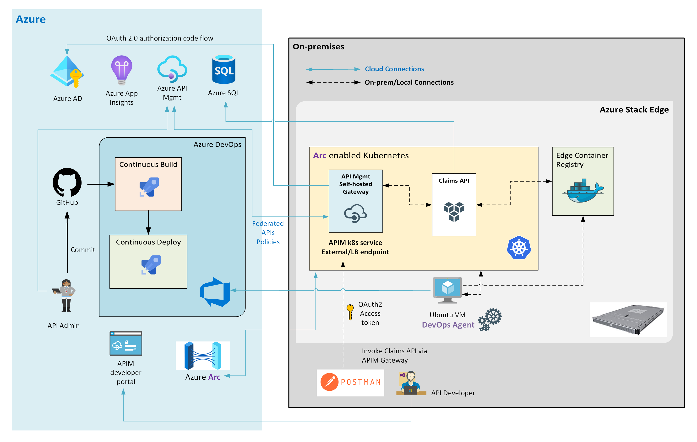

# Deploy Claims API on Azure Stack Edge

**Functional Architecture:**



Prerequisites:
* You have access to a [fully functional ASE with internet access and allocated sufficient IP address space for k8s services](https://docs.microsoft.com/en-us/azure/databox-online/azure-stack-edge-gpu-deploy-configure-network-compute-web-proxy#enable-compute-network) exopsed on your local network.
* [Create a new user and namespace with proper RBAC on ASE k8s](https://docs.microsoft.com/en-us/azure/databox-online/azure-stack-edge-gpu-create-kubernetes-cluster).
* [Enable edge container registry on ASE](https://docs.microsoft.com/en-us/azure/databox-online/azure-stack-edge-gpu-edge-container-registry).
* [Install latest stable Helm](https://helm.sh/docs/intro/install/) on your build agent.
* Your build agent should have network connectivity to reach the k8s cluster on ASE.
* **Optional**: You can [create a VM on ASE](https://docs.microsoft.com/en-us/azure/databox-online/azure-stack-edge-gpu-deploy-virtual-machine-portal) and use it as the ADO agent for building and deploying the Claims API.

Steps:
1. [Create a new branch](https://docs.github.com/en/github/collaborating-with-issues-and-pull-requests/creating-and-deleting-branches-within-your-repository) (e.g. "ase-test") on GitHub.
2. [Checkout](https://git-scm.com/book/en/v2/Git-Branching-Basic-Branching-and-Merging) the new branch.
3. Rename your existing claims-api directory to **aks-aspnet-sqldb-rest/claims-api.orig**.
4. Copy **aks-aspnet-sqldb-rest/extensions/azure-stack-edge/claims-api** to **aks-aspnet-sqldb-rest/claims-api**.
5. Make necessary changes (registry url, username, password, email) under "imageCredentials" in **values.yaml**.
6. Commit and push changes to new branch.
7. Go to the ADO project and update the build pipeline using your new branch (instead of master):

8. Create a new container registry service connection for your edge container registry and update the build pipeline (e.g. "https://ecr.dbe-70c9r53.microsoftdatabox.com:31001/"):

9. Create a new Kubernetes service connection using the KubeConfig file for the user who's grant access to the namespace for deployment:

10. In the release pipeline, edit the namespace and use the one you created for Claims API deployment.
11. Run pipeline and verify result with curl:
```bash
azureuser@Ubuntu1804:~$ helm ls -n claims-api-dev
NAME                    NAMESPACE       REVISION        UPDATED                                 STATUS          CHART                   APP VERSION
aks-aspnetcore-lab      claims-api-dev  1               2021-03-31 23:44:33.354484376 +0000 UTC deployed        claims-api-0.1.0        1.0
azureuser@Ubuntu1804:~$ kubectl get services -n claims-api-dev
NAME             TYPE           CLUSTER-IP       EXTERNAL-IP   PORT(S)        AGE
claims-api-svc   LoadBalancer   172.28.121.185   192.168.1.9   80:31608/TCP   154m
azureuser@Ubuntu1804:~$ curl -i http://192.168.1.9/api/v1/claims
HTTP/1.1 200 OK
Date: Thu, 01 Apr 2021 15:41:39 GMT
Content-Type: application/json; charset=utf-8
Server: Kestrel
Transfer-Encoding: chunked
X-Pod-IpAddr: 172.27.114.62

[{"claimItemId":100,"claimStatus":"02","claimType":"InstClaim","senderID":"CLPCSVNTEST2","receiverID":"APPCSVNTEST1","originatorID":"ORGNCSVTEST1","destinationID":"DESMEDSTEST1","claimInputMethod":"E","subscriberInfo":[{"subscriberInfoId":100,"subscriberRelationship":"18","subscriberPolicyNumber":"12345","insuredGroupName":"MD000004","subscriberLastName":"Doe","subscriberFirstName":"John","subscriberMiddleName":"","subscriberIdentifierSSN":"489-88-7001","subscriberAddressLine1":"5589 Hawthorne Way","subscriberAddressLine2":"","subscriberCity":"Sacramento","subscriberState":"CA","subscriberPostalCode":"95835","subscriberCountry":"US","subDateOfBirth":"12-19-1984","subscriberGender":"Male","payerName":"","patientLastName":"","patientFirstName":"","patientSSN":"489-88-7001","patientMemberID":"12345","patientDOB":"12-19-1984","patientGender":"Male","catgOfService":"Consultation","claimItemId":100}],"claimNumber":"1234121235","totalClaimCharge":1234.50,"patientStatus":"01","patientAmountDue":0.00,"serviceDate":"0001-01-01T00:00:00","policyNumber":"898435","claimPaidDate":"2021-02-03T00:06:38.4030071","serviceLineDetails":[{"serviceLineDetailsId":100,"statementDate":"2018-10-31T08:30:00","lineCounter":1,"serviceCodeDescription":"INPT","lineChargeAmount":15000.00,"drugCode":"UN","drugUnitQuantity":23,"pharmacyPrescriptionNumber":"123897","serviceType":"Consultation","providerCode":"72","providerLastName":"Longhorn","providerFirstName":"Dr. James","providerIdentification":"20120904-20120907","inNetworkIndicator":true,"claimItemId":100}],"planPayment":[{"planPaymentId":100,"primaryPayerID":"MEDICAID","cobServicePaidAmount":15000.00,"serviceCode":"ABC","paymentDate":"2021-02-03T00:00:00","claimAdjGroupCode":"HIPAA","claimAdjReasonCode":"CO","claimAdjAmount":500.00,"claimAdjQuantity":"3","claimItemId":100}]}]
```
At this point, we have successfully deployed Claims API to the ASE. In the following steps, we will add API Management functionalities to this lab.

12. [Deploy APIM](https://docs.microsoft.com/en-us/azure/api-management/get-started-create-service-instance) in Azure and create a new API: "Claims API" and define the backend endpoint by specifying the k8s **internal endpoint** for Claims API: "http://claims-api-svc.claims-api-dev".


13. Make sure you have followed instructions to [enable Arc for K8S on ASE](https://docs.microsoft.com/en-us/azure/databox-online/azure-stack-edge-gpu-deploy-arc-kubernetes-cluster): 
14. Install Azure Arc extension: API Management gateway (preview) in k8s namespace "apim":

15. Add "Claims API" to the APIM Gateway:

16. Confirm the APIM Gateway service is running: APIM self-hosted gateway is deployed in the k8s namespace "**apim**" (configured in step 14 above), take a note of the **External Endpoint** of the gateway. From the screenshot below, it is **192.168.1.10:5000**.

17. Use Postman to invoke the Claims API by sending a request to APIM Gateway: Create a new request in Postman and configure the request URL as "http://192.168.1.10:5000/claims-api/api/v1/claims". Verify the response is the same as in step 11.

18. Examin the APIM gateway metrics:


In the following steps, we will [**integrate Azure AD to protect the Claims API**](https://docs.microsoft.com/en-us/azure/api-management/api-management-howto-protect-backend-with-aad) on Azure Stack Edge.

19. [Create an App Registration](https://docs.microsoft.com/en-us/azure/active-directory/develop/quickstart-configure-app-expose-web-apis) in Azure AD to represent the **Claims web API**. On the app Overview page, find the **Application (client) ID** value and record it for later.

Expose the API and define a scope. Take a note of the scope.

20. Register another application in Azure AD to represent **a client application (in this example, Postman)**. Add client secret.

Add Redirect URIs.

21. Grant permissions in Azure AD so the client app can access the Claims API. **Optionally**, grant admin consent if you have permissions. Otherwise user consent will be granted later.

22. Enable OAuth 2.0 user authorization for the APIM instance in Azure Portal.

23. Configure a JWT validation policy for the APIM to pre-authorize requests before passing them to Claims API.

24. Configure [OAuth2 Auth Code Grant](https://docs.microsoft.com/en-us/azure/active-directory/develop/v2-oauth2-auth-code-flow) and obtain a JWT token while submitting request to Claims API.

25. Verify the response. It should be the same as in step 17 above.


**Notes**:
* Since we are using the edge container registry (ECR) instead of ACR, we will need to create imagePullSecret on k8s to store the ECR credential "**regcred**", see below:
```bash
azureuser@Ubuntu1804:~$ kubectl get secrets -n claims-api-dev
NAME                                       TYPE                                  DATA   AGE
default-token-424lf                        kubernetes.io/service-account-token   3      4d20h
regcred                                    kubernetes.io/dockerconfigjson        1      15h
sec-smbcredentials                         microsoft.com/smb                     2      46h
sh.helm.release.v1.aks-aspnetcore-lab.v1   helm.sh/release.v1                    1      15h
azureuser@Ubuntu1804:~$ kubectl get secret regcred -n claims-api-dev --output=yaml
apiVersion: v1
data:
  .dockerconfigjson: eyJhdXRocyI6eyJodHRwczovL2Vjci5kYmUtNzBjOXI1My5taWNyb3NvZnRkYXRhYm94LmNvbTozMTAwMSI6eyJ1c2VybmFtZSI6ImFzZS1lY3ItdXNlciIsInBhc3N3b3JkIjoiTG5KbFF5V0owZlRXNEZsIiwiZW1haWwiOiJrOHNhZG1pbkByZWRvbmRvYXNlLm9yZyIsImF1dGgiOiJZWE5sTFdWamNpMTFjMlZ5T2t4dVNteFJlVmRLTUdaVVZ6UkdiQT09In19fQ==
kind: Secret
metadata:
  annotations:
    meta.helm.sh/release-name: aks-aspnetcore-lab
    meta.helm.sh/release-namespace: claims-api-dev
  creationTimestamp: "2021-03-31T23:44:33Z"
  labels:
    app.kubernetes.io/managed-by: Helm
  name: regcred
  namespace: claims-api-dev
  resourceVersion: "394062"
  selfLink: /api/v1/namespaces/claims-api-dev/secrets/regcred
  uid: 1ce2902e-78b3-433b-a289-f6c0fa2b655c
type: kubernetes.io/dockerconfigjson
```
* Finally, **seeing is believing**:

