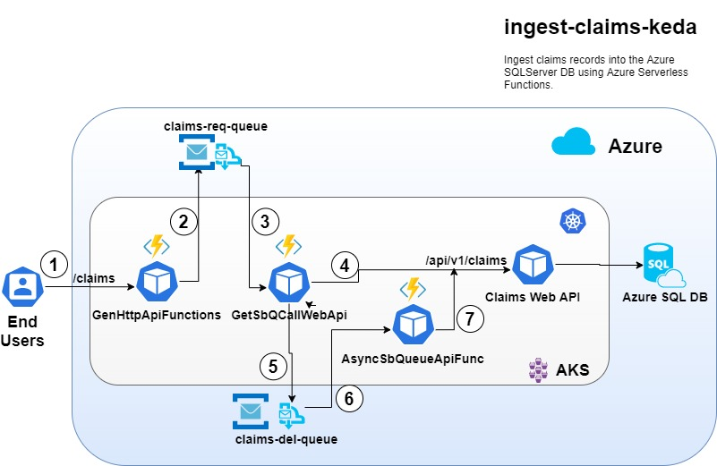

# Process transactions at scale using Azure Functions and KEDA on AKS
This sub-project describes the steps for ingesting Claims records into the backend Azure SQL Server Database using **Azure Functions** serverless applications.

The Functions application modules are implemented in .NET Core and Nodejs respectively. The Azure Functions runtime itself is packaged within a Linux container and deployed on AKS.

A brief description of the Functions applications is provided below.
- [ClaimsApiSyncFunc](./ClaimsApiAsyncFunc)

  This .NET Core application comprises of two Functions (modules) written in C#.
  - **GenHttpApiFunctions**:

    This Function exposes a generic REST API for processing new medical Claims.  Upon receiving medical Claims transactions, this function stores them in a persistent Azure Service Bus Queue. This step ensures the received Claims transactions are processed in a guaranteed and reliable manner.
  - **AsyncSbQueueApiFunc**:

    This Function reads medical Claims transactions from an Azure Service Bus Queue and then invokes the Claims REST API end-points implemented in the parent project. In the event the backend application is down or unreachable, the Claims transactions persist in the service bus queue.

- [ClaimsAsyncApiFunc](./ClaimsAsyncApiFunc)

  This Nodejs application comprises of one Function (module) written in Javascript.
  - **GetSbQCallWebApi**:

    This Function reads the medical Claims transactions from the Azure Service Bus Queue and then invokes the Claims REST API end-point implemented in the parent project.  This step executes an atomic transaction and ensures the Claims records are successfully delivered to the backend application.  In the event the backend application is down or unreachable, the Claims transactions remain in the service bus queue.


**Functional Diagram:**



The solution leverages *Kubernetes Event Driven Auto-scaling* (KEDA) on AKS.  Kubernetes based Functions provides the Functions runtime in a Docker container with event-driven scaling through KEDA.

**Prerequisites:**
1. Readers are required to complete Sections A thru G in the [parent project](https://github.com/ganrad/aks-aspnet-sqldb-rest) before proceeding with the hands-on labs in this sub-project.

Readers are advised to go thru the following on-line resources before proceeding with the hands-on sections.
- [Azure Functions Documentation](https://docs.microsoft.com/en-us/azure/azure-functions/)
- [Kubernetes based event driven auto-scaling - KEDA](https://keda.sh/)
- [KEDA on AKS](https://docs.microsoft.com/en-us/azure/azure-functions/functions-kubernetes-keda)
- [Osiris - A general purpose scale to zero component for Kubernetes](https://github.com/deislabs/osiris)

## A. Deploy Azure Infrastructure resources
**Approx. time to complete this section: 30 minutes**

In this project, the Azure Function (serverless) applications will be deployed on **Virtual** (ACI) **Nodes** on AKS.  With virtual nodes, customers only have to pay for container execution time.  Virtual nodes are ideal for running data processing workloads which typically run for a few minutes (< 10 minutes).  By running these workloads on virtual nodes, customers can achieve significant cost savings through **per-second** billing.

Virtual nodes enable network communication between pods that run on [ACI](https://azure.microsoft.com/en-us/services/container-instances/) and AKS cluster.  As such, virtual nodes only work with AKS clusters created using **Advanced** networking (Azure CNI).

Follow the steps below to provision a Virtual Node and associate it with an AKS cluster.

>**NOTE:** Skip the steps (1 .. 3) below if you have deployed a *Basic* AKS cluster with **Kubenet** overlay networking.  For adding **Virtual Nodes** to an AKS cluster and deploying ACI containers, Azure CNI networking is required!  Complete the steps below only if you have provisioned an AKS cluster within a private VNET and also configured the cluster to use Azure CNI.

1. Login into the Linux VM via SSH.
  
   ```bash
   # ssh into the VM. Substitute the public IP address for the Linux VM in the command below.
   $ ssh labuser@x.x.x.x
   #
   ```
2. Register Azure Service Provider for Container Instances.

   ```bash
   # Register the ACI provider with your subscription.
   $ az provider list --query "[?contains(namespace,'Microsoft.ContainerInstance')]" -o table
   #
   # The provider should report as 'registered' (above command).  If the output displays 
   # 'NotRegistered' execute the next command below.
   #
   # Register the provider
   $ az provider register --namespace Microsoft.ContainerInstance
   #
   ```

3. Enable Virtual Nodes addon on AKS Cluster.

   ```bash
   # Enable the virtual node addon on the AKS cluster which you provisioned in parent project.
   # NOTE: In the parente project, you should have provisioned an AKS cluster with Azure CNI 
   # networking!!
   # Substitute the name of the virtual node subnet.
   #
   $ az aks enable-addons \
     --resource-group myResourceGroup \
     --name akscluster \
     --addons virtual-node \
     --subnet-name myVirtualNodeSubnet
   #
   # Verify the virtual node is provisioned and associated with the cluster.
   # The output of the command should list 3 nodes including the 'aci' node 
   # eg., virtual-node-aci-linux
   $ kubectl get nodes
   #
   ```

Next, follow the steps below to provision an Azure Service Bus Namespace and Queues.  The service bus queues will be used by the function applications to reliably process claims records in a guaranteed manner.

1. Login to the Azure Portal.

   Login to the [Azure Portal](https://portal.azure.com) using your credentials.

2. Provision an Azure Service Bus Namespace and Queues.

   Refer to the tutorial below to provision an Azure Service Bus, Namespace and Queues.  Create two Queues named **claims-req-queue** and **claims-del-queue**.

   - [Create a Service Bus queue - Azure Portal](https://docs.microsoft.com/en-us/azure/service-bus-messaging/service-bus-quickstart-portal)
   - [Create a Service Bus queue - Azure CLI](https://docs.microsoft.com/en-us/azure/service-bus-messaging/service-bus-quickstart-cli)

   Save the Azure Service Bus **Connection String** in a file.  The connection string for the Service Bus namespace can be obtained from the Azure Portal under the *Shared Access Policies* blade/section.  The namespace connection string will be required to test the Function applications locally on the Linux VM.

## B. Install pre-requisite tools on the Linux VM (Bastion Host)
**Approx. time to complete this section: 15 minutes**

1. Login into the Linux VM via SSH.
  
   ```bash
   # ssh into the VM. Substitute the public IP address for the Linux VM in the command below.
   $ ssh labuser@x.x.x.x
   #
   ```

2. Install Nodejs on the Linux VM.

   ```bash
   # Switch to home directory
   $ cd
   #
   # Create a directory to save 'nodejs' runtime
   $ mkdir nodejs
   #
   # Download and unzip the binary into $HOME/nodejs
   $ curl -sL "https://nodejs.org/dist/v12.14.1/node-v12.14.1-linux-x64.tar.xz" | unxz | tar -xv --directory=$HOME/nodejs
   #
   # Edit '.bashrc' file in your home ($HOME) directory and set the PATH variable to include the 
   # path of the 'nodejs' bin directory => '$HOME/nodejs/node-vx.x.x-linux-x64/bin'
   #
   # Check 'nodejs' version
   $ node --version
   #
   ```

3. Install Azure Function Core Tools v3.x.

   Execute the commands shown in the snippet below.

   ```bash
   # Switch to home directory
   $ cd
   #
   # Download Azure Function Core Tools 2.x runtime
   # wget https://github.com/Azure/azure-functions-core-tools/releases/download/2.7.2045/Azure.Functions.Cli.linux-x64.2.7.2045.zip
   #
   # Download Azure Function Core Tools 3.x runtime
   $ wget https://github.com/Azure/azure-functions-core-tools/releases/tag/3.0.2009
   #
   # Create a directory to save 'Azure Function Tools' binaries
   $ mkdir az-func-core-tools
   #
   # Unzip the Azure Function Core Tools binaries into the 'az-func-core-tools' directory
   $ unzip -d ~/az-func-core-tools/ Azure.Functions.Cli.linux-x64.3.0.2009.zip
   #
   # Edit '.bashrc' file in your home ($HOME) directory and set the PATH variable to include the 
   # path of the 'Azure Function Core Tools' directory. See below.
   # => AZ_FUNC_CORE_TOOLS=$HOME/az-func-core-tools
   # => export PATH=$AZ_FUNC_CORE_TOOLS:$PATH
   #
   # Check Azure Function Core Tools version
   $ func --version
   #
   ```

## C. Build and Test the Azure Function Applications locally on the Linux VM
**Approx. time to complete this section: 30 mins**

This section describes the steps for building, deploying and testing the Function applications locally on the Linux VM.  Follow the steps below.

1. Refer to [ClaimsApiAsyncFunc](./ClaimsApiAsyncFunc) to build and deploy this Azure Function Application on the Linux VM.

2. Refer to [ClaimsAsyncApiFunc](./ClaimsAsyncApiFunc) to deploy this Azure Function Application on the Linux VM.

3. Test both the Function applications locally on the Linux VM.

   Login to the Linux VM via another SSH terminal window. Execute the test shell script `./shell-scripts/create-load.sh`.  Refer to the command snippet below.

   ```bash
   # ssh login into the Linux VM.
   $ ssh labuser@x.x.x.x
   #
   # Make sure you are in the 'PROJECT_DIR/extensions/ingest-claims-keda'
   # PROJECT_DIR => $HOME/git-repos/aks-aspnet-sqldb-rest
   $ cd $HOME/git-repos/aks-aspnet-sqldb-rest/extensions/ingest-claims-keda
   #
   # Run the shell script => 'create-load.sh'
   # Script parameter descriptions are provided below:
   #
   # runs => 2 [any integer value]
   # port => 7071 [port should be the 'ClaimsApiAsyncFunc' Function Application listen port]
   # location of test data => ./../../test-data/claim01.json
   #
   $ ./shell-scripts/create-load.sh <runs> localhost:<port> <location of test data>
   #
   # After testing the Function apps, shut them down (control + c)
   #
   ```

## D. Build & Push the Function Application container images into ACR
**Approx. time to complete this section: 15 mins**

This section details the steps for building the Function application container images and pushing them into the ACR instance..

All the steps below have to be executed on the Linux VM terminal window.

1. Login to the ACR instance.

   ```bash
   # List the ACR instances
   $ az acr list -o table
   #
   # Login to your ACR instance
   # => ACR NAME : Substitute the 'name' of the ACR instance in the command below.
   $ az acr login --name <ACR NAME>
   #
   ```

2. Build and push the **ClaimsApiAsyncFunc** Function application container image into ACR.

   ```bash
   # Switch to the 'ClaimsApiAsyncFunc' Function application directory.
   $ cd $HOME/git-repos/aks-aspnet-sqldb-rest/extensions/ingest-claims-keda/ClaimsApiAsyncFunc
   #
   # Build the Function application container image.
   # => Keep in mind there is a dot '.' at the end of the command.
   # => ACR NAME : Substitute the 'name' of the ACR instance in the command.
   $ docker build -t <ACR NAME>.azurecr.io/claims-ingest-api:latest .
   #
   # (Optional) Verify the container image got built
   $ docker images
   #
   # Push the Function application container image into ACR
   # => Substitute the 'name' of the ACR instance in the command.
   $ docker push <ACR Name>.azurecr.io/claims-ingest-api:latest
   #
   # List the ACR repositories
   # => ACR NAME : Substitute the 'name' of the ACR instance in the command.
   $ az acr repository list --name <ACR_NAME> -o table
   #
   # List the repository tags
   # => ACR NAME : Substitute the 'name' of the ACR instance in the command.
   $ az acr repository show-tags --name <ACR NAME> --repository claims-ingest-api -o table
   #
   ```

3. Build and push the **ClaimsAsyncApiFunc** Function application container image into ACR.

   ```bash
   # Switch to the 'ClaimsAsyncApiFunc' Function application directory.
   $ cd $HOME/git-repos/aks-aspnet-sqldb-rest/extensions/ingest-claims-keda/ClaimsAsyncApiFunc
   #
   # Build the Function application container image.
   # => Keep in mind there is a dot '.' at the end of the command.
   # => ACR NAME : Substitute the 'name' of the ACR instance in the command.
   $ docker build -t <ACR NAME>.azurecr.io/claims-ingest-async:latest .
   #
   # (Optional) Verify the container image got built
   $ docker images
   #
   # Push the Function application container image into ACR
   # => Substitute the 'name' of the ACR instance in the command.
   $ docker push <ACR Name>.azurecr.io/claims-ingest-async:latest
   #
   # List the ACR repositories
   # => ACR NAME : Substitute the 'name' of the ACR instance in the command.
   $ az acr repository list --name <ACR_NAME> -o table
   #
   # List the repository tags
   # => ACR NAME : Substitute the 'name' of the ACR instance in the command.
   $ az acr repository show-tags --name <ACR NAME> --repository claims-ingest-api -o table
   #
   ```

## E. Deploy KEDA and Osiris (HTTP zero-scaler) on AKS
**Approx. time to complete this section: 20 mins**

If you haven't already, log into the Linux VM thru a SSH terminal window.

All the steps below have to be executed on the Linux VM terminal window.
  
1. Deploy Keda on AKS

   Run the commands shown in the snippet below.

   ```bash
   # Add Keda Helm repo on local machine
   $ helm repo add kedacore https://kedacore.github.io/charts
   #
   # Update the local repo
   $ helm repo update
   #
   # Install Keda in AKS namespace 'keda'
   $ helm install kedacore/keda --namespace keda --name keda
   #
   # List all resources deployed in the 'keda' namespace
   # Before proceeding to the next section, make sure all pods are in 'running' state.
   $ kubectl get all -n keda
   #
   ```

2. Deploy Osiris http zero-scaler on AKS

   Run the commands shown in the snippet below.

   ```bash
   # Add Osiris Helm repo on local machine
   $ helm repo add osiris https://osiris.azurecr.io/helm/v1/repo \
     --username eae9749a-fccf-4a24-ac0d-6506fe2a6ab3 \
     --password =s-e.2-84BhIo6LM6=/l4C_sFzxb=sT[
   #
   # Install Osiris in AKS namespace 'osiris-system'
   $ helm install osiris/osiris-edge \
     --name osiris \
     --namespace osiris-system \
     --devel
   #
   # List all resources deployed in 'osiris-system' namespace
   # Before proceeding to the next section, make sure all pods are in 'running' state.
   $ kubectl get all -n osiris-system
   #
   ```
## F. Deploy containerized Azure Function Applications on AKS
**Approx. time to complete this section: 60 mins**

All the steps in this section have to be executed on the Linux VM terminal window.

**Helm** charts will be used to deploy the containerized Function Applications to AKS.  


1. Switch to the **ingest-claims-keda** extension directory.

   ```bash
   # Switch to the 'ingest-claims-keda' extension directory
   $ cd $HOME/git-repos/aks-aspnet-sqldb-rest/extensions/ingest-claims-keda
   #
   ```

   >**NOTE:** Before proceeding, review the Helm charts in `claims-api-func` and `claims-async-func` directories.

2. Update **ClaimsApiAsyncFunc** Function Helm chart. 

   Update the following parameter values in the Helm chart `./claims-api-func/values.yaml` file.  Refer to the table below.

   Parameter Name | Value | Description
   -------------- | ----- | -----------
   image.repository | <acrname>.azurecr.io/claims-ingest-api | ACR (name) to download the Function application container image from.  Substitute correct value for ACR name.
   function.azServiceBusConnection | "" | Specify Azure Service Bus namespace **Connection String**.
   function.ClaimsApiHost | claims-api-svc.development | Kubernetes DNS **Service** name where the Claims Web API is exposed.  This value has to be **Base64** encoded!
   function.claimsDelQueue | claims-del-queue | The function gets/reads a Claims transaction from this queue and calls the backend Claims Web API to delete the Claims record from the underlying persistent Azure SQL database.


   For a description of all other parameters in `./claims-api-func/values.yaml`, refer to [ClaimsApiAsyncFunc documentation](./ClaimsApiAsyncFunc).

   >**NOTE:** **Function** parameter values which are specified in a Kubernetes *Secret* have to be **Base64** encoded in the Helm chart `values.yaml` file.

   Refer to the command snippet below for encoding and decoding parameter values.

   ```bash
   # Base64 encode a string value.
   $ echo -n "This is a test" | base64
   #
   # For a decoding an Base64 encoded value, use the command below.
   $ echo -n "Base64 encoded value" | base64 -d
   #
   ```

3. Update **ClaimsAsyncApiFunc** Function Helm chart. 

   Update the following parameter values in the Helm chart `./claims-async-func/values.yaml` file.  Refer to the table below.

   Parameter Name | Value | Description
   -------------- | ----- | -----------
   image.repository | <acrname>.azurecr.io/claims-ingest-async | ACR (name) to download the Function application container image from.  Substitute correct value for ACR name.
   function.azServiceBusConnection | "" | Specify Azure Service Bus namespace **Connection String**.
   function.ClaimsApiHost | claims-api-svc.development | Kubernetes DNS **Service** name where the Claims Web API is exposed.  This value has to be **Base64** encoded!
   function.claimsReqQueue | claims-req-queue | The function gets/reads a Claims transaction from this queue and calls the backend Claims Web API to insert the Claims record into the underlying persistent Azure SQL database.


   For a description of all other parameters in `./claims-async-func/values.yaml`, refer to [ClaimsAsyncApiFunc documentation](./ClaimsAsyncApiFunc).

   >**NOTE:** **Function** parameter values which are specified in a Kubernetes *Secret* have to be **Base64** encoded in the Helm chart `values.yaml` file.

4. Create an Kubernetes namespace and image pull secret.

   >**NOTE:** This step is required only if you have provisioned an AKS cluster with advanced networking (Azure CNI).  You can skip this step if you have deployed an AKS cluster with basic (Kubenet) networking plug-in.

   The virtual node is not yet integrated with Azure AD service principal authentication.  Hence a Kubernetes *Secret* object has to be created containing the service principal credentials.  This secret object will then be used by the kubelet to pull the container image from ACR.  Review the deployment manifest ('deploy-res.yaml') in the Helm chart folder to understand how this works.

   ```bash
   # Create a kubernetes namespace first.
   # This namespace will be used to deploy all the Function apps.
   $ kubectl create ns dev-claims
   #
   # Create a kubernetes secret containing the SP credentials.
   # You should have saved the SP 'appId' and 'password' values in a file while 
   # completing the hands-on labs in the parent project.  Refer to Section [G]
   # in parent project.
   # 
   # Substitute the correct values for 
   # acr-name => Fully quailified acr name eg., xyz.azurecr.io
   # SP appId => Service Principal App ID
   # SP password => Service Principal password
   #
   $ kubectl create secret docker-registry regcred \
     --docker-server=<acr-name> \
     --docker-username=<SP appId> \
     --docker-password=<SP password> \
     --docker-email=<your email id> \
     -n dev-claims
   #
   # Verify if the secret got created in k8s namespace 'dev-claims'
   $ kubectl get secrets -n dev-claims
   #
   # (Optional) Inspect the contents of the secret
   $ kubectl get secret regred -n dev-claims -o yaml
   #
   # Inspect the value of '.dockerconfigjson' field, should contain the ACR 
   # name, SP appId + password and email id.
   $ kubectl get secret regcred --output="jsonpath={.data.\.dockerconfigjson}" -n dev-claims | base64 --decode
   #
   ```

5. Deploy **ClaimsApiAsyncFunc** Function application on AKS.

   ```bash
   # Use Helm to install/deploy the application on AKS
   # Deploy the Function apps in a new namespace eg., 'dev-claims'
   $ helm install ./claims-api-func/ --namespace dev-claims --name claims-api-func --atomic
   #
   ```

6. Deploy **ClaimsAsyncApiFunc** Function application on AKS.

   ```bash
   # Use Helm to install/deploy the application on AKS
   $ helm install ./claims-async-func/ --namespace dev-claims --name claims-async-func --atomic
   #
   ```

## G. Test the HTTP zero (Osiris) and auto event (KEDA) scalers 
**Approx. time to complete this section: 30 mins**

Use the shell script `./shell-scripts/create-load.sh` to invoke the Claims HTTP API.  Refer to the command snippet below.

```bash
# To test auto Function scaling, run multiple instance of the shell script in
# parallel.
# => Runs : 1...N (An integer eg., 50)
# => Service IP address : $ kubectl get service -n dev-claims
#
$ ./shell-scripts/create-load.sh <Runs> <'claims-api-func' Service IP address> ./../../test-data/claim01.json
#
# Check the number of Pods
$ kubectl get pods -n dev-claims
#
# Check and stream pod logs
$ kubectl logs -f <Pod name> -n dev-claims
#
```

## H. Use Azure DevOps to build and deploy the containerized Function Applications

This section is left as an exercise to the readers and workshop attendees.  Refer to the parent project to implement the Azure DevOps build, release and delivery pipelines.

**Hint:**
- Use the `Dockerfile` in the build pipeline to build the Function application container images.  
- Use the `Helm Charts` in the release pipeline to deploy the containerized Function applications on AKS.

Congrats! In this extension, you learnt how to build and deploy event driven serverless applications (**Azure Function Apps**) on AKS and scale them using **KEDA** and **Osiris**!
